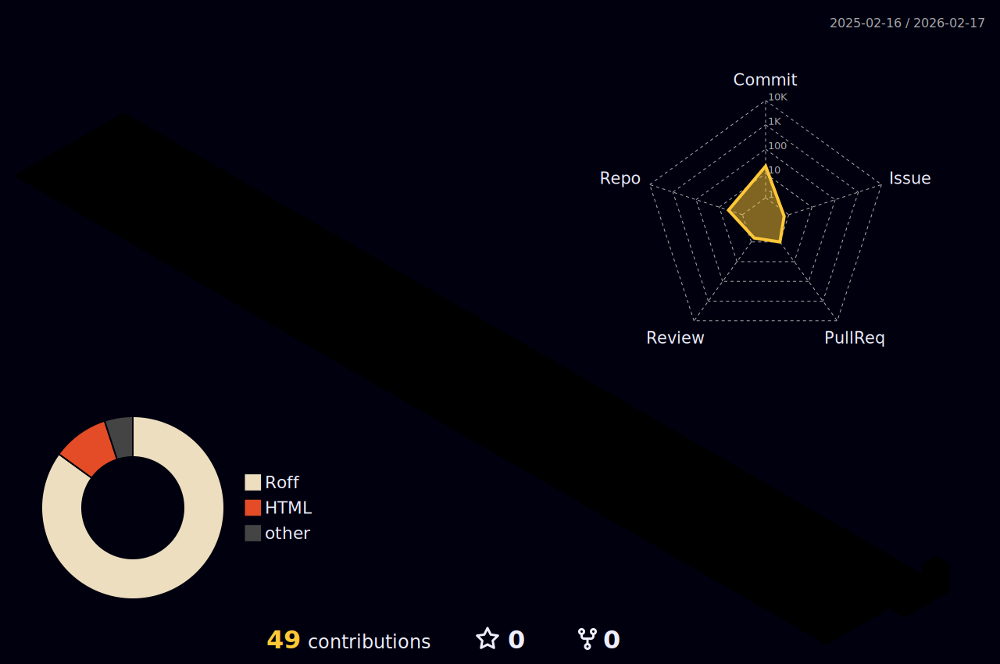

<!-- ╔══════════════════════════════════════════════════════╗ -->
<!-- ║  MATHEUS AGUEDA — 서울 사이버펑크 NEON PROFILE      ║ -->
<!-- ╚══════════════════════════════════════════════════════╝ -->

<div align="center">

<!-- ▓▓▓ HEADER ▓▓▓ -->


<!-- ▓▓▓ KOREAN NEON BAR ▓▓▓ -->


<br>


<br>

<!-- ▓▓▓ ROLE BADGES ▓▓▓ -->
<p>
  
  
  
  
</p>

<!-- ▓▓▓ LINKS ▓▓▓ -->
<p>
  <a href="https://linkedin.com/in/matheus-agueda"></a>
  <a href="https://www.greenvillagemobilehomes.com"></a>
  <a href="https://github.com/MatheusAgueda"></a>
  <a href="mailto:info@greenvillagemobilehomes.com"></a>
</p>

<!-- ▓▓▓ COUNTERS ▓▓▓ -->
<p>
  
  
  
</p>

</div>


<!-- ═══════════════════════════════════════════════════════ -->
<!--                    $ ./system_init.sh                   -->
<!-- ═══════════════════════════════════════════════════════ -->

##  `$ ./system_init.sh`


```bash
#!/usr/bin/env bash
# ━━━━━━━━━━━━━━━━━━━━━━━━━━━━━━━━━━━━
#  matheus@hq:~$ neofetch --developer
# ━━━━━━━━━━━━━━━━━━━━━━━━━━━━━━━━━━━━

MATHEUS_AGUEDA=(
  [name]="Matheus Agueda"
  [role]="CEO & Full Stack Developer"
  [company]="Green Village Mobile Homes"
  [hq]="Pombal, Portugal"
  [stores]=7
  [countries]="PT ES BR"
  [cloud_phones]=20
  [daily_scrapes]="70+ sites"
  [uptime]="24/7/365"
)

# Running processes:
#  PID  PRI   SERVICE
#  001  CRIT  geelark-orchestrator   ← 20 phones
#  002  CRIT  web-scraper-engine     ← 70+ sites
#  003  HIGH  tiktok-auto-daemon     ← 24h likes
#  004  HIGH  instagram-warmup-svc   ← stories
#  005  HIGH  facebook-dm-outreach   ← auto-msg
#  006  NORM  3d-showroom-renderer   ← Three.js
#  007  NORM  import-calculator-api  ← 13 countries

echo "All systems operational. 무중단 운영중."
#                              ↑ (non-stop)
```

<br clear="both">


<!-- ═══════════════════════════════════════════════════════ -->
<!--                  SYSTEM ARCHITECTURE                    -->
<!-- ═══════════════════════════════════════════════════════ -->

## 🏗️ `// SYSTEM_ARCHITECTURE.exe`

<div align="center">

```
┌───────────────────────────────────────────────────────────────────────┐
│                     PRODUCTION INFRASTRUCTURE                         │
│                     ─────────────────────────                         │
│                                                                       │
│   ┌───────────┐     ┌────────────┐     ┌─────────────────────────┐   │
│   │  CLIENTS  │     │  CDN/EDGE  │     │    CLOUD SERVICES       │   │
│   │           │     │            │     │                         │   │
│   │  Web App  ├────►│  Vercel    ├────►│  Hetzner  (Scraper)    │   │
│   │  iOS App  │     │  CF Pages  │     │  GeeLark  (20 Phones)  │   │
│   │  Android  │     │            │     │  Oxylabs  (20 Proxies) │   │
│   └───────────┘     └────────────┘     └────────────┬────────────┘   │
│                                                      │                │
│   ┌──────────────────────────────────────────────────┼────────────┐  │
│   │                   BACKEND LAYER                   │            │  │
│   │                                                   ▼            │  │
│   │   ┌───────────┐   ┌────────────┐   ┌─────────────────────┐  │  │
│   │   │  Fastify  │   │ Puppeteer  │   │  GeeLark Open API   │  │  │
│   │   │  REST API │   │ Playwright │   │                     │  │  │
│   │   │  :3001    │   │ Scraping   │   │  POST /phone/*      │  │  │
│   │   │           │   │ Engine     │   │  POST /proxy/*      │  │  │
│   │   └─────┬─────┘   └─────┬──────┘   │  POST /task/*       │  │  │
│   │         │               │          │  POST /app/*        │  │  │
│   │         ▼               ▼          └─────────────────────┘  │  │
│   │   ┌────────────────────────────┐                             │  │
│   │   │    PostgreSQL / Storage    │                             │  │
│   │   │    Thousands of listings   │                             │  │
│   │   └────────────────────────────┘                             │  │
│   └──────────────────────────────────────────────────────────────┘  │
│                                                                       │
│   ┌──────────────────────────────────────────────────────────────┐  │
│   │                  AUTOMATION LAYER                              │  │
│   │                                                                │  │
│   │   ┌────────┐   ┌──────────┐   ┌──────────┐   ┌────────────┐ │  │
│   │   │TikTok  │   │Instagram │   │ Facebook │   │Custom Flow │ │  │
│   │   │Like 24h│   │ Warmup   │   │ DM       │   │Engine      │ │  │
│   │   │30% prob│   │ Stories  │   │ Outreach │   │.gal/.json  │ │  │
│   │   └────────┘   └──────────┘   └──────────┘   └────────────┘ │  │
│   │                                                                │  │
│   │   openApp → waitEle → ifElse → forTimes → scroll → log       │  │
│   └──────────────────────────────────────────────────────────────┘  │
│                                                                       │
│   ┌──────────────────────────────────────────────────────────────┐  │
│   │                  AI / INTELLIGENCE LAYER                       │  │
│   │                                                                │  │
│   │   Claude AI ──► Code Gen ────► Custom Flow Builder             │  │
│   │   Claude AI ──► 3D NPCs ────► Virtual Showroom                 │  │
│   │   Claude AI ──► Analysis ───► Market Intelligence              │  │
│   └──────────────────────────────────────────────────────────────┘  │
└───────────────────────────────────────────────────────────────────────┘
```

</div>


<!-- ═══════════════════════════════════════════════════════ -->
<!--                   PRODUCTION SYSTEMS                    -->
<!-- ═══════════════════════════════════════════════════════ -->

## ⚡ `// PRODUCTION_SYSTEMS.exe`

<div align="center">

<table>
<tr>
<td width="50%">

### 🤖 GeeLark Cloud Phones
```typescript
// geelark-orchestrator.ts

interface PhoneCluster {
  phones: 20;
  os: "Android 15";
  proxy: "Oxylabs US Residential";
  proxyMode: "1:1 dedicated";
  apps: [
    "TikTok v43.1.4",
    "Instagram",
    "Facebook"
  ];
  automation: "Custom Flow (.gal/.json)";
  api: "REST POST + Bearer + UUID";
  rateLimit: "200 req/min";
  uptime: "24/7";
}

type TaskType = "warmup" | "video" | "image";

type FlowNode =
  | "openApp" | "click" | "clickXY"
  | "inputContent" | "keyOption"
  | "waitTime" | "waitEle"
  | "ifElse" | "forTimes" | "breakLoop"
  | "scroll" | "screenshotPage"
  | "pageBack" | "log";
```

</td>
<td width="50%">

### 🕷️ Web Scraping Engine
```typescript
// scraper-engine.ts

interface ScraperConfig {
  targets: "70+ European sites";
  runtime: "Hetzner Cloud VPS";
  stack: "Next.js + TypeScript";
  browsers: ["Puppeteer", "Playwright"];
  db: "PostgreSQL";
  output: "Thousands/day";
  antiDetect: true;
  proxyRotation: true;
}

type Pipeline =
  | "crawl"       // Fetch pages
  | "parse"       // Extract data
  | "normalize"   // Standardize
  | "dedupe"      // Remove dupes
  | "enrich"      // Computed fields
  | "store"       // PostgreSQL
  | "index"       // Search index
  | "serve";      // REST → frontends
```

</td>
</tr>
<tr>
<td width="50%">

### 🏠 3D Virtual Showroom
```typescript
// virtual-showroom.ts

interface ShowroomEngine {
  renderer: "Three.js (WebGL)";
  framework: "React + TypeScript";
  features: [
    "Walk-through 3D homes",
    "AI NPC sales agents",
    "Real-time lighting",
    "Interactive placement",
    "Multi-camera views"
  ];
  ai: {
    engine: "Claude AI";
    role: "Sales assistant";
    catalog: "3000+ models";
    langs: ["PT","ES","EN","FR"];
  };
}
```

</td>
<td width="50%">

### 💰 Import Calculator
```typescript
// import-calculator.ts

interface CalcEngine {
  type: "PWA";
  stack: "Vanilla JS + Tailwind";
  countries: 13;
  calculations: [
    "IVA / VAT per country",
    "ICMS (Brazil)",
    "Import duties",
    "Transport estimation",
    "Currency conversion",
    "Total landed cost"
  ];
  rates: "Live exchange";
  offline: true;
  repo: "MatheusAgueda/calculadora";
}
```

</td>
</tr>
</table>

</div>


<!-- ═══════════════════════════════════════════════════════ -->
<!--                   GEELARK DEEP DIVE                     -->
<!-- ═══════════════════════════════════════════════════════ -->

## 🔮 `// GEELARK_INFRASTRUCTURE.exe`

<div align="center">

```
                  ┌───────────────────────────────────────┐
                  │        GEELARK CONTROL PLANE           │
                  │                                        │
                  │  API: POST openapi.geelark.com/open/v1 │
                  │  Auth: Bearer + traceId (UUID v4)      │
                  │  Rate: 200/min · 24k/hour              │
                  └─────────────────┬─────────────────────┘
                                    │
                  ┌─────────────────┼─────────────────────┐
                  │                 │                       │
            ┌─────▼─────┐   ┌──────▼──────┐   ┌──────────▼─────┐
            │   PHONE   │   │    PROXY    │   │     TASK       │
            │  MANAGER  │   │   MANAGER   │   │   SCHEDULER    │
            │           │   │             │   │                │
            │ /phone/*  │   │ /proxy/*    │   │ /task/add      │
            │ 20 active │   │ 20 Oxylabs  │   │ /task/detail   │
            │ A15 each  │   │ 1:1 mapped  │   │ warmup/video   │
            └─────┬─────┘   └──────┬──────┘   └───────┬────────┘
                  │                │                    │
       ┌──────────┼────────────────┼────────────────────┼─────┐
       │          ▼                ▼                    ▼     │
       │  ┌────────────────────────────────────────────────┐  │
       │  │           20 CLOUD PHONES (Android 15)          │  │
       │  │                                                 │  │
       │  │  GV GREECE ── GV SUICA ─── GV CROACIA          │  │
       │  │  GV HUNGRIA ─ GV ALEMANHA  GV AUSTRALIA         │  │
       │  │  GV BELGICA ─ GV BRASIL ── GV HOLANDA          │  │
       │  │  GV FRANCA ── GV MEXICO ── GV USA              │  │
       │  │  GV ITALIA ── GV POLONIA ─ GV UCRANIA          │  │
       │  │  GV MADEIRA ─ GV BULGARIA  #46 · #47 · #48     │  │
       │  │                                                 │  │
       │  │  Per phone:                                     │  │
       │  │   ├─ TikTok v43.1.4  → Random Like 24h         │  │
       │  │   ├─ Instagram       → Warmup + Stories         │  │
       │  │   ├─ Facebook        → DM Outreach              │  │
       │  │   └─ Proxy           → Oxylabs -sessid-gvXX    │  │
       │  └─────────────────────────────────────────────────┘  │
       │                                                        │
       │  ┌─────────────────────────────────────────────────┐  │
       │  │            CUSTOM FLOW ENGINE                    │  │
       │  │                                                  │  │
       │  │  openApp ──── Launch by packageName              │  │
       │  │  click ────── Element (desc/text/id/class)       │  │
       │  │  clickXY ──── Coordinate + randomDistance        │  │
       │  │  inputContent  Array of strings → EditText       │  │
       │  │  keyOption ─── keyType: "enter" | "back"         │  │
       │  │  waitTime ──── Fixed | randomInterval            │  │
       │  │  waitEle ───── Wait + capture → variable         │  │
       │  │  ifElse ────── exist | probability               │  │
       │  │  forTimes ──── Loop N iterations                 │  │
       │  │  scroll ────── direction + distance + speed      │  │
       │  │  screenshot ── Capture screen                    │  │
       │  │  pageBack ──── Android back                      │  │
       │  │  log ───────── Output message                    │  │
       │  │                                                  │  │
       │  │  errorType: "skip" → fault-tolerant execution    │  │
       │  └──────────────────────────────────────────────────┘  │
       └────────────────────────────────────────────────────────┘

┌─────────────────────────────────────────────────────────────────┐
│                    OXYLABS PROXY MESH                            │
│                                                                  │
│  Server: pr.oxylabs.io:7777     Auth: cc-US-sessid-gvXX        │
│                                                                  │
│  ┌──────┐ ┌──────┐ ┌──────┐ ┌──────┐ ┌──────┐      ┌──────┐  │
│  │ gv01 │ │ gv02 │ │ gv03 │ │ gv04 │ │ gv05 │ ···  │ gv20 │  │
│  └──┬───┘ └──┬───┘ └──┬───┘ └──┬───┘ └──┬───┘      └──┬───┘  │
│     └────────┴────────┴────────┴────────┴──────────────┘       │
│                    US RESIDENTIAL IP POOL                        │
│         Sticky sessions · 1:1 isolation · Anti-fingerprint      │
└─────────────────────────────────────────────────────────────────┘
```

<table>
<tr>
<td align="center" width="16%"><h2>📱</h2><strong>20</strong><br><sub>Phones</sub></td>
<td align="center" width="16%"><h2>🌍</h2><strong>20</strong><br><sub>Countries</sub></td>
<td align="center" width="16%"><h2>🔌</h2><strong>20</strong><br><sub>Proxies</sub></td>
<td align="center" width="16%"><h2>⚡</h2><strong>24/7</strong><br><sub>Non-Stop</sub></td>
<td align="center" width="16%"><h2>📊</h2><strong>3</strong><br><sub>Platforms</sub></td>
<td align="center" width="16%"><h2>🔄</h2><strong>60</strong><br><sub>Flows</sub></td>
</tr>
</table>

</div>


<!-- ═══════════════════════════════════════════════════════ -->
<!--                     TECH ARSENAL                        -->
<!-- ═══════════════════════════════════════════════════════ -->

## 🛠️ `// TECH_ARSENAL.exe`

<div align="center">


<br><br>

<table>
<tr>
<td valign="top" width="25%">

#### ⚡ Frontend


</td>
<td valign="top" width="25%">

#### 🔧 Backend


</td>
<td valign="top" width="25%">

#### 🤖 AI & Automation


</td>
<td valign="top" width="25%">

#### ☁️ Cloud & DevOps


</td>
</tr>
</table>

</div>


<!-- ═══════════════════════════════════════════════════════ -->
<!--                    GITHUB ANALYTICS                     -->
<!-- ═══════════════════════════════════════════════════════ -->

## 📊 `// GITHUB_ANALYTICS.exe`

<div align="center">


<br>


<br><br>


<br><br>


<!-- 3D CONTRIBUTION (auto-generated by workflow) -->


<!-- SNAKE (auto-generated by workflow) -->
<picture>
  <source media="(prefers-color-scheme: dark)" srcset="https://raw.githubusercontent.com/MatheusAgueda/MatheusAgueda/output/github-snake-dark.svg" />
  <source media="(prefers-color-scheme: light)" srcset="https://raw.githubusercontent.com/MatheusAgueda/MatheusAgueda/output/github-snake.svg" />
  
</picture>

</div>


<!-- ═══════════════════════════════════════════════════════ -->
<!--                   ADVANCED METRICS                      -->
<!-- ═══════════════════════════════════════════════════════ -->

## 🔬 `// ADVANCED_METRICS.exe` — AUTO-GENERATED

<div align="center">


<br>


<br>


</div>


<!-- ═══════════════════════════════════════════════════════ -->
<!--                    GREEN VILLAGE                         -->
<!-- ═══════════════════════════════════════════════════════ -->

## 🏡 `// GREEN_VILLAGE.exe`

<div align="center">

```
┌───────────────────────────────────────────────────────────────┐
│                                                                │
│   GREEN VILLAGE MOBILE HOMES                                   │
│   Europe's Leading Mobile Home Marketplace                     │
│                                                                │
│   From 8,400 EUR  ·  7 Stores  ·  +3,000 Models              │
│   PT · ES · BR    ·  Free Delivery  ·  iOS & Android          │
│                                                                │
│   ┌───────────────────────────────────────────────────┐       │
│   │  STORE NETWORK                                     │       │
│   │                                                    │       │
│   │  PT  Grande Porto ──── Praceta Parque Nascente 35  │       │
│   │  PT  Pombal (HQ) ───── Vermoil, Pombal             │       │
│   │  PT  Algarve ────────── Nacional 125                │       │
│   │  PT  Lisboa ─────────── Fernao Ferro                │       │
│   │  PT  Acores ─────────── Rua das Covas N67           │       │
│   │  ES  Vigo ───────────── Carr. Madrid 183            │       │
│   │  BR  Chacara ────────── Rua Socrates Fernandes N35  │       │
│   └───────────────────────────────────────────────────┘       │
└───────────────────────────────────────────────────────────────┘
```

<table>
<tr>
<td align="center" width="25%"><h2>🏡</h2><strong>Private</strong><br><sub>Custom homes</sub></td>
<td align="center" width="25%"><h2>🏢</h2><strong>Corporate</strong><br><sub>Temp housing</sub></td>
<td align="center" width="25%"><h2>⛺</h2><strong>Tourism</strong><br><sub>Glamping parks</sub></td>
<td align="center" width="25%"><h2>🏙️</h2><strong>Projects</strong><br><sub>Developments</sub></td>
</tr>
</table>

<p>
  <a href="https://www.greenvillagemobilehomes.com"></a>
  <a href="https://apps.apple.com/app/green-village-mobile-homes"></a>
  <a href="https://play.google.com/store/apps/details?id=com.greenvillage"></a>
</p>

</div>


<!-- ═══════════════════════════════════════════════════════ -->
<!--                    2026 ROADMAP                          -->
<!-- ═══════════════════════════════════════════════════════ -->

## 🎮 `// ROADMAP_2026.exe`

<div align="center">

```typescript
const ROADMAP_2026 = {
  Q1: {
    "GeeLark":   "Scale 20 → 50 phones",
    "Scraper":   "Add 30 more EU sites",
    "TikTok":    "24/7 engagement + DM funnels",
  },
  Q2: {
    "AI Agents": "Claude auto-responses",
    "WhatsApp":  "Automated support",
    "3D Room":   "VR showroom mode",
  },
  Q3: {
    "Expansion": "10 new countries",
    "Apps":      "Push notifs + analytics",
    "Proxy":     "Multi-country rotation",
  },
  Q4: {
    "Scale":     "100 phones × 3 platforms",
    "ML":        "Predict best post times",
    "Revenue":   "Full funnel automation",
  },
} as const;

type Stack2026 = {
  mastering: ["GeeLark API", "Cloud Automation", "Custom Flows"];
  learning:  ["Rust", "Go", "Kubernetes"];
  exploring: ["WebGPU", "AI Agents", "Edge Computing"];
};
```

</div>


<!-- ═══════════════════════════════════════════════════════ -->
<!--                     PHILOSOPHY                           -->
<!-- ═══════════════════════════════════════════════════════ -->

## 💡 `// PHILOSOPHY.exe`

<div align="center">

```
╔════════════════════════════════════════════════════════╗
║                                                        ║
║  「 Build it yourself. 」                               ║
║                                                        ║
║  The best tech is built by people who understand       ║
║  the problem deeply. No middlemen. No agencies.        ║
║  No outsourcing. Just clean code and results.          ║
║                                                        ║
║  자기 손으로 만들어라 — Build it with your own hands.    ║
║                                                        ║
╚════════════════════════════════════════════════════════╝
```

<table>
<tr>
<td align="center" width="25%"><h2>💻</h2><strong>Clean Code</strong><br><sub>Scalable</sub></td>
<td align="center" width="25%"><h2>⚡</h2><strong>Performance</strong><br><sub>Optimized</sub></td>
<td align="center" width="25%"><h2>🤖</h2><strong>Automation</strong><br><sub>Scale via Tech</sub></td>
<td align="center" width="25%"><h2>🎯</h2><strong>Results</strong><br><sub>Business First</sub></td>
</tr>
</table>

</div>


<!-- ═══════════════════════════════════════════════════════ -->
<!--                       FOOTER                             -->
<!-- ═══════════════════════════════════════════════════════ -->

<div align="center">


<br>

<p>
  <a href="https://linkedin.com/in/matheus-agueda"></a>
  <a href="https://www.greenvillagemobilehomes.com"></a>
  <a href="mailto:info@greenvillagemobilehomes.com"></a>
</p>


<sub>Built with 💜 by a CEO who refuses to stop coding · Powered by Claude AI</sub>

</div>
