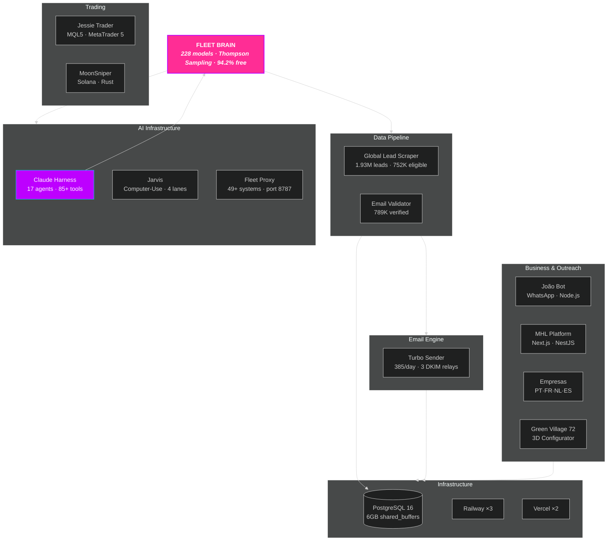

<div align="center">


<a href="https://git.io/typing-svg"></a>

<br/>


&nbsp;

&nbsp;

&nbsp;

&nbsp;

&nbsp;


</div>

---

<!-- IDENTITY + TECH ARSENAL -->

<table>
<tr>
<td width="42%" valign="top">

<div align="center">
 <b>SYSTEM CONFIGURATION</b>
</div>

```properties
# /etc/architect.conf — v12

[identity]
name      = Matheus Agueda
class     = Systems Architect & AI Engineer
scope     = PT · FR · NL · ES
style     = git push main → production

[scale]
systems   = 12 production services
ai_models = 228 (179 alive, 94.2% free)
leads     = 1,930,000 processed
emails    = 385/day × 3 DKIM relays
agents    = 17 specialized AI agents
tools     = 85+ MCP · 40 skills

[compute]
local     = M4 Pro 14-core · 24 GB unified
database  = PostgreSQL 16 · 6 GB shared_buffers
cloud     = Railway ×3 · Vercel ×2 · CF ×2
```

</td>
<td width="58%" valign="top">

<div align="center">
 <b>TECH ARSENAL</b>
<br/><br/>

<br/>
<sub><kbd>LANGUAGES</kbd></sub>
<br/><br/>

<br/>
<sub><kbd>BACKEND</kbd></sub>
<br/><br/>

<br/>
<sub><kbd>FRONTEND</kbd></sub>
<br/><br/>

<br/>
<sub><kbd>INFRASTRUCTURE</kbd></sub>
<br/><br/>

<br/>
<sub><kbd>DEVOPS & DEPLOY</kbd></sub>

</div>

</td>
</tr>
</table>

<!-- TROPHIES + STATS -->
<div align="center">

</div>

<div align="center">
<table>
<tr>
<td width="50%">

</td>
<td width="50%">

</td>
</tr>
</table>
</div>


<!-- CUSTOM SVGs -->

<div align="center">

##  Live Dashboard


</div>


<div align="center">

##  Skills Radar


</div>


<!-- 3D CONTRIBUTION + SNAKE -->

<div align="center">

##  3D Contribution Map

<picture>
  <source media="(prefers-color-scheme: dark)" srcset="./profile-3d-contrib/profile-night-rainbow.svg" />
  <source media="(prefers-color-scheme: light)" srcset="./profile-3d-contrib/profile-green-animate.svg" />
  
</picture>

</div>


<div align="center">

##  Contribution Snake

<picture>
  <source media="(prefers-color-scheme: dark)" srcset="https://raw.githubusercontent.com/MatheusAgueda/MatheusAgueda/output/github-snake-dark.svg" />
  <source media="(prefers-color-scheme: light)" srcset="https://raw.githubusercontent.com/MatheusAgueda/MatheusAgueda/output/github-snake.svg" />
  
</picture>

</div>


<!-- SYSTEM ARCHITECTURE — ONE clean diagram -->

##  System Architecture


```mermaid
%%{init: {'theme': 'dark'}}%%

graph TB
    FLEET["FLEET BRAIN<br/><i>228 models · Thompson Sampling · 94.2% free</i>"]

    subgraph DATA["Data Pipeline"]
        GLS["Global Lead Scraper<br/>1.93M leads · 752K eligible"]
        VALID["Email Validator<br/>789K verified"]
    end

    subgraph MAIL["Email Engine"]
        TURBO["Turbo Sender<br/>385/day · 3 DKIM relays"]
    end

    subgraph BUSINESS["Business & Outreach"]
        JOAO["João Bot<br/>WhatsApp · Node.js"]
        MHL["MHL Platform<br/>Next.js · NestJS"]
        EMP["Empresas<br/>PT·FR·NL·ES"]
        GV72["Green Village 72<br/>3D Configurator"]
    end

    subgraph TRADE["Trading"]
        JESSIE["Jessie Trader<br/>MQL5 · MetaTrader 5"]
        MOON["MoonSniper<br/>Solana · Rust"]
    end

    subgraph AI["AI Infrastructure"]
        HARNESS["Claude Harness<br/>17 agents · 85+ tools"]
        JARVIS["Jarvis<br/>Computer-Use · 4 lanes"]
        PROXY["Fleet Proxy<br/>49+ systems · port 8787"]
    end

    subgraph INFRA["Infrastructure"]
        PG[("PostgreSQL 16<br/>6GB shared_buffers")]
        RW["Railway ×3"]
        VC["Vercel ×2"]
    end

    FLEET --> DATA
    FLEET --> AI
    DATA --> MAIL
    DATA --> PG
    MAIL --> INFRA
    BUSINESS --> INFRA
    HARNESS --> FLEET

    style FLEET fill:#FF2D95,stroke:#BD00FF,color:#fff,font-weight:bold,stroke-width:2px
    style HARNESS fill:#BD00FF,stroke:#00D4FF,color:#fff
```


<!-- PRODUCTION SYSTEMS -->

##  Production Systems

<table>
<tr>
<td align="center" width="25%">


<br/><sub><b>AI Model Router</b></sub><br/>
<sub>228 models · 94.2% free routing</sub><br/>


</td>
<td align="center" width="25%">


<br/><sub><b>B2B Lead Engine</b></sub><br/>
<sub>1.93M leads · 789K emails verified</sub><br/>


</td>
<td align="center" width="25%">


<br/><sub><b>WhatsApp Automation</b></sub><br/>
<sub>Node.js · Baileys · Railway</sub><br/>


</td>
<td align="center" width="25%">


<br/><sub><b>Business Website</b></sub><br/>
<sub>Next.js 15 · NestJS · Prisma</sub><br/>


</td>
</tr>
<tr>
<td align="center">


<br/><sub><b>Self-Improving AI</b></sub><br/>
<sub>17 agents · 85+ tools · 40 skills</sub><br/>


</td>
<td align="center">


<br/><sub><b>Algo Trading</b></sub><br/>
<sub>MQL5 · MetaTrader 5 · Live</sub><br/>


</td>
<td align="center">


<br/><sub><b>Solana Trading</b></sub><br/>
<sub>Rust · Mempool · Token launch</sub><br/>


</td>
<td align="center">


<br/><sub><b>Multi-Country Ops</b></sub><br/>
<sub>PT·FR·NL·ES portal automation</sub><br/>


</td>
</tr>
<tr>
<td align="center">


<br/><sub><b>3D Configurator</b></sub><br/>
<sub>Three.js · Interactive · Live</sub><br/>


</td>
<td align="center">


<br/><sub><b>Computer-Use Stack</b></sub><br/>
<sub>4 lanes · 17 cognitive modules</sub><br/>


</td>
<td align="center">


<br/><sub><b>Unified API</b></sub><br/>
<sub>49+ systems · Intelligence hub</sub><br/>


</td>
<td align="center">


<br/><sub><b>Sports Analytics</b></sub><br/>
<sub>FastAPI · ML predictions</sub><br/>


</td>
</tr>
</table>


<!-- GITHUB ANALYTICS -->

##  GitHub Analytics

<div align="center">


</div>

<div align="center">


</div>

<div align="center">


</div>

<div align="center">


</div>


<!-- OPERATIONS MAP -->

##  Operations Map — 4 Countries

```geojson
{
  "type": "FeatureCollection",
  "features": [
    {
      "type": "Feature",
      "properties": {
        "name": "Portugal — Green Village Mobile Homes",
        "description": "HQ · Mobile home sales & logistics · 1.93M leads",
        "marker-color": "#FF2D95",
        "marker-size": "large",
        "marker-symbol": "commercial"
      },
      "geometry": { "type": "Point", "coordinates": [-8.61, 41.15] }
    },
    {
      "type": "Feature",
      "properties": {
        "name": "France — Easystart Office",
        "description": "Company formation · INPI/URSSAF automation",
        "marker-color": "#BD00FF",
        "marker-size": "large",
        "marker-symbol": "town-hall"
      },
      "geometry": { "type": "Point", "coordinates": [2.35, 48.86] }
    },
    {
      "type": "Feature",
      "properties": {
        "name": "Netherlands — EU Operations",
        "description": "Cross-border coordination · KVK · VAT VIES",
        "marker-color": "#00D4FF",
        "marker-size": "large",
        "marker-symbol": "embassy"
      },
      "geometry": { "type": "Point", "coordinates": [4.90, 52.37] }
    },
    {
      "type": "Feature",
      "properties": {
        "name": "Spain — Market Expansion",
        "description": "Dealer network · Lead generation · CRM",
        "marker-color": "#FF2D95",
        "marker-size": "large",
        "marker-symbol": "rocket"
      },
      "geometry": { "type": "Point", "coordinates": [-3.70, 40.42] }
    },
    {
      "type": "Feature",
      "properties": {
        "name": "Lead Coverage — 48 Countries",
        "stroke": "#BD00FF",
        "stroke-width": 2,
        "stroke-opacity": 0.6,
        "fill": "#BD00FF",
        "fill-opacity": 0.08
      },
      "geometry": {
        "type": "Polygon",
        "coordinates": [[[-10, 35], [30, 35], [30, 58], [-10, 58], [-10, 35]]]
      }
    }
  ]
}
```


<!-- CHESS -->

##  Play Chess Against Me

<div align="center">

**Make a move by opening a [new issue](https://github.com/MatheusAgueda/MatheusAgueda/issues/new?template=chess-move.yml)!**

| | a | b | c | d | e | f | g | h |
|:--|:-:|:-:|:-:|:-:|:-:|:-:|:-:|:-:|
| **8** | r | n | b | q | k | b | n | r |
| **7** | p | p | p | p | p | p | p | p |
| **6** | . | . | . | . | . | . | . | . |
| **5** | . | . | . | . | . | . | . | . |
| **4** | . | . | . | . | . | . | . | . |
| **3** | . | . | . | . | . | . | . | . |
| **2** | P | P | P | P | P | P | P | P |
| **1** | R | N | B | Q | K | B | N | R |

<a href="https://github.com/MatheusAgueda/MatheusAgueda/issues/new?template=chess-move.yml&title=chess%7Ce2e4"></a>
&nbsp;
<a href="https://github.com/MatheusAgueda/MatheusAgueda/issues/new?template=chess-move.yml&title=chess%7CNf3"></a>
&nbsp;
<a href="https://github.com/MatheusAgueda/MatheusAgueda/issues/new?template=chess-move.yml&title=chess%7Cd2d4"></a>

</div>


<!-- METRICS -->

<div align="center">


</div>

<div align="center">


</div>

<!-- RECENT ACTIVITY -->

##  Recent Activity

<!--START_SECTION:activity-->
1. Pushed commits to repositories
<!--END_SECTION:activity-->

---

<!-- SYSTEM STATUS -->

<div align="center">

```diff
@@                    SYSTEM STATUS                    @@
+ 12 production systems operational
+ 228 AI models · 179 alive · 94.2% free routing
+ 1.93M leads · 385 emails/day · 3 DKIM relays
+ 4 countries · PT · FR · NL · ES
+ 17 AI agents · 85+ tools · 40 skills
- 0 systems down
```

</div>

---

<!-- FOOTER -->

<div align="center">


&nbsp;

&nbsp;

&nbsp;


<br/><br/>

<a href="mailto:info@greenvillagemobilehomes.com"></a>
&nbsp;
<a href="https://www.greenvillagemobilehomes.com"></a>
&nbsp;
<a href="https://github.com/MatheusAgueda"></a>

</div>

<br/>


