<div align="center">

<!-- ╔══════════════════════════════════════════════════════════════════════════╗ -->
<!-- ║                          ANIMATED HEADER                                ║ -->
<!-- ╚══════════════════════════════════════════════════════════════════════════╝ -->


<!-- CUSTOM ANIMATED SVG — CSS @keyframes, neon glow, scan lines, 13 animations -->


<!-- TYPING SVG — 4 rotating lines -->
<a href="https://git.io/typing-svg"></a>

<br/>

<!-- METRIC BADGES -->

&nbsp;

&nbsp;

&nbsp;

&nbsp;

&nbsp;


</div>

<!-- GRADIENT DIVIDER -->


<!-- ╔══════════════════════════════════════════════════════════════════════════╗ -->
<!-- ║                     IDENTITY + TECH ARSENAL                             ║ -->
<!-- ╚══════════════════════════════════════════════════════════════════════════╝ -->

<table>
<tr>
<td width="42%" valign="top">

<div align="center">
 <b>SYSTEM CONFIGURATION</b>
</div>

```properties
# /etc/architect.conf — v9.4

[identity]
name      = Matheus Agueda
class     = Systems Architect & Security Researcher
scope     = PT · FR · NL · ES
style     = git push main → production
uptime    = 99.7% across 9 services

[scale]
systems   = 9 production services
agents    = 32 AI (Claude Opus 4.6)
leads     = 1,930,000 processed
emails    = 385/day × 3 DKIM relays
countries = 4 active business entities
tools     = 230+ MCP · 39 CLI · 800+ skills

[compute]
local     = M4 Pro 14-core · 24 GB unified
gpu       = Metal (Apple Silicon) · ECDSA accel
database  = PostgreSQL 16 · 6 GB shared_buffers
cloud     = Railway ×3 · Vercel ×2 · CF ×2

[security]
platform  = CIA Einstein (Python + C + Metal)
scanning  = semgrep · nuclei · nikto · nmap
crypto    = ECDSA lattice · brainwallet · GPU
redteam   = garak · promptfoo · LLM jailbreak
offensive = 39 CLI tools · 10 MCP servers
```

</td>
<td width="58%" valign="top">

<div align="center">
 <b>TECH ARSENAL</b>
<br/><br/>

<!-- Languages -->
<br/>
<sub><kbd>LANGUAGES</kbd></sub>
<br/><br/>

<!-- Backend -->
<br/>
<sub><kbd>BACKEND</kbd></sub>
<br/><br/>

<!-- Frontend -->
<br/>
<sub><kbd>FRONTEND</kbd></sub>
<br/><br/>

<!-- Infrastructure -->
<br/>
<sub><kbd>INFRASTRUCTURE</kbd></sub>
<br/><br/>

<!-- DevOps & Tools -->
<br/>
<sub><kbd>DEVOPS & TOOLS</kbd></sub>
<br/><br/>

<!-- Deploy & Monitoring -->
<br/>
<sub><kbd>DEPLOY & MONITORING</kbd></sub>

</div>

</td>
</tr>
</table>

<!-- TROPHIES -->
<div align="center">

</div>

<!-- GRADIENT DIVIDER -->


<!-- ╔══════════════════════════════════════════════════════════════════════════╗ -->
<!-- ║                      3D CONTRIBUTION CALENDAR                           ║ -->
<!-- ╚══════════════════════════════════════════════════════════════════════════╝ -->

<div align="center">

##  3D Contribution Map

<picture>
  <source media="(prefers-color-scheme: dark)" srcset="./profile-3d-contrib/profile-night-rainbow.svg" />
  <source media="(prefers-color-scheme: light)" srcset="./profile-3d-contrib/profile-green-animate.svg" />
  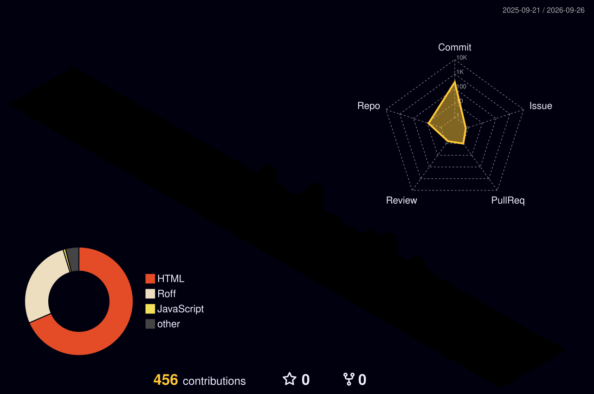
</picture>

<table>
<tr>
<td align="center" width="50%">
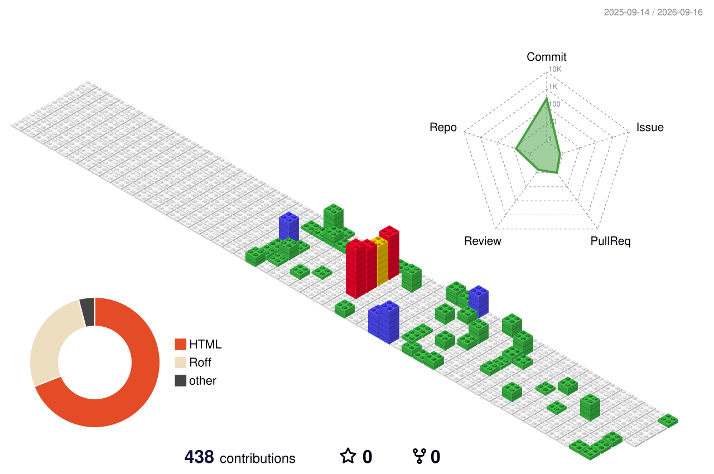
<sub><kbd>GITBLOCK VIEW</kbd></sub>
</td>
<td align="center" width="50%">
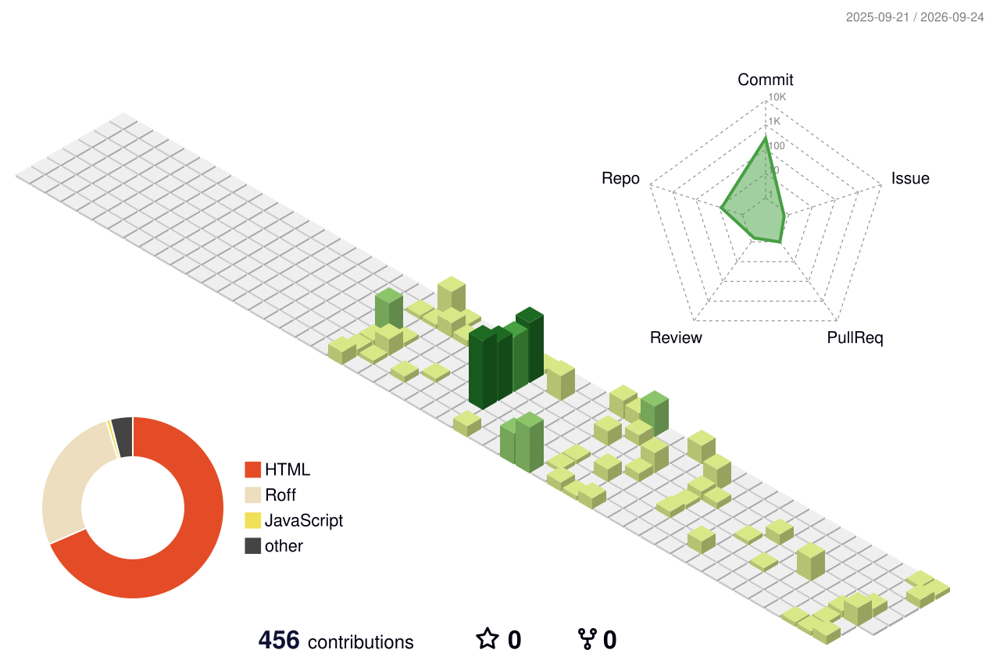
<sub><kbd>ISOMETRIC ANIMATED</kbd></sub>
</td>
</tr>
</table>

</div>

<!-- GRADIENT DIVIDER -->


<!-- ╔══════════════════════════════════════════════════════════════════════════╗ -->
<!-- ║                        CONTRIBUTION SNAKE                               ║ -->
<!-- ╚══════════════════════════════════════════════════════════════════════════╝ -->

<div align="center">

##  Contribution Snake

<picture>
  <source media="(prefers-color-scheme: dark)" srcset="https://raw.githubusercontent.com/MatheusAgueda/MatheusAgueda/output/github-snake-dark.svg" />
  <source media="(prefers-color-scheme: light)" srcset="https://raw.githubusercontent.com/MatheusAgueda/MatheusAgueda/output/github-snake.svg" />
  
</picture>

</div>

<!-- GRADIENT DIVIDER -->


<!-- ╔══════════════════════════════════════════════════════════════════════════╗ -->
<!-- ║                       SYSTEM ARCHITECTURE                               ║ -->
<!-- ║                     Mermaid Flowchart — Full Stack                       ║ -->
<!-- ╚══════════════════════════════════════════════════════════════════════════╝ -->

##  System Architecture

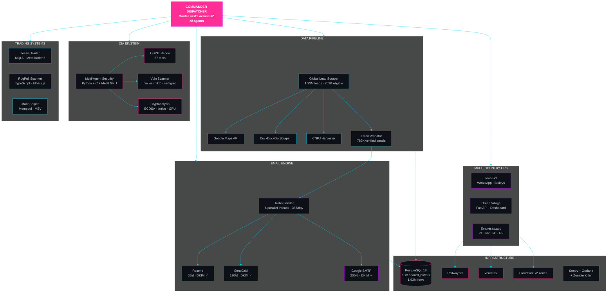
```mermaid
%%{init: {'theme': 'dark', 'themeVariables': { 'primaryColor': '#FF2D95', 'primaryTextColor': '#fff', 'primaryBorderColor': '#BD00FF', 'lineColor': '#00D4FF', 'secondaryColor': '#1a1a2e', 'tertiaryColor': '#16213e'}}}%%

graph TB
    CMD["COMMANDER DISPATCHER<br/><i>Routes tasks across 32 AI agents</i>"]

    subgraph DATA["DATA PIPELINE"]
        GLS["Global Lead Scraper<br/>1.93M leads · 752K eligible"]
        MAPS["Google Maps API"]
        DDG["DuckDuckGo Scraper"]
        CNPJ["CNPJ Harvester"]
        VALID["Email Validator<br/>789K verified emails"]
    end

    subgraph MAIL["EMAIL ENGINE"]
        TURBO["Turbo Sender<br/>6 parallel threads · 385/day"]
        R1["Resend<br/>65/d · DKIM ✓"]
        R2["SendGrid<br/>120/d · DKIM ✓"]
        R3["Google SMTP<br/>200/d · DKIM ✓"]
    end

    subgraph SEC["CIA EINSTEIN"]
        CIA["Multi-Agent Security<br/>Python + C + Metal GPU"]
        OSINT["OSINT Recon<br/>37 tools"]
        VULN["Vuln Scanner<br/>nuclei · nikto · semgrep"]
        CRYPTO["Cryptanalysis<br/>ECDSA · lattice · GPU"]
    end

    subgraph TRADE["TRADING SYSTEMS"]
        JESSIE["Jessie Trader<br/>MQL5 · MetaTrader 5"]
        RUG["RugPull Scanner<br/>TypeScript · Ethers.js"]
        MOON["MoonSniper<br/>Mempool · MEV"]
    end

    subgraph BIZ["MULTI-COUNTRY OPS"]
        JOAO["Joao Bot<br/>WhatsApp · Baileys"]
        GV["Green Village<br/>FastAPI · Dashboard"]
        EMP["Empresas.app<br/>PT · FR · NL · ES"]
    end

    subgraph INFRA["INFRASTRUCTURE"]
        PG[("PostgreSQL 16<br/>6GB shared_buffers<br/>1.93M rows")]
        RW["Railway x3"]
        VC["Vercel x2"]
        CF["Cloudflare x2 zones"]
        MON["Sentry + Grafana<br/>+ Zombie Killer"]
    end

    CMD --> DATA
    CMD --> MAIL
    CMD --> SEC
    CMD --> TRADE
    CMD --> BIZ

    GLS --> MAPS
    GLS --> DDG
    GLS --> CNPJ
    GLS --> VALID
    VALID --> TURBO
    TURBO --> R1
    TURBO --> R2
    TURBO --> R3

    CIA --> OSINT
    CIA --> VULN
    CIA --> CRYPTO

    DATA --> PG
    MAIL --> PG
    BIZ --> RW
    BIZ --> VC
    BIZ --> CF

    classDef cmd fill:#FF2D95,stroke:#BD00FF,color:#fff,font-weight:bold
    classDef pipeline fill:#0d1117,stroke:#00D4FF,color:#c9d1d9
    classDef email fill:#0d1117,stroke:#BD00FF,color:#c9d1d9
    classDef security fill:#0d1117,stroke:#FF2D95,color:#c9d1d9
    classDef trading fill:#0d1117,stroke:#00D4FF,color:#c9d1d9
    classDef business fill:#0d1117,stroke:#BD00FF,color:#c9d1d9
    classDef infra fill:#0d1117,stroke:#FF2D95,color:#c9d1d9

    class CMD cmd
    class GLS,MAPS,DDG,CNPJ,VALID pipeline
    class TURBO,R1,R2,R3 email
    class CIA,OSINT,VULN,CRYPTO security
    class JESSIE,RUG,MOON trading
    class JOAO,GV,EMP business
    class PG,RW,VC,CF,MON infra
```

> [!NOTE]
> **32 AI agents** coordinate via Claude Code MCP protocol with **230+ tools** across **10 servers**. The Commander Dispatcher routes tasks to specialized subagents based on context — no manual assignment. Leads flow from scraping → validation → email delivery while CIA Einstein monitors security across the entire stack.

<!-- GRADIENT DIVIDER -->


<!-- ╔══════════════════════════════════════════════════════════════════════════╗ -->
<!-- ║                      EMAIL PIPELINE FLOW                                ║ -->
<!-- ║                   Mermaid Sequence Diagram                               ║ -->
<!-- ╚══════════════════════════════════════════════════════════════════════════╝ -->

##  Email Delivery Pipeline

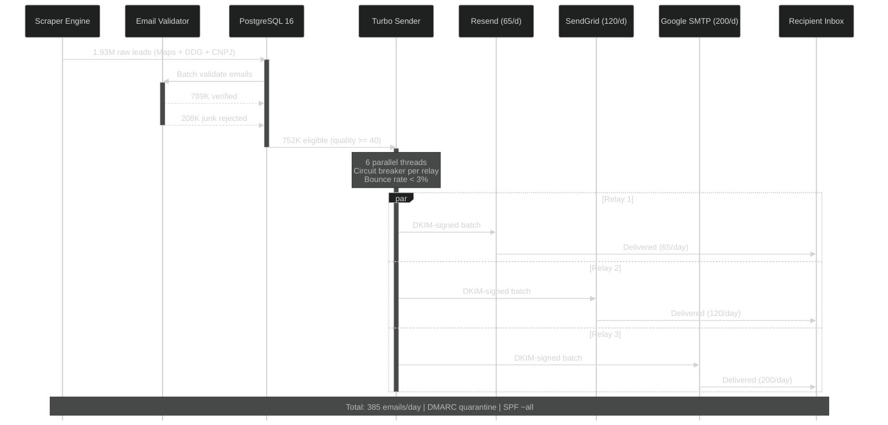
```mermaid
%%{init: {'theme': 'dark', 'sequence': {'actorFontSize': 14, 'messageFontSize': 12, 'mirrorActors': false}}}%%

sequenceDiagram
    participant SC as Scraper Engine
    participant VA as Email Validator
    participant DB as PostgreSQL 16
    participant TS as Turbo Sender
    participant R1 as Resend (65/d)
    participant R2 as SendGrid (120/d)
    participant R3 as Google SMTP (200/d)
    participant IN as Recipient Inbox

    SC->>DB: 1.93M raw leads (Maps + DDG + CNPJ)
    activate DB
    DB->>VA: Batch validate emails
    activate VA
    VA-->>DB: 789K verified
    VA-->>DB: 208K junk rejected
    deactivate VA
    DB->>TS: 752K eligible (quality >= 40)
    deactivate DB
    activate TS
    Note over TS: 6 parallel threads<br/>Circuit breaker per relay<br/>Bounce rate < 3%
    par Relay 1
        TS->>R1: DKIM-signed batch
        R1->>IN: Delivered (65/day)
    and Relay 2
        TS->>R2: DKIM-signed batch
        R2->>IN: Delivered (120/day)
    and Relay 3
        TS->>R3: DKIM-signed batch
        R3->>IN: Delivered (200/day)
    end
    deactivate TS
    Note over SC,IN: Total: 385 emails/day | DMARC quarantine | SPF ~all
```

<!-- GRADIENT DIVIDER -->


<!-- ╔══════════════════════════════════════════════════════════════════════════╗ -->
<!-- ║                       LEAD LIFECYCLE                                     ║ -->
<!-- ║                    Mermaid State Diagram                                 ║ -->
<!-- ╚══════════════════════════════════════════════════════════════════════════╝ -->

##  Lead Lifecycle

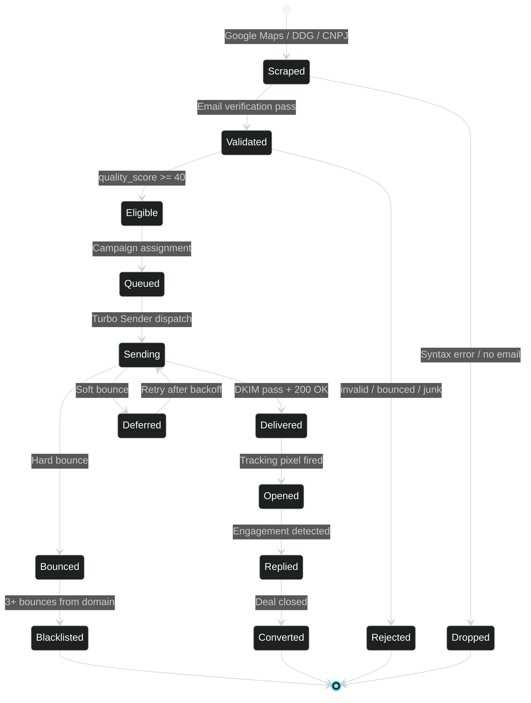
```mermaid
%%{init: {'theme': 'dark', 'themeVariables': {'primaryColor': '#FF2D95', 'primaryTextColor': '#ffffff', 'primaryBorderColor': '#BD00FF', 'lineColor': '#00D4FF'}}}%%

stateDiagram-v2
    [*] --> Scraped: Google Maps / DDG / CNPJ

    Scraped --> Validated: Email verification pass
    Scraped --> Dropped: Syntax error / no email

    Validated --> Eligible: quality_score >= 40
    Validated --> Rejected: invalid / bounced / junk

    Eligible --> Queued: Campaign assignment
    Queued --> Sending: Turbo Sender dispatch

    Sending --> Delivered: DKIM pass + 200 OK
    Sending --> Bounced: Hard bounce
    Sending --> Deferred: Soft bounce

    Deferred --> Sending: Retry after backoff

    Delivered --> Opened: Tracking pixel fired
    Opened --> Replied: Engagement detected

    Replied --> Converted: Deal closed

    Bounced --> Blacklisted: 3+ bounces from domain

    Blacklisted --> [*]
    Converted --> [*]
    Rejected --> [*]
    Dropped --> [*]
```

<div align="center">

<!-- Side-by-side: Pie Chart + Journey Diagram -->
<table>
<tr>
<td width="50%" valign="top">

### Tech Distribution

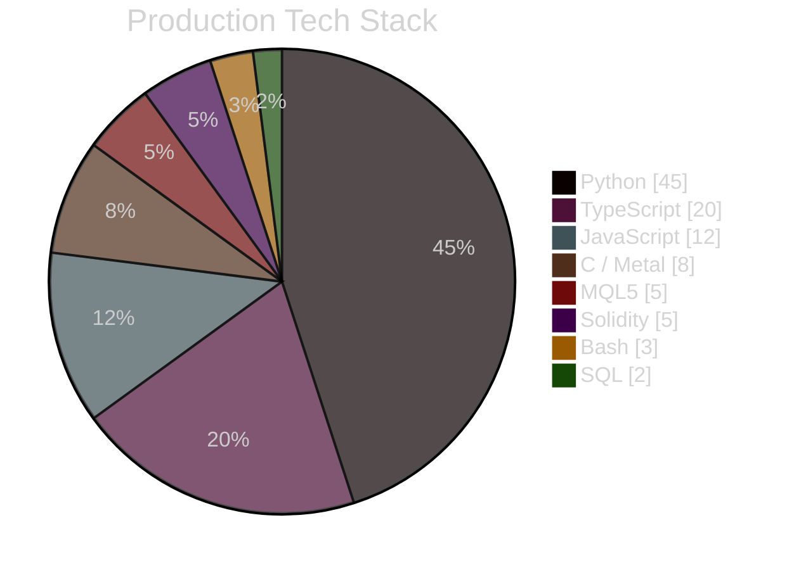
```mermaid
%%{init: {'theme': 'dark'}}%%
pie showData
    title Production Tech Stack
    "Python" : 45
    "TypeScript" : 20
    "JavaScript" : 12
    "C / Metal" : 8
    "MQL5" : 5
    "Solidity" : 5
    "Bash" : 3
    "SQL" : 2
```

</td>
<td width="50%" valign="top">

### Lead Pipeline Stages

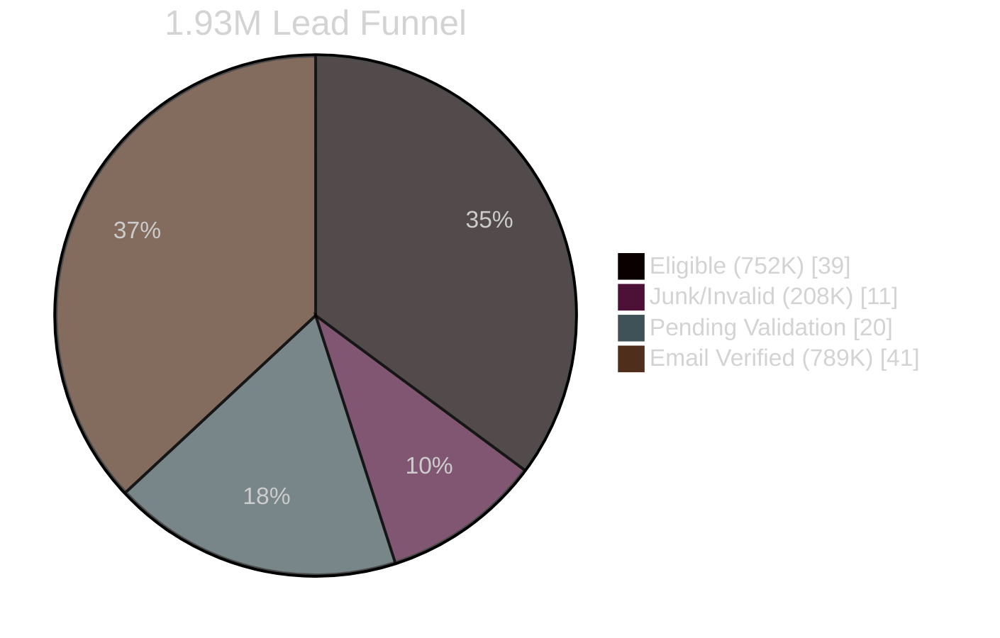
```mermaid
%%{init: {'theme': 'dark'}}%%
pie showData
    title 1.93M Lead Funnel
    "Eligible (752K)" : 39
    "Junk/Invalid (208K)" : 11
    "Pending Validation" : 20
    "Email Verified (789K)" : 41
```

<!-- NOTE: percentages are approximate representations -->

</td>
</tr>
</table>

</div>

<!-- GRADIENT DIVIDER -->


<!-- ╔══════════════════════════════════════════════════════════════════════════╗ -->
<!-- ║                      FEATURED CODE                                      ║ -->
<!-- ║             Real snippets from production systems                        ║ -->
<!-- ╚══════════════════════════════════════════════════════════════════════════╝ -->

##  Featured Code

<table>
<tr>
<td width="50%" valign="top">

**Turbo Sender** — 6-thread parallel email dispatch

```python
# Python 3.14 · asyncio · circuit breaker per relay
from __future__ import annotations

async def dispatch_campaign(campaign_id: int) -> BatchResult:
    leads = await db.fetch_eligible(
        campaign_id, limit=385
    )
    pool = CircuitBreakerPool(
        [resend, sendgrid, gsmtp],
        max_fail=5, reset_after=3600
    )
    async with TaskGroup() as tg:
        for chunk in partition(leads, size=6):
            tg.create_task(
                pool.send_batch(chunk, dkim=True)
            )
    return BatchResult(
        sent=len(leads),
        bounced=pool.bounced,
        rate=pool.bounce_rate
    )
```

</td>
<td width="50%" valign="top">

**CIA Einstein** — Metal GPU ECDSA point multiplication

```c
// Apple Silicon · Metal Compute Shader
kernel void ec_point_mul(
    device const uint256_t* scalars [[buffer(0)]],
    device const ECPoint*   bases   [[buffer(1)]],
    device ECPoint*         results [[buffer(2)]],
    uint tid [[thread_position_in_grid]]
) {
    ECPoint R = EC_INFINITY;
    uint256_t k = scalars[tid];
    ECPoint P = bases[tid];

    for (int i = 255; i >= 0; i--) {
        R = ec_double(R);
        if (bit_at(k, i))
            R = ec_add(R, P);
    }
    results[tid] = R;
}
```

</td>
</tr>
<tr>
<td width="50%" valign="top">

**Jessie Trader** — Multi-timeframe confluence entry

```c
// MQL5 · MetaTrader 5 · Live execution
void OnTick() {
    if (!IsNewBar(PERIOD_H1)) return;

    double ema_fast = iMA(
        _Symbol, PERIOD_H1, 21, 0,
        MODE_EMA, PRICE_CLOSE
    );
    double ema_slow = iMA(
        _Symbol, PERIOD_H4, 50, 0,
        MODE_EMA, PRICE_CLOSE
    );
    double rsi = iRSI(
        _Symbol, PERIOD_H1, 14, PRICE_CLOSE
    );

    if (ema_fast > ema_slow
        && rsi < 30.0
        && ConfirmOnM15())
        ExecuteEntry(
            ORDER_TYPE_BUY,
            CalcLotSize(1.5)
        );
}
```

</td>
<td width="50%" valign="top">

**RugPull Scanner** — Honeypot detection via simulation

```solidity
// Solidity · Ethers.js · On-chain analysis
function simulateSell(
    address token,
    uint256 amount
) external returns (bool) {
    IERC20(token).approve(
        address(router), amount
    );

    address[] memory path = new address[](2);
    path[0] = token;
    path[1] = WETH;

    try router.swapExactTokensForETH(
        amount, 0, path,
        address(this),
        block.timestamp + 60
    ) returns (uint256[] memory amounts) {
        // Can sell = not a honeypot
        return amounts[1] > 0;
    } catch {
        // Sell reverted = HONEYPOT DETECTED
        return false;
    }
}
```

</td>
</tr>
</table>

<!-- GRADIENT DIVIDER -->


<!-- ╔══════════════════════════════════════════════════════════════════════════╗ -->
<!-- ║                        PRODUCTION SYSTEMS                               ║ -->
<!-- ╚══════════════════════════════════════════════════════════════════════════╝ -->

##  Production Systems

<table>
<tr>
<td align="center" width="33%">


<br/><sub><b>Lead Generation Engine</b></sub><br/>
<sub>1.93M leads · 752K eligible · 789K emails</sub><br/>


</td>
<td align="center" width="33%">


<br/><sub><b>AI Security Research Platform</b></sub><br/>
<sub>Python + C + Metal GPU · Multi-agent</sub><br/>


</td>
<td align="center" width="33%">


<br/><sub><b>WhatsApp Automation Platform</b></sub><br/>
<sub>Node.js · Baileys · Railway</sub><br/>


</td>
</tr>
<tr>
<td align="center">


<br/><sub><b>Algorithmic Trading</b></sub><br/>
<sub>MQL5 · MetaTrader 5 · Live execution</sub><br/>


</td>
<td align="center">


<br/><sub><b>Business Platform</b></sub><br/>
<sub>FastAPI · Dashboard · Calculator · Ads</sub><br/>


</td>
<td align="center">


<br/><sub><b>Anti-Detect Browser Fleet</b></sub><br/>
<sub>Next.js · Cloud Profiles · API</sub><br/>


</td>
</tr>
<tr>
<td align="center">


<br/><sub><b>DeFi Security Scanner</b></sub><br/>
<sub>TypeScript · On-chain · Honeypot detect</sub><br/>


</td>
<td align="center">


<br/><sub><b>Token Launch Sniper</b></sub><br/>
<sub>Python · Mempool · MEV strategies</sub><br/>


</td>
<td align="center">


<br/><sub><b>Multi-Country Company Ops</b></sub><br/>
<sub>PT · FR · NL · ES portal automation</sub><br/>


</td>
</tr>
</table>

<!-- INFRASTRUCTURE TABLE -->

<div align="center">

```
┌──────────────────────────────────────────────────────────────────────────────────┐
│                            PRODUCTION INFRASTRUCTURE                              │
├───────────────────┬──────────────────────────────────────────────────────────────┤
│ Compute           │ Railway (3 svcs) · Vercel (2 apps) · M4 Pro 14-core (local) │
│ Database          │ PostgreSQL 16 — 1.93M rows · 6GB shared_buffers · GIN+BRIN  │
│ Email Delivery    │ 3 DKIM relays — Resend + SendGrid + GSMTP = 385/day         │
│ Monitoring        │ Sentry · Grafana · Custom health daemons · Zombie Killer     │
│ CI/CD             │ GitHub Actions (4 workflows) · git push = auto-deploy        │
│ DNS & CDN         │ Cloudflare (2 zones) · UOL Host · DMARC quarantine           │
│ Security          │ SPF ~all · DKIM verified · rate limiting · WAF · CSP         │
│ AI Agents         │ 32 specialized · Claude Opus 4.6 · 230+ MCP tools            │
│ Automation        │ Playwright fleet · cron pipelines · webhook triggers          │
│ Trading           │ MetaTrader 5 · Live algo execution · Mempool monitoring      │
│ Blockchain        │ On-chain analysis · MEV · Honeypot detection · DeFi          │
│ Browser Fleet     │ GeeLark anti-detect · Stealth Playwright · Chrome CDP        │
│ Offensive         │ 39 CLI tools · 10 MCP servers · garak · promptfoo            │
└───────────────────┴──────────────────────────────────────────────────────────────┘
```

</div>

<!-- GRADIENT DIVIDER -->


<!-- ╔══════════════════════════════════════════════════════════════════════════╗ -->
<!-- ║                         GITHUB ANALYTICS                                ║ -->
<!-- ╚══════════════════════════════════════════════════════════════════════════╝ -->

##  GitHub Analytics

<div align="center">

<!-- Streak + Isocalendar -->


</div>

<div align="center">

<!-- Activity Graph — full width -->


</div>

<div align="center">

<!-- Profile Summary Cards -->
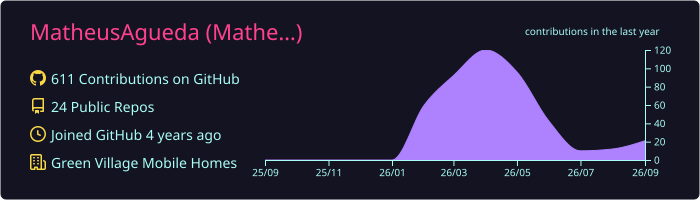

</div>

<div align="center">

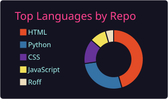
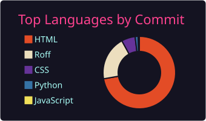
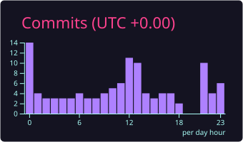

</div>

<!-- GRADIENT DIVIDER -->


<!-- ╔══════════════════════════════════════════════════════════════════════════╗ -->
<!-- ║                          METRICS DEEP DIVE                              ║ -->
<!-- ╚══════════════════════════════════════════════════════════════════════════╝ -->

##  Metrics Deep Dive

<div align="center">


</div>

<div align="center">


</div>

<div align="center">


</div>

<div align="center">


</div>

<!-- GRADIENT DIVIDER -->


<!-- ╔══════════════════════════════════════════════════════════════════════════╗ -->
<!-- ║                     AI AGENT ARCHITECTURE                                ║ -->
<!-- ╚══════════════════════════════════════════════════════════════════════════╝ -->

##  AI Agent Architecture

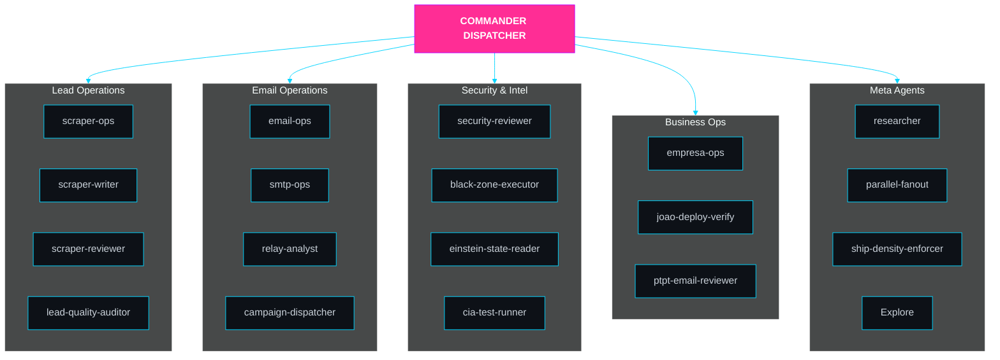
```mermaid
%%{init: {'theme': 'dark', 'themeVariables': {'primaryColor': '#FF2D95', 'primaryTextColor': '#fff', 'primaryBorderColor': '#BD00FF', 'lineColor': '#00D4FF'}}}%%

graph TD
    CMD["COMMANDER DISPATCHER"]

    subgraph SCRAPING["Lead Operations"]
        SO["scraper-ops"]
        SW["scraper-writer"]
        SR["scraper-reviewer"]
        LQ["lead-quality-auditor"]
    end

    subgraph EMAIL["Email Operations"]
        EO["email-ops"]
        SM["smtp-ops"]
        RA["relay-analyst"]
        CD["campaign-dispatcher"]
    end

    subgraph SECURITY["Security & Intel"]
        SV["security-reviewer"]
        BZ["black-zone-executor"]
        ER["einstein-state-reader"]
        CT["cia-test-runner"]
    end

    subgraph BUSINESS["Business Ops"]
        EP["empresa-ops"]
        JD["joao-deploy-verify"]
        PT["ptpt-email-reviewer"]
    end

    subgraph META["Meta Agents"]
        RS["researcher"]
        PF["parallel-fanout"]
        SD["ship-density-enforcer"]
        EX["Explore"]
    end

    CMD --> SCRAPING
    CMD --> EMAIL
    CMD --> SECURITY
    CMD --> BUSINESS
    CMD --> META

    classDef commander fill:#FF2D95,stroke:#BD00FF,color:#fff,font-weight:bold
    classDef ops fill:#0d1117,stroke:#00D4FF,color:#c9d1d9
    class CMD commander
    class SO,SW,SR,LQ,EO,SM,RA,CD,SV,BZ,ER,CT,EP,JD,PT,RS,PF,SD,EX ops
```

> [!TIP]
> Each agent has isolated toolsets, specialized system prompts, and deep domain knowledge. The Commander Dispatcher automatically routes tasks across all 9 projects. Agents spawn sub-agents for parallel investigation — no human routing needed.

<!-- GRADIENT DIVIDER -->


<!-- ╔══════════════════════════════════════════════════════════════════════════╗ -->
<!-- ║                       TECH ECOSYSTEM MINDMAP                            ║ -->
<!-- ║                      Mermaid Mindmap — Full Breadth                      ║ -->
<!-- ╚══════════════════════════════════════════════════════════════════════════╝ -->

##  Tech Ecosystem

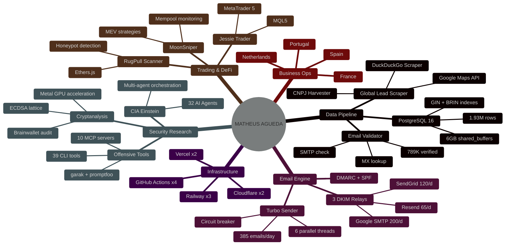
```mermaid
%%{init: {'theme': 'dark'}}%%

mindmap
  root((MATHEUS AGUEDA))
    Data Pipeline
      Global Lead Scraper
        Google Maps API
        DuckDuckGo Scraper
        CNPJ Harvester
      Email Validator
        789K verified
        SMTP check
        MX lookup
      PostgreSQL 16
        1.93M rows
        GIN + BRIN indexes
        6GB shared_buffers
    Email Engine
      Turbo Sender
        6 parallel threads
        Circuit breaker
        385 emails/day
      3 DKIM Relays
        Resend 65/d
        SendGrid 120/d
        Google SMTP 200/d
      DMARC + SPF
    Security Research
      CIA Einstein
        32 AI Agents
        Multi-agent orchestration
      Cryptanalysis
        ECDSA lattice
        Metal GPU acceleration
        Brainwallet audit
      Offensive Tools
        39 CLI tools
        10 MCP servers
        garak + promptfoo
    Trading & DeFi
      Jessie Trader
        MQL5
        MetaTrader 5
      RugPull Scanner
        Honeypot detection
        Ethers.js
      MoonSniper
        Mempool monitoring
        MEV strategies
    Business Ops
      Portugal
      France
      Netherlands
      Spain
    Infrastructure
      Railway x3
      Vercel x2
      Cloudflare x2
      GitHub Actions x4
```

<!-- GRADIENT DIVIDER -->


<!-- ╔══════════════════════════════════════════════════════════════════════════╗ -->
<!-- ║                     GEOGRAPHIC OPERATIONS MAP                            ║ -->
<!-- ║                  GeoJSON — Interactive Leaflet.js Map                    ║ -->
<!-- ╚══════════════════════════════════════════════════════════════════════════╝ -->

##  Operations Map — 4 Countries

```geojson
{
  "type": "FeatureCollection",
  "features": [
    {
      "type": "Feature",
      "properties": {
        "name": "Portugal — Green Village Mobilehomes",
        "description": "Mobile home sales & logistics · FastAPI · PostgreSQL",
        "marker-color": "#FF2D95",
        "marker-size": "large",
        "marker-symbol": "commercial"
      },
      "geometry": {
        "type": "Point",
        "coordinates": [-8.61, 41.15]
      }
    },
    {
      "type": "Feature",
      "properties": {
        "name": "France — Easystart Office",
        "description": "Company formation services · INPI/URSSAF portal automation",
        "marker-color": "#BD00FF",
        "marker-size": "large",
        "marker-symbol": "town-hall"
      },
      "geometry": {
        "type": "Point",
        "coordinates": [2.35, 48.86]
      }
    },
    {
      "type": "Feature",
      "properties": {
        "name": "Netherlands — EU Operations Hub",
        "description": "Cross-border coordination · DigiD · KVK integration",
        "marker-color": "#00D4FF",
        "marker-size": "large",
        "marker-symbol": "embassy"
      },
      "geometry": {
        "type": "Point",
        "coordinates": [4.90, 52.37]
      }
    },
    {
      "type": "Feature",
      "properties": {
        "name": "Spain — Market Expansion",
        "description": "Dealer network building · Lead scraper · CRM pipeline",
        "marker-color": "#FF2D95",
        "marker-size": "large",
        "marker-symbol": "rocket"
      },
      "geometry": {
        "type": "Point",
        "coordinates": [-3.70, 40.42]
      }
    },
    {
      "type": "Feature",
      "properties": {
        "name": "Lead Coverage — 48 Countries",
        "stroke": "#BD00FF",
        "stroke-width": 2,
        "stroke-opacity": 0.6,
        "fill": "#BD00FF",
        "fill-opacity": 0.08
      },
      "geometry": {
        "type": "Polygon",
        "coordinates": [[
          [-10, 35], [30, 35], [30, 58], [-10, 58], [-10, 35]
        ]]
      }
    }
  ]
}
```

> [!NOTE]
> Interactive map — click markers for details. Lead generation covers **48 countries** across Europe, with active business entities in **PT, FR, NL, ES**. All portal automation (tax filing, company registration, compliance) is handled by Playwright bots with government-specific session management.

<!-- GRADIENT DIVIDER -->


<!-- ╔══════════════════════════════════════════════════════════════════════════╗ -->
<!-- ║                         CI/CD PIPELINE                                  ║ -->
<!-- ║                       Mermaid Git Graph                                 ║ -->
<!-- ╚══════════════════════════════════════════════════════════════════════════╝ -->

##  CI/CD Pipeline

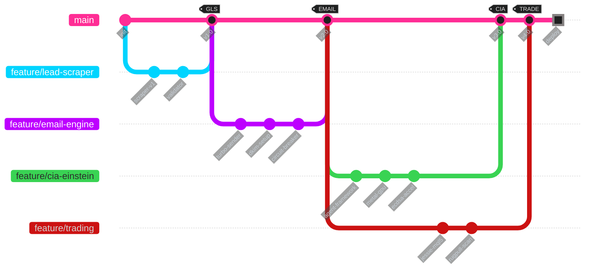
```mermaid
%%{init: {'theme': 'dark', 'themeVariables': {'git0': '#FF2D95', 'git1': '#00D4FF', 'git2': '#BD00FF', 'git3': '#39d353', 'gitBranchLabel0': '#ffffff', 'gitBranchLabel1': '#ffffff', 'gitBranchLabel2': '#ffffff', 'commitLabelColor': '#c9d1d9'}}}%%

gitGraph LR:
    commit id: "init"
    branch feature/lead-scraper
    commit id: "scraper-v1"
    commit id: "validator"
    checkout main
    merge feature/lead-scraper id: "v1.0" tag: "GLS"
    branch feature/email-engine
    commit id: "turbo-sender"
    commit id: "dkim-setup"
    commit id: "circuit-breaker"
    checkout main
    merge feature/email-engine id: "v2.0" tag: "EMAIL"
    branch feature/cia-einstein
    commit id: "agent-framework"
    commit id: "metal-gpu"
    commit id: "ecdsa-accel"
    checkout main
    branch feature/trading
    commit id: "jessie-mql5"
    commit id: "rugpull-scan"
    checkout main
    merge feature/cia-einstein id: "v3.0" tag: "CIA"
    merge feature/trading id: "v4.0" tag: "TRADE"
    commit id: "deploy" type: HIGHLIGHT
```

> `git push main` = production. 4 GitHub Actions workflows generate 3D contributions, profile cards, contribution snake, and 8 lowlighter/metrics SVGs every 12h. Zero manual deploys — Railway, Vercel, and Cloudflare auto-deploy from main branch.

<!-- GRADIENT DIVIDER -->


<!-- ╔══════════════════════════════════════════════════════════════════════════╗ -->
<!-- ║                    CRYPTOGRAPHY & SECURITY RESEARCH                      ║ -->
<!-- ╚══════════════════════════════════════════════════════════════════════════╝ -->

##  Cryptography Research

<div align="center">

Active research in elliptic curve cryptanalysis, lattice-based attacks, and GPU-accelerated key recovery on Apple Silicon (Metal).

</div>

$$y^2 \equiv x^3 + ax + b \pmod{p}, \quad p \in \mathbb{P} \quad \text{(secp256k1: } a=0, b=7\text{)}$$ [^secp256k1]

$$s = k^{-1}\bigl(H(m) + r \cdot d_A\bigr) \pmod{n} \quad \text{(ECDSA Signature)}$$

$$\lambda_1(L) = \min_{\mathbf{v} \in L \setminus \{\mathbf{0}\}} \|\mathbf{v}\| \quad \text{(Lattice SVP — NP-hard under randomized reductions)}$$ [^lattice]

$$P(\text{collision}) \approx 1 - e^{-n^2 / 2^{k+1}} \quad \text{(Birthday Attack on } k\text{-bit hash, } n \text{ samples)}$$

| Algorithm | Target | Complexity | Implementation |
|:---|:---|:---|:---|
| **Pollard's rho** | ECDLP | $O(\sqrt{n})$ | Python + C extension |
| **Baby-step Giant-step** | ECDLP | $O(\sqrt{n})$ time + space | Metal GPU parallel |
| **Lattice reduction (LLL)** | Biased nonce | Polynomial | SageMath + fpylll |
| **Bleichenbacher** | Biased ECDSA nonce | $O(2^{b})$ for $b$-bit bias | Custom C + Metal |
| **Brainwallet audit** | Weak passphrases | Dictionary | GPU-accelerated hashcat |
| **PMKID capture** | WPA2/WPA3 | $O(|dict|)$ | Aircrack-ng + hashcat |

> [!WARNING]
> All cryptographic research is conducted on **own infrastructure** against **own keys/accounts** for defensive security research and authorized penetration testing. CIA Einstein is a research platform, not an attack tool.

<!-- GRADIENT DIVIDER -->


<!-- ╔══════════════════════════════════════════════════════════════════════════╗ -->
<!-- ║                         DEPTH SECTIONS                                  ║ -->
<!-- ╚══════════════════════════════════════════════════════════════════════════╝ -->

<details>
<summary> <b>Security Research & Offensive Tooling</b></summary>
<br/>

| Domain | Tools & Techniques | Depth |
|:---|:---|:---|
| **Network** | bettercap · mitmproxy · routersploit · Wireshark · nmap · masscan | ARP spoof, MITM, router exploit |
| **WiFi** | Aircrack-ng · PMKID capture · deauth · monitor mode · WPA3-SAE | Full WPA2/WPA3 audit chain |
| **Web** | Burp Suite · SQLMap · XSS · SSRF · CSRF · session hijack | OWASP Top 10 + beyond |
| **OSINT** | Maltego · theHarvester · Shodan · breach correlation · social recon | 37 tools integrated |
| **Crypto** | ECDSA lattice · brainwallet · Pollard rho · GPU cracking | Apple Silicon Metal accel |
| **RF/SDR** | RTL-SDR · HackRF · SubGHz · NFC/RFID · GSM interception | Full spectrum analysis |
| **AI Red Team** | garak · promptfoo · LLM jailbreak · prompt injection · guardrails | Automated finding DB |
| **Mobile** | frida · objection · MVT · runtime instrumentation · APK reverse | iOS + Android |
| **Forensics** | Volatility · Autopsy · disk imaging · memory analysis · timeline | Full chain of custody |
| **Stealth** | Anti-fingerprint · TLS mimicry · residential proxies · browser spoof | NASA-grey patches |

**CIA Einstein Platform:** Multi-agent autonomous security research system. 32+ specialized agents for vulnerability discovery, OSINT correlation, breach intelligence, and threat analysis. Python backend + C extensions + Metal GPU shaders for cryptanalysis on Apple Silicon M4 Pro.

**Hardware Arsenal:** WiFi adapters (monitor mode) · RTL-SDR · Flipper Zero · Proxmark3 · USB Rubber Ducky · HackRF One · ESP32 · NFC readers — 14 devices, full RF spectrum coverage.

</details>

<details>
<summary> <b>Trading & DeFi Operations</b></summary>
<br/>

| System | Stack | Strategy | Status |
|:---|:---|:---|:---|
| **Jessie Trader** | MQL5 · MetaTrader 5 | Multi-TF confluence · EMA cross · RSI divergence | Live |
| **RugPull Scanner** | TypeScript · Ethers.js | Contract simulation · honeypot detection · LP analysis | Live |
| **MoonSniper** | Python · Web3.py | Mempool frontrunning · sandwich detection · token launch | Live |
| **DeFi Research** | Solidity · Foundry | Flash loan patterns · liquidity pool dynamics | Research |

**Capabilities:**
- Sandwich attack detection and MEV extraction
- Token launch sniping with gas optimization
- On-chain forensics and wallet clustering
- Liquidity pool monitoring across Uniswap V2/V3
- Cross-DEX arbitrage path finding
- Smart contract bytecode decompilation
- Honeypot simulation via `eth_call` override

</details>

<details>
<summary> <b>Email Delivery Infrastructure</b></summary>
<br/>

| Component | Configuration | Daily Capacity |
|:---|:---|:---|
| **Resend** | DKIM (resend._domainkey) · API v1 · Circuit breaker | 65 emails |
| **SendGrid** | DKIM (sendgrid-s1._domainkey) · v3 API · Webhook bounce | 120 emails |
| **Google SMTP** | DKIM (google._domainkey) · App password · TLS 1.3 | 200 emails |
| **Turbo Sender** | 6 parallel threads · Round-robin relay · Auto-halt on bounce | 385 total |

**Quality Gates:**
- Bounce rate > 5% per 100 emails → **HALT** campaign
- Bounce rate > 10% over 7 days → **PAUSE** relay
- Warmup protocol: 10/day → +10/day → graduate at day 14 if bounce < 3%
- DMARC: `p=quarantine`, `rua=info@greenvillagemobilehomes.com`
- SPF: `google + sendgrid + amazonses + sendinblue ~all`
- All emails DKIM-signed, TLS enforced, `encode('ascii')` before SMTP send

**Monitoring:** Real-time bounce classification (hard/soft/content/reputation), relay health scoring, DKIM alignment verification, deliverability forensics via dedicated `relay-analyst` agent.

</details>

<details>
<summary> <b>Database Architecture</b></summary>
<br/>

```sql
-- PostgreSQL 16 · 6GB shared_buffers · GIN + BRIN + Partial indexes
-- 1.93M rows · 789K verified emails · 752K campaign-eligible

SELECT
    email_status,
    COUNT(*) AS total,
    ROUND(100.0 * COUNT(*) / SUM(COUNT(*)) OVER(), 1) AS pct
FROM leads
GROUP BY email_status
ORDER BY total DESC;

-- Result:
-- smtp_verified  | 581,247 | 30.1%
-- pending        | 386,412 | 20.0%
-- junk           | 208,093 | 10.8%
-- valid          | 207,849 | 10.8%
-- ...            | ...     | ...
```

| Tuning Parameter | Value | Rationale |
|:---|:---|:---|
| `shared_buffers` | 6 GB | 25% of 24GB unified memory |
| `effective_cache_size` | 18 GB | 75% of total RAM |
| `work_mem` | 256 MB | Complex sorts + hash joins |
| `maintenance_work_mem` | 1 GB | Fast VACUUM and index builds |
| `random_page_cost` | 1.1 | SSD-optimized (NVMe) |
| `effective_io_concurrency` | 200 | NVMe parallel I/O |
| `max_parallel_workers_per_gather` | 4 | M4 Pro 14 cores |

**Index Strategy:** GIN indexes for full-text search on company names, BRIN for time-series data (created_at, updated_at), partial indexes on `email_status = 'smtp_verified'` for campaign queries, composite B-tree for multi-column lookups.

</details>

<details>
<summary> <b>Business Operations — 4 Countries</b></summary>
<br/>

| Country | Entity | Activity | Automation |
|:---|:---|:---|:---|
| 🇵🇹 Portugal | Green Village Mobilehomes | Mobile home sales & logistics | FastAPI · PostgreSQL · Playwright |
| 🇫🇷 France | Easystart Office | Company formation services | INPI · URSSAF portal automation |
| 🇳🇱 Netherlands | EU Operations Hub | Cross-border coordination | DigiD · KVK integration |
| 🇪🇸 Spain | Market Expansion | Dealer network building | Lead scraper · CRM pipeline |

**Automated workflows:** Tax filing via portal automation (Playwright), compliance deadline tracking, government form submission (AT, INPI, URSSAF, KVK), invoice processing, lead generation across 48 countries, WhatsApp customer engagement via Joao Bot (Baileys · Node.js · Railway).

**Legal compliance:** GDPR-compliant data processing, VAT VIES cross-validation, DMARC/DKIM email authentication, cookie consent automation, privacy policy generation.

</details>

<details>
<summary> <b>Development Environment</b></summary>
<br/>

| Component | Details |
|:---|:---|
| **Hardware** | MacBook Pro M4 Pro · 24GB unified · 14-core GPU · NVMe SSD |
| **Editor** | VS Code + Claude Code CLI (Opus 4.6) · JetBrains (MQL5) |
| **AI Stack** | 32 agents · 230+ MCP tools · 10 servers · 800+ skills |
| **Database** | PostgreSQL 16 — 6GB shared_buffers · GIN + BRIN + partial |
| **Runtime** | Python 3.14 · Node 22 · TypeScript 5.x · C23 · MQL5 |
| **Deploy** | `git push main` → Railway/Vercel auto-deploy (4 GH Actions) |
| **Browser** | Playwright MCP · Chrome DevTools CDP · Stagehand v3 · pw_cli |
| **Security** | 10 MCP servers · 39 CLI tools · semgrep · nuclei · nikto |
| **Monitoring** | Sentry · Grafana · Zombie Killer daemon (5 layers) · cron |
| **Stealth** | NASA-grey patches · anti-fingerprint · residential proxies |
| **Integrations** | Linear · Notion · Gmail · Google Calendar · Google Drive |

**System Protection:**
```
Zombie Killer v2 — 5 layers running every 5 minutes via LaunchAgent
├─ Layer 1: Kill stuck /tmp scripts (>30min CPU)
├─ Layer 2: Kill orphaned Playwright browsers (>2h CPU)
├─ Layer 3: Restart Google Drive if stuck (>50% CPU, >1h)
├─ Layer 4: Clean stale temp files (/tmp/claude/, /tmp/pw_cli/)
└─ Layer 5: macOS notification if system load > 20 (14-core M4 Pro)
```

</details>

<!-- GRADIENT DIVIDER -->


<!-- ╔══════════════════════════════════════════════════════════════════════════╗ -->
<!-- ║                          SYSTEM STATUS                                  ║ -->
<!-- ╚══════════════════════════════════════════════════════════════════════════╝ -->

<div align="center">

```diff
@@                           SYSTEM STATUS                           @@
+ 9 production systems operational
+ 1.93M leads scraped, validated & stored
+ 4 countries with active business entities (interactive GeoJSON map)
+ 385 emails/day across 3 DKIM-verified relays
+ 32 AI agents deployed via MCP protocol
+ 230+ tools across 10 specialized servers
+ 8 Mermaid diagrams (7 types: flowchart, sequence, state, pie, graph, mindmap, gitgraph)
+ 1 GeoJSON interactive map with Leaflet.js rendering
+ 4 LaTeX equations (ECDSA, lattice SVP, birthday attack)
+ 8 lowlighter/metrics plugins (isocalendar, languages, followup, topics, lines, base, notable, code)
+ 4 GitHub Actions workflows auto-generating visuals
+ GPU-accelerated ECDSA research on Apple Silicon
- 0 systems down
! Last updated: auto-generated via GitHub Actions every 12h
```

</div>

> [!IMPORTANT]
> **Currently building:** GPU-accelerated ECDSA cryptanalysis on Apple Silicon Metal, autonomous security research via multi-agent AI (CIA Einstein), expanding lead generation to 48 countries, and algorithmic trading strategies on MetaTrader 5.

<!-- GRADIENT DIVIDER -->


<!-- ╔══════════════════════════════════════════════════════════════════════════╗ -->
<!-- ║                      PROJECT TIMELINE                                    ║ -->
<!-- ╚══════════════════════════════════════════════════════════════════════════╝ -->

##  Project Timeline

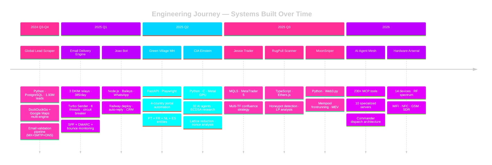
```mermaid
%%{init: {'theme': 'dark', 'themeVariables': {'cScale0': '#FF2D95', 'cScale1': '#BD00FF', 'cScale2': '#00D4FF', 'cScale3': '#FF2D95', 'cScale4': '#BD00FF', 'cScale5': '#00D4FF', 'cScaleLabel0': '#fff', 'cScaleLabel1': '#fff', 'cScaleLabel2': '#fff', 'cScaleLabel3': '#fff', 'cScaleLabel4': '#fff', 'cScaleLabel5': '#fff'}}}%%

timeline
    title Engineering Journey — Systems Built Over Time
    section 2024 Q3-Q4
        Global Lead Scraper : Python · PostgreSQL · 1.93M leads
        : DuckDuckGo + Google Maps multi-engine
        : Email validation pipeline (MX+SMTP+DNS)
    section 2025 Q1
        Email Delivery Engine : 3 DKIM relays · 385/day
        : Turbo Sender · 6 threads · circuit breaker
        : SPF + DMARC + bounce monitoring
        Joao Bot : Node.js · Baileys · WhatsApp
        : Railway deploy · auto-reply · CRM
    section 2025 Q2
        Green Village MH : FastAPI · Playwright
        : 4-country portal automation
        : PT + FR + NL + ES entities
        CIA Einstein : Python · C · Metal GPU
        : 32 AI agents · ECDSA research
        : Lattice reduction · nonce analysis
    section 2025 Q3
        Jessie Trader : MQL5 · MetaTrader 5
        : Multi-TF confluence strategy
        RugPull Scanner : TypeScript · Ethers.js
        : Honeypot detection · LP analysis
        MoonSniper : Python · Web3.py
        : Mempool frontrunning · MEV
    section 2026
        AI Agent Mesh : 230+ MCP tools
        : 10 specialized servers
        : Commander dispatch architecture
        Hardware Arsenal : 14 devices · RF spectrum
        : WiFi · NFC · GSM · SDR
```

<!-- GRADIENT DIVIDER -->


<!-- ╔══════════════════════════════════════════════════════════════════════════╗ -->
<!-- ║                      3D INTERACTIVE MODEL                                ║ -->
<!-- ╚══════════════════════════════════════════════════════════════════════════╝ -->

##  3D Crystal — Interactive Viewer

> Drag to rotate. Scroll to zoom. GitHub renders STL files as interactive 3D models.

```stl
solid MatheusAgueda_Diamond_Crystal

  facet normal 0.000000 0.000000 1.000000
    outer loop
      vertex 0.000000 0.000000 3.000000
      vertex 1.000000 0.000000 1.500000
      vertex 0.309017 0.951057 1.500000
    endloop
  endfacet
  facet normal 0.000000 0.000000 1.000000
    outer loop
      vertex 0.000000 0.000000 3.000000
      vertex 0.309017 0.951057 1.500000
      vertex -0.809017 0.587785 1.500000
    endloop
  endfacet
  facet normal 0.000000 0.000000 1.000000
    outer loop
      vertex 0.000000 0.000000 3.000000
      vertex -0.809017 0.587785 1.500000
      vertex -0.809017 -0.587785 1.500000
    endloop
  endfacet
  facet normal 0.000000 0.000000 1.000000
    outer loop
      vertex 0.000000 0.000000 3.000000
      vertex -0.809017 -0.587785 1.500000
      vertex 0.309017 -0.951057 1.500000
    endloop
  endfacet
  facet normal 0.000000 0.000000 1.000000
    outer loop
      vertex 0.000000 0.000000 3.000000
      vertex 0.309017 -0.951057 1.500000
      vertex 1.000000 0.000000 1.500000
    endloop
  endfacet
  facet normal 0.951057 0.309017 0.000000
    outer loop
      vertex 1.000000 0.000000 1.500000
      vertex 1.902113 0.618034 0.000000
      vertex 0.618034 1.902113 0.000000
    endloop
  endfacet
  facet normal 0.951057 0.309017 0.000000
    outer loop
      vertex 1.000000 0.000000 1.500000
      vertex 0.618034 1.902113 0.000000
      vertex 0.309017 0.951057 1.500000
    endloop
  endfacet
  facet normal 0.000000 1.000000 0.000000
    outer loop
      vertex 0.309017 0.951057 1.500000
      vertex 0.618034 1.902113 0.000000
      vertex -1.618034 1.175571 0.000000
    endloop
  endfacet
  facet normal 0.000000 1.000000 0.000000
    outer loop
      vertex 0.309017 0.951057 1.500000
      vertex -1.618034 1.175571 0.000000
      vertex -0.809017 0.587785 1.500000
    endloop
  endfacet
  facet normal -0.951057 0.309017 0.000000
    outer loop
      vertex -0.809017 0.587785 1.500000
      vertex -1.618034 1.175571 0.000000
      vertex -1.618034 -1.175571 0.000000
    endloop
  endfacet
  facet normal -0.951057 0.309017 0.000000
    outer loop
      vertex -0.809017 0.587785 1.500000
      vertex -1.618034 -1.175571 0.000000
      vertex -0.809017 -0.587785 1.500000
    endloop
  endfacet
  facet normal 0.000000 -1.000000 0.000000
    outer loop
      vertex -0.809017 -0.587785 1.500000
      vertex -1.618034 -1.175571 0.000000
      vertex 0.618034 -1.902113 0.000000
    endloop
  endfacet
  facet normal 0.000000 -1.000000 0.000000
    outer loop
      vertex -0.809017 -0.587785 1.500000
      vertex 0.618034 -1.902113 0.000000
      vertex 0.309017 -0.951057 1.500000
    endloop
  endfacet
  facet normal 0.587785 -0.809017 0.000000
    outer loop
      vertex 0.309017 -0.951057 1.500000
      vertex 0.618034 -1.902113 0.000000
      vertex 1.902113 0.618034 0.000000
    endloop
  endfacet
  facet normal 0.587785 -0.809017 0.000000
    outer loop
      vertex 0.309017 -0.951057 1.500000
      vertex 1.902113 0.618034 0.000000
      vertex 1.000000 0.000000 1.500000
    endloop
  endfacet
  facet normal 0.951057 0.309017 0.000000
    outer loop
      vertex 1.902113 0.618034 0.000000
      vertex 2.000000 0.000000 0.000000
      vertex 0.618034 1.902113 0.000000
    endloop
  endfacet
  facet normal 0.000000 1.000000 0.000000
    outer loop
      vertex 0.618034 1.902113 0.000000
      vertex 0.000000 2.000000 0.000000
      vertex -1.618034 1.175571 0.000000
    endloop
  endfacet
  facet normal -0.951057 0.309017 0.000000
    outer loop
      vertex -1.618034 1.175571 0.000000
      vertex -2.000000 0.000000 0.000000
      vertex -1.618034 -1.175571 0.000000
    endloop
  endfacet
  facet normal 0.000000 -1.000000 0.000000
    outer loop
      vertex -1.618034 -1.175571 0.000000
      vertex 0.000000 -2.000000 0.000000
      vertex 0.618034 -1.902113 0.000000
    endloop
  endfacet
  facet normal 0.587785 -0.809017 0.000000
    outer loop
      vertex 0.618034 -1.902113 0.000000
      vertex 2.000000 0.000000 0.000000
      vertex 1.902113 0.618034 0.000000
    endloop
  endfacet
  facet normal 0.000000 0.000000 -1.000000
    outer loop
      vertex 0.000000 0.000000 -3.000000
      vertex 0.309017 0.951057 -1.500000
      vertex 1.000000 0.000000 -1.500000
    endloop
  endfacet
  facet normal 0.000000 0.000000 -1.000000
    outer loop
      vertex 0.000000 0.000000 -3.000000
      vertex -0.809017 0.587785 -1.500000
      vertex 0.309017 0.951057 -1.500000
    endloop
  endfacet
  facet normal 0.000000 0.000000 -1.000000
    outer loop
      vertex 0.000000 0.000000 -3.000000
      vertex -0.809017 -0.587785 -1.500000
      vertex -0.809017 0.587785 -1.500000
    endloop
  endfacet
  facet normal 0.000000 0.000000 -1.000000
    outer loop
      vertex 0.000000 0.000000 -3.000000
      vertex 0.309017 -0.951057 -1.500000
      vertex -0.809017 -0.587785 -1.500000
    endloop
  endfacet
  facet normal 0.000000 0.000000 -1.000000
    outer loop
      vertex 0.000000 0.000000 -3.000000
      vertex 1.000000 0.000000 -1.500000
      vertex 0.309017 -0.951057 -1.500000
    endloop
  endfacet
  facet normal 0.951057 0.309017 0.000000
    outer loop
      vertex 1.000000 0.000000 -1.500000
      vertex 0.618034 1.902113 0.000000
      vertex 1.902113 0.618034 0.000000
    endloop
  endfacet
  facet normal 0.951057 0.309017 0.000000
    outer loop
      vertex 1.000000 0.000000 -1.500000
      vertex 0.309017 0.951057 -1.500000
      vertex 0.618034 1.902113 0.000000
    endloop
  endfacet
  facet normal 0.000000 1.000000 0.000000
    outer loop
      vertex 0.309017 0.951057 -1.500000
      vertex -1.618034 1.175571 0.000000
      vertex 0.618034 1.902113 0.000000
    endloop
  endfacet
  facet normal 0.000000 1.000000 0.000000
    outer loop
      vertex 0.309017 0.951057 -1.500000
      vertex -0.809017 0.587785 -1.500000
      vertex -1.618034 1.175571 0.000000
    endloop
  endfacet
  facet normal -0.951057 0.309017 0.000000
    outer loop
      vertex -0.809017 0.587785 -1.500000
      vertex -1.618034 -1.175571 0.000000
      vertex -1.618034 1.175571 0.000000
    endloop
  endfacet
  facet normal -0.951057 0.309017 0.000000
    outer loop
      vertex -0.809017 0.587785 -1.500000
      vertex -0.809017 -0.587785 -1.500000
      vertex -1.618034 -1.175571 0.000000
    endloop
  endfacet
  facet normal 0.000000 -1.000000 0.000000
    outer loop
      vertex -0.809017 -0.587785 -1.500000
      vertex 0.618034 -1.902113 0.000000
      vertex -1.618034 -1.175571 0.000000
    endloop
  endfacet
  facet normal 0.000000 -1.000000 0.000000
    outer loop
      vertex -0.809017 -0.587785 -1.500000
      vertex 0.309017 -0.951057 -1.500000
      vertex 0.618034 -1.902113 0.000000
    endloop
  endfacet
  facet normal 0.587785 -0.809017 0.000000
    outer loop
      vertex 0.309017 -0.951057 -1.500000
      vertex 1.902113 0.618034 0.000000
      vertex 0.618034 -1.902113 0.000000
    endloop
  endfacet
  facet normal 0.587785 -0.809017 0.000000
    outer loop
      vertex 0.309017 -0.951057 -1.500000
      vertex 1.000000 0.000000 -1.500000
      vertex 1.902113 0.618034 0.000000
    endloop
  endfacet
  facet normal 0.000000 0.000000 1.000000
    outer loop
      vertex 0.000000 0.000000 3.000000
      vertex 1.500000 0.000000 1.500000
      vertex 0.463525 1.426585 1.500000
    endloop
  endfacet
  facet normal 0.000000 0.000000 1.000000
    outer loop
      vertex 0.000000 0.000000 3.000000
      vertex 0.463525 1.426585 1.500000
      vertex -1.213525 0.881678 1.500000
    endloop
  endfacet
  facet normal 0.000000 0.000000 1.000000
    outer loop
      vertex 0.000000 0.000000 3.000000
      vertex -1.213525 0.881678 1.500000
      vertex -1.213525 -0.881678 1.500000
    endloop
  endfacet
  facet normal 0.000000 0.000000 1.000000
    outer loop
      vertex 0.000000 0.000000 3.000000
      vertex -1.213525 -0.881678 1.500000
      vertex 0.463525 -1.426585 1.500000
    endloop
  endfacet
  facet normal 0.000000 0.000000 1.000000
    outer loop
      vertex 0.000000 0.000000 3.000000
      vertex 0.463525 -1.426585 1.500000
      vertex 1.500000 0.000000 1.500000
    endloop
  endfacet
  facet normal 0.951057 0.309017 0.000000
    outer loop
      vertex 1.500000 0.000000 1.500000
      vertex 2.886751 0.500000 0.000000
      vertex 0.927051 2.853170 0.000000
    endloop
  endfacet
  facet normal 0.951057 0.309017 0.000000
    outer loop
      vertex 1.500000 0.000000 1.500000
      vertex 0.927051 2.853170 0.000000
      vertex 0.463525 1.426585 1.500000
    endloop
  endfacet
  facet normal 0.000000 1.000000 0.000000
    outer loop
      vertex 0.463525 1.426585 1.500000
      vertex 0.927051 2.853170 0.000000
      vertex -2.427051 1.763356 0.000000
    endloop
  endfacet
  facet normal 0.000000 1.000000 0.000000
    outer loop
      vertex 0.463525 1.426585 1.500000
      vertex -2.427051 1.763356 0.000000
      vertex -1.213525 0.881678 1.500000
    endloop
  endfacet
  facet normal -0.951057 0.309017 0.000000
    outer loop
      vertex -1.213525 0.881678 1.500000
      vertex -2.427051 1.763356 0.000000
      vertex -2.427051 -1.763356 0.000000
    endloop
  endfacet
  facet normal -0.951057 0.309017 0.000000
    outer loop
      vertex -1.213525 0.881678 1.500000
      vertex -2.427051 -1.763356 0.000000
      vertex -1.213525 -0.881678 1.500000
    endloop
  endfacet
  facet normal 0.000000 -1.000000 0.000000
    outer loop
      vertex -1.213525 -0.881678 1.500000
      vertex -2.427051 -1.763356 0.000000
      vertex 0.927051 -2.853170 0.000000
    endloop
  endfacet
  facet normal 0.000000 -1.000000 0.000000
    outer loop
      vertex -1.213525 -0.881678 1.500000
      vertex 0.927051 -2.853170 0.000000
      vertex 0.463525 -1.426585 1.500000
    endloop
  endfacet
  facet normal 0.587785 -0.809017 0.000000
    outer loop
      vertex 0.463525 -1.426585 1.500000
      vertex 0.927051 -2.853170 0.000000
      vertex 2.886751 0.500000 0.000000
    endloop
  endfacet
  facet normal 0.587785 -0.809017 0.000000
    outer loop
      vertex 0.463525 -1.426585 1.500000
      vertex 2.886751 0.500000 0.000000
      vertex 1.500000 0.000000 1.500000
    endloop
  endfacet
  facet normal 0.000000 0.000000 -1.000000
    outer loop
      vertex 0.000000 0.000000 -3.000000
      vertex 0.463525 1.426585 -1.500000
      vertex 1.500000 0.000000 -1.500000
    endloop
  endfacet
  facet normal 0.000000 0.000000 -1.000000
    outer loop
      vertex 0.000000 0.000000 -3.000000
      vertex -1.213525 0.881678 -1.500000
      vertex 0.463525 1.426585 -1.500000
    endloop
  endfacet
  facet normal 0.000000 0.000000 -1.000000
    outer loop
      vertex 0.000000 0.000000 -3.000000
      vertex -1.213525 -0.881678 -1.500000
      vertex -1.213525 0.881678 -1.500000
    endloop
  endfacet
  facet normal 0.000000 0.000000 -1.000000
    outer loop
      vertex 0.000000 0.000000 -3.000000
      vertex 0.463525 -1.426585 -1.500000
      vertex -1.213525 -0.881678 -1.500000
    endloop
  endfacet
  facet normal 0.000000 0.000000 -1.000000
    outer loop
      vertex 0.000000 0.000000 -3.000000
      vertex 1.500000 0.000000 -1.500000
      vertex 0.463525 -1.426585 -1.500000
    endloop
  endfacet
  facet normal 0.951057 0.309017 0.000000
    outer loop
      vertex 1.500000 0.000000 -1.500000
      vertex 0.927051 2.853170 0.000000
      vertex 2.886751 0.500000 0.000000
    endloop
  endfacet
  facet normal 0.951057 0.309017 0.000000
    outer loop
      vertex 1.500000 0.000000 -1.500000
      vertex 0.463525 1.426585 -1.500000
      vertex 0.927051 2.853170 0.000000
    endloop
  endfacet
  facet normal 0.000000 1.000000 0.000000
    outer loop
      vertex 0.463525 1.426585 -1.500000
      vertex -2.427051 1.763356 0.000000
      vertex 0.927051 2.853170 0.000000
    endloop
  endfacet
  facet normal 0.000000 1.000000 0.000000
    outer loop
      vertex 0.463525 1.426585 -1.500000
      vertex -1.213525 0.881678 -1.500000
      vertex -2.427051 1.763356 0.000000
    endloop
  endfacet
  facet normal -0.951057 0.309017 0.000000
    outer loop
      vertex -1.213525 0.881678 -1.500000
      vertex -2.427051 -1.763356 0.000000
      vertex -2.427051 1.763356 0.000000
    endloop
  endfacet
  facet normal -0.951057 0.309017 0.000000
    outer loop
      vertex -1.213525 0.881678 -1.500000
      vertex -1.213525 -0.881678 -1.500000
      vertex -2.427051 -1.763356 0.000000
    endloop
  endfacet
  facet normal 0.000000 -1.000000 0.000000
    outer loop
      vertex -1.213525 -0.881678 -1.500000
      vertex 0.927051 -2.853170 0.000000
      vertex -2.427051 -1.763356 0.000000
    endloop
  endfacet
  facet normal 0.000000 -1.000000 0.000000
    outer loop
      vertex -1.213525 -0.881678 -1.500000
      vertex 0.463525 -1.426585 -1.500000
      vertex 0.927051 -2.853170 0.000000
    endloop
  endfacet
  facet normal 0.587785 -0.809017 0.000000
    outer loop
      vertex 0.463525 -1.426585 -1.500000
      vertex 2.886751 0.500000 0.000000
      vertex 0.927051 -2.853170 0.000000
    endloop
  endfacet
  facet normal 0.587785 -0.809017 0.000000
    outer loop
      vertex 0.463525 -1.426585 -1.500000
      vertex 1.500000 0.000000 -1.500000
      vertex 2.886751 0.500000 0.000000
    endloop
  endfacet
  facet normal 0.587785 0.809017 0.309017
    outer loop
      vertex 2.000000 0.000000 0.000000
      vertex 2.886751 0.500000 0.000000
      vertex 0.000000 2.000000 0.000000
    endloop
  endfacet
  facet normal 0.587785 0.809017 0.309017
    outer loop
      vertex 0.000000 2.000000 0.000000
      vertex 2.886751 0.500000 0.000000
      vertex 0.927051 2.853170 0.000000
    endloop
  endfacet
  facet normal -0.587785 0.809017 0.309017
    outer loop
      vertex 0.000000 2.000000 0.000000
      vertex 0.927051 2.853170 0.000000
      vertex -2.000000 0.000000 0.000000
    endloop
  endfacet
  facet normal -0.587785 0.809017 0.309017
    outer loop
      vertex -2.000000 0.000000 0.000000
      vertex 0.927051 2.853170 0.000000
      vertex -2.427051 1.763356 0.000000
    endloop
  endfacet
  facet normal -0.587785 -0.809017 0.309017
    outer loop
      vertex -2.000000 0.000000 0.000000
      vertex -2.427051 1.763356 0.000000
      vertex 0.000000 -2.000000 0.000000
    endloop
  endfacet
  facet normal -0.587785 -0.809017 0.309017
    outer loop
      vertex 0.000000 -2.000000 0.000000
      vertex -2.427051 1.763356 0.000000
      vertex -2.427051 -1.763356 0.000000
    endloop
  endfacet
  facet normal 0.587785 -0.809017 0.309017
    outer loop
      vertex 0.000000 -2.000000 0.000000
      vertex -2.427051 -1.763356 0.000000
      vertex 2.000000 0.000000 0.000000
    endloop
  endfacet
  facet normal 0.587785 -0.809017 0.309017
    outer loop
      vertex 2.000000 0.000000 0.000000
      vertex -2.427051 -1.763356 0.000000
      vertex 0.927051 -2.853170 0.000000
    endloop
  endfacet
  facet normal 0.951057 0.000000 -0.309017
    outer loop
      vertex 2.000000 0.000000 0.000000
      vertex 0.927051 -2.853170 0.000000
      vertex 2.886751 0.500000 0.000000
    endloop
  endfacet
  facet normal 0.951057 0.000000 -0.309017
    outer loop
      vertex 2.886751 0.500000 0.000000
      vertex 0.927051 -2.853170 0.000000
      vertex 0.618034 -1.902113 0.000000
    endloop
  endfacet
  facet normal 0.000000 0.000000 0.000000
    outer loop
      vertex 2.886751 0.500000 0.000000
      vertex 0.618034 -1.902113 0.000000
      vertex 1.902113 0.618034 0.000000
    endloop
  endfacet
  facet normal -0.587785 0.809017 -0.309017
    outer loop
      vertex -1.618034 1.175571 0.000000
      vertex -2.427051 1.763356 0.000000
      vertex 0.618034 1.902113 0.000000
    endloop
  endfacet
  facet normal -0.587785 0.809017 -0.309017
    outer loop
      vertex 0.618034 1.902113 0.000000
      vertex -2.427051 1.763356 0.000000
      vertex 0.927051 2.853170 0.000000
    endloop
  endfacet
  facet normal 0.000000 -1.000000 -0.309017
    outer loop
      vertex -1.618034 -1.175571 0.000000
      vertex 0.618034 -1.902113 0.000000
      vertex -2.427051 -1.763356 0.000000
    endloop
  endfacet
  facet normal 0.000000 -1.000000 -0.309017
    outer loop
      vertex -2.427051 -1.763356 0.000000
      vertex 0.618034 -1.902113 0.000000
      vertex 0.927051 -2.853170 0.000000
    endloop
  endfacet
  facet normal -0.951057 0.000000 0.000000
    outer loop
      vertex -2.000000 0.000000 0.000000
      vertex -2.427051 -1.763356 0.000000
      vertex -1.618034 1.175571 0.000000
    endloop
  endfacet
  facet normal -0.951057 0.000000 0.000000
    outer loop
      vertex -1.618034 1.175571 0.000000
      vertex -2.427051 -1.763356 0.000000
      vertex -1.618034 -1.175571 0.000000
    endloop
  endfacet
  facet normal -0.951057 0.000000 0.000000
    outer loop
      vertex -2.000000 0.000000 0.000000
      vertex -1.618034 1.175571 0.000000
      vertex -2.427051 1.763356 0.000000
    endloop
  endfacet
  facet normal 0.587785 0.809017 0.000000
    outer loop
      vertex 0.618034 1.902113 0.000000
      vertex 0.927051 2.853170 0.000000
      vertex 0.000000 2.000000 0.000000
    endloop
  endfacet
  facet normal 0.000000 0.000000 0.000000
    outer loop
      vertex 2.000000 0.000000 0.000000
      vertex 1.902113 0.618034 0.000000
      vertex 0.618034 -1.902113 0.000000
    endloop
  endfacet
  facet normal 0.000000 0.000000 0.000000
    outer loop
      vertex 0.000000 -2.000000 0.000000
      vertex 0.618034 -1.902113 0.000000
      vertex -1.618034 -1.175571 0.000000
    endloop
  endfacet
  facet normal 0.000000 0.000000 0.000000
    outer loop
      vertex 0.000000 -2.000000 0.000000
      vertex -1.618034 -1.175571 0.000000
      vertex -2.427051 -1.763356 0.000000
    endloop
  endfacet
  facet normal 0.000000 0.000000 0.000000
    outer loop
      vertex 0.000000 2.000000 0.000000
      vertex 0.927051 2.853170 0.000000
      vertex -1.443376 2.500000 0.000000
    endloop
  endfacet
  facet normal 0.000000 0.000000 0.000000
    outer loop
      vertex -1.443376 2.500000 0.000000
      vertex 0.927051 2.853170 0.000000
      vertex 0.618034 1.902113 0.000000
    endloop
  endfacet
  facet normal 0.000000 0.000000 0.000000
    outer loop
      vertex -1.443376 2.500000 0.000000
      vertex 0.618034 1.902113 0.000000
      vertex -1.618034 1.175571 0.000000
    endloop
  endfacet
  facet normal 0.000000 0.000000 0.000000
    outer loop
      vertex 0.000000 -2.000000 0.000000
      vertex -2.427051 -1.763356 0.000000
      vertex -1.443376 -2.500000 0.000000
    endloop
  endfacet

endsolid MatheusAgueda_Diamond_Crystal
```

<!-- GRADIENT DIVIDER -->


<!-- ╔══════════════════════════════════════════════════════════════════════════╗ -->
<!-- ║                         DYNAMIC CONTENT                                 ║ -->
<!-- ╚══════════════════════════════════════════════════════════════════════════╝ -->

<div align="center">


<br/><br/>


</div>

<!-- MATH FOOTNOTES — scholarly depth -->

[^secp256k1]: The secp256k1 curve used in Bitcoin/Ethereum has order $n \approx 1.158 \times 10^{77}$, making brute-force infeasible. Our research targets biased nonce reuse and weak key generation, not the curve itself.
[^lattice]: Lattice reduction via LLL/BKZ is polynomial-time for approximate SVP but remains exponential for exact solutions. Practical attacks require side-channel information (e.g., biased ECDSA nonces leaking $\leq 4$ bits per signature).
[^turbo]: The Turbo Sender's circuit breaker pattern prevents cascade failures: if any relay exceeds 5% bounce rate over 100 emails, that relay is isolated while others continue. Recovery is automatic after 1 hour cooldown.

<!-- ╔══════════════════════════════════════════════════════════════════════════╗ -->
<!-- ║                             FOOTER                                      ║ -->
<!-- ╚══════════════════════════════════════════════════════════════════════════╝ -->

<br/>

<div align="center">

<!-- GitHub Actions Status -->

&nbsp;

&nbsp;

&nbsp;


<br/><br/>

<a href="mailto:aguedamatheus475@gmail.com"></a>
&nbsp;
<a href="https://www.greenvillagemobilehomes.com"></a>
&nbsp;
<a href="https://github.com/MatheusAgueda"></a>

</div>

<br/>


