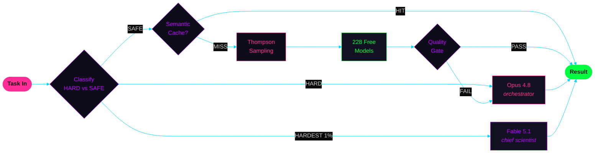
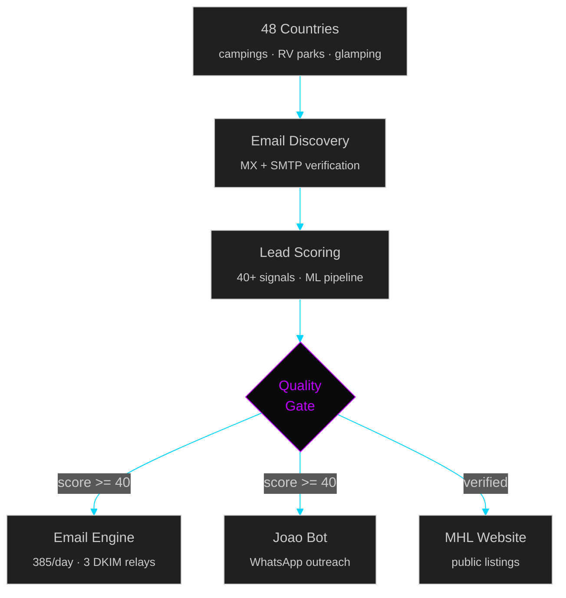

<div align="center">


<br/>

<a href="https://git.io/typing-svg"></a>

<br/>


&nbsp;

&nbsp;

&nbsp;


</div>

<!-- ═══════════════════════════════════════════════
     HERO — AI-generated mobile home park
     ═══════════════════════════════════════════════ -->

<div align="center">

</div>


<!-- ═══════════════════════════════════════════════
     SERVICES — What we do
     ═══════════════════════════════════════════════ -->

<div align="center">

</div>


<!-- ═══════════════════════════════════════════════
     IDENTITY + TECH ICONS
     ═══════════════════════════════════════════════ -->

<table>
<tr>
<td width="40%" valign="top">

```properties
# ~/.config/greenvillage.yml

identity:
  name:  Matheus Agueda
  role:  CEO & Systems Architect
  company: Green Village Mobile Homes
  scope: PT · FR · NL · ES

business:
  product:   Premium static caravans
  market:    Campings, RV parks, glamping
  leads:     1,930,000 processed
  emails:    385/day × 3 DKIM relays
  countries: 48 covered

technology:
  ai_models: 228 (94.2% routed free)
  agents:    17 self-improving AI agents
  systems:   12 production services
  hardware:  M4 Pro 14-core · 24GB
```

</td>
<td width="60%" valign="top">

<div align="center">

<br/>
<sub><kbd>LANGUAGES</kbd></sub>
<br/><br/>

<br/>
<sub><kbd>BACKEND</kbd></sub>
<br/><br/>

<br/>
<sub><kbd>FRONTEND</kbd></sub>
<br/><br/>

<br/>
<sub><kbd>INFRASTRUCTURE</kbd></sub>

</div>

</td>
</tr>
</table>


<!-- ═══════════════════════════════════════════════
     SHOWCASE — Premium Mobile Home
     ═══════════════════════════════════════════════ -->

<div align="center">

## Our Product

> [!IMPORTANT]
> Premium **static caravans** and **mobile homes** for campings, RV parks, and glamping sites across Europe. From sourcing to delivery.



</div>


<!-- ═══════════════════════════════════════════════
     SYSTEM DASHBOARD — Green Village branded
     ═══════════════════════════════════════════════ -->

##  Technology Stack

> [!NOTE]
> The engine behind Green Village — **228 AI models** routing tasks via Thompson Sampling, **1.93M leads** scraped and verified, **385 emails/day** across 3 DKIM relays.

<div align="center">

</div>

<div align="center">

$$P(\theta_i \mid \mathcal{D}) \propto \prod_{t=1}^{n} \text{Bernoulli}(r_t \mid \theta_i) \cdot \text{Beta}(\alpha_i, \beta_i)$$

</div>

<details>
<summary><b>&nbsp;Routing Architecture (Mermaid)&nbsp;</b></summary>
<br/>


```mermaid
%%{init: {'theme': 'dark', 'themeVariables': {
  'primaryColor': '#FF2D95',
  'primaryTextColor': '#fff',
  'primaryBorderColor': '#BD00FF',
  'lineColor': '#00D4FF',
  'secondaryColor': '#0a0a14',
  'tertiaryColor': '#111122',
  'edgeLabelBackground': '#0a0a0a',
  'clusterBkg': '#0d0d1a',
  'clusterBorder': '#BD00FF',
  'titleColor': '#00D4FF',
  'nodeTextColor': '#cccccc'
}}}%%

flowchart LR
  IN(["Task In"]):::input --> CLASS{"Classify<br/>HARD vs SAFE"}:::gate

  CLASS -->|"HARD"| OPUS["Opus 4.8<br/><i>orchestrator</i>"]:::opus
  CLASS -->|"SAFE"| CACHE{"Semantic<br/>Cache?"}:::gate
  CLASS -->|"HARDEST 1%"| FABLE["Fable 5.1<br/><i>chief scientist</i>"]:::fable

  CACHE -->|"HIT"| OUT(["Result"]):::output
  CACHE -->|"MISS"| MAB["Thompson<br/>Sampling"]:::mab

  MAB --> FREE["228 Free<br/>Models"]:::free
  FREE --> VERIFY{"Quality<br/>Gate"}:::gate
  VERIFY -->|"PASS"| OUT
  VERIFY -->|"FAIL"| OPUS

  OPUS --> OUT
  FABLE --> OUT

  classDef input fill:#FF2D95,stroke:#FF2D95,color:#0a0a0a,font-weight:bold
  classDef output fill:#00ff41,stroke:#00ff41,color:#0a0a0a,font-weight:bold
  classDef gate fill:#0d0d1a,stroke:#BD00FF,color:#BD00FF
  classDef opus fill:#111122,stroke:#FF2D95,color:#FF2D95
  classDef fable fill:#111122,stroke:#BD00FF,color:#BD00FF
  classDef mab fill:#0d0d1a,stroke:#FF2D95,color:#FF2D95
  classDef free fill:#111122,stroke:#00ff41,color:#00ff41
```

</details>


<!-- ═══════════════════════════════════════════════
     DATA PIPELINE + LIFESTYLE
     ═══════════════════════════════════════════════ -->

<table>
<tr>
<td width="50%" valign="top">

### Data Pipeline


```mermaid
%%{init: {'theme': 'dark', 'themeVariables': {
  'primaryColor': '#FF2D95',
  'primaryTextColor': '#cccccc',
  'primaryBorderColor': '#BD00FF',
  'lineColor': '#00D4FF',
  'secondaryColor': '#111122',
  'tertiaryColor': '#0d0d1a'
}}}%%

flowchart TB
  SCRAPE["48 Countries<br/><sub>campings · RV parks · glamping</sub>"]:::green
  --> ENRICH["Email Discovery<br/><sub>MX + SMTP verification</sub>"]:::gold
  --> SCORE["Lead Scoring<br/><sub>40+ signals · ML pipeline</sub>"]:::green
  --> GATE{"Quality<br/>Gate"}:::gate
  GATE -->|"score >= 40"| SEND["Email Engine<br/><sub>385/day · 3 DKIM relays</sub>"]:::green
  GATE -->|"score >= 40"| WA["Joao Bot<br/><sub>WhatsApp outreach</sub>"]:::gold
  GATE -->|"verified"| MHL["MHL Website<br/><sub>public listings</sub>"]:::green

  classDef pink fill:#1a0a14,stroke:#FF2D95,color:#FF2D95
  classDef purple fill:#140a1a,stroke:#BD00FF,color:#BD00FF
  classDef gate fill:#0a0a0a,stroke:#BD00FF,color:#BD00FF
```

$$\text{Score}(l) = \sum_{i=1}^{n} w_i \cdot f_i(l) \quad \text{s.t.} \quad \sum w_i = 1$$

</td>
<td width="50%" valign="top">

### The Lifestyle


<div align="center">
<sub>Premium living, closer to nature.</sub>
</div>

</td>
</tr>
</table>


<!-- ═══════════════════════════════════════════════
     3D CONTRIBUTION + SNAKE
     ═══════════════════════════════════════════════ -->

<div align="center">

## Contribution Topology

<picture>
  <source media="(prefers-color-scheme: dark)" srcset="./profile-3d-contrib/profile-night-rainbow.svg" />
  <source media="(prefers-color-scheme: light)" srcset="./profile-3d-contrib/profile-green-animate.svg" />
  
</picture>

<br/>

<picture>
  <source media="(prefers-color-scheme: dark)" srcset="https://raw.githubusercontent.com/MatheusAgueda/MatheusAgueda/output/github-snake-dark.svg" />
  <source media="(prefers-color-scheme: light)" srcset="https://raw.githubusercontent.com/MatheusAgueda/MatheusAgueda/output/github-snake.svg" />
  
</picture>

</div>


<!-- ═══════════════════════════════════════════════
     GITHUB STATS
     ═══════════════════════════════════════════════ -->

<div align="center">


<br/>


</div>

<details>
<summary><b>&nbsp;Detailed Metrics&nbsp;</b></summary>
<br/>

<div align="center">


<br/>


<br/>


<br/>


</div>

</details>


<!-- ═══════════════════════════════════════════════
     3D CRYSTAL + INTERACTIVE MAP
     ═══════════════════════════════════════════════ -->

<div align="center">

## Rotate This

> [!TIP]
> Click and drag the diamond below. GitHub renders 3D models natively in markdown.

</div>

```stl
solid diamond
  facet normal 0.0 1.0 0.0
    outer loop
      vertex 0.0000 75.0000 0.0000
      vertex 34.3275 70.0000 6.8282
      vertex 29.1014 70.0000 19.4450
    endloop
  endfacet
  facet normal 0.0 1.0 0.0
    outer loop
      vertex 0.0000 75.0000 0.0000
      vertex 29.1014 70.0000 19.4450
      vertex 19.4450 70.0000 29.1014
    endloop
  endfacet
  facet normal 0.0 1.0 0.0
    outer loop
      vertex 0.0000 75.0000 0.0000
      vertex 19.4450 70.0000 29.1014
      vertex 6.8282 70.0000 34.3275
    endloop
  endfacet
  facet normal 0.0 1.0 0.0
    outer loop
      vertex 0.0000 75.0000 0.0000
      vertex 6.8282 70.0000 34.3275
      vertex -6.8282 70.0000 34.3275
    endloop
  endfacet
  facet normal 0.0 1.0 0.0
    outer loop
      vertex 0.0000 75.0000 0.0000
      vertex -6.8282 70.0000 34.3275
      vertex -19.4450 70.0000 29.1014
    endloop
  endfacet
  facet normal 0.0 1.0 0.0
    outer loop
      vertex 0.0000 75.0000 0.0000
      vertex -19.4450 70.0000 29.1014
      vertex -29.1014 70.0000 19.4450
    endloop
  endfacet
  facet normal 0.0 1.0 0.0
    outer loop
      vertex 0.0000 75.0000 0.0000
      vertex -29.1014 70.0000 19.4450
      vertex -34.3275 70.0000 6.8282
    endloop
  endfacet
  facet normal 0.0 1.0 0.0
    outer loop
      vertex 0.0000 75.0000 0.0000
      vertex -34.3275 70.0000 6.8282
      vertex -34.3275 70.0000 -6.8282
    endloop
  endfacet
  facet normal 0.0 1.0 0.0
    outer loop
      vertex 0.0000 75.0000 0.0000
      vertex -34.3275 70.0000 -6.8282
      vertex -29.1014 70.0000 -19.4450
    endloop
  endfacet
  facet normal 0.0 1.0 0.0
    outer loop
      vertex 0.0000 75.0000 0.0000
      vertex -29.1014 70.0000 -19.4450
      vertex -19.4450 70.0000 -29.1014
    endloop
  endfacet
  facet normal 0.0 1.0 0.0
    outer loop
      vertex 0.0000 75.0000 0.0000
      vertex -19.4450 70.0000 -29.1014
      vertex -6.8282 70.0000 -34.3275
    endloop
  endfacet
  facet normal 0.0 1.0 0.0
    outer loop
      vertex 0.0000 75.0000 0.0000
      vertex -6.8282 70.0000 -34.3275
      vertex 6.8282 70.0000 -34.3275
    endloop
  endfacet
  facet normal 0.0 1.0 0.0
    outer loop
      vertex 0.0000 75.0000 0.0000
      vertex 6.8282 70.0000 -34.3275
      vertex 19.4450 70.0000 -29.1014
    endloop
  endfacet
  facet normal 0.0 1.0 0.0
    outer loop
      vertex 0.0000 75.0000 0.0000
      vertex 19.4450 70.0000 -29.1014
      vertex 29.1014 70.0000 -19.4450
    endloop
  endfacet
  facet normal 0.0 1.0 0.0
    outer loop
      vertex 0.0000 75.0000 0.0000
      vertex 29.1014 70.0000 -19.4450
      vertex 34.3275 70.0000 -6.8282
    endloop
  endfacet
  facet normal 0.0 1.0 0.0
    outer loop
      vertex 0.0000 75.0000 0.0000
      vertex 34.3275 70.0000 -6.8282
      vertex 34.3275 70.0000 6.8282
    endloop
  endfacet
  facet normal -0.8365 -0.4246 -0.3465
    outer loop
      vertex 34.3275 70.0000 6.8282
      vertex 60.0000 25.0000 0.0000
      vertex 29.1014 70.0000 19.4450
    endloop
  endfacet
  facet normal -0.8450 -0.5076 -0.1681
    outer loop
      vertex 29.1014 70.0000 19.4450
      vertex 60.0000 25.0000 0.0000
      vertex 55.4328 25.0000 22.9610
    endloop
  endfacet
  facet normal -0.6402 -0.4246 -0.6402
    outer loop
      vertex 29.1014 70.0000 19.4450
      vertex 55.4328 25.0000 22.9610
      vertex 19.4450 70.0000 29.1014
    endloop
  endfacet
  facet normal -0.7164 -0.5076 -0.4787
    outer loop
      vertex 19.4450 70.0000 29.1014
      vertex 55.4328 25.0000 22.9610
      vertex 42.4264 25.0000 42.4264
    endloop
  endfacet
  facet normal -0.3465 -0.4246 -0.8365
    outer loop
      vertex 19.4450 70.0000 29.1014
      vertex 42.4264 25.0000 42.4264
      vertex 6.8282 70.0000 34.3275
    endloop
  endfacet
  facet normal -0.4787 -0.5076 -0.7164
    outer loop
      vertex 6.8282 70.0000 34.3275
      vertex 42.4264 25.0000 42.4264
      vertex 22.9610 25.0000 55.4328
    endloop
  endfacet
  facet normal -0.0000 -0.4246 -0.9054
    outer loop
      vertex 6.8282 70.0000 34.3275
      vertex 22.9610 25.0000 55.4328
      vertex -6.8282 70.0000 34.3275
    endloop
  endfacet
  facet normal -0.1681 -0.5076 -0.8450
    outer loop
      vertex -6.8282 70.0000 34.3275
      vertex 22.9610 25.0000 55.4328
      vertex 0.0000 25.0000 60.0000
    endloop
  endfacet
  facet normal 0.3465 -0.4246 -0.8365
    outer loop
      vertex -6.8282 70.0000 34.3275
      vertex 0.0000 25.0000 60.0000
      vertex -19.4450 70.0000 29.1014
    endloop
  endfacet
  facet normal 0.1681 -0.5076 -0.8450
    outer loop
      vertex -19.4450 70.0000 29.1014
      vertex 0.0000 25.0000 60.0000
      vertex -22.9610 25.0000 55.4328
    endloop
  endfacet
  facet normal 0.6402 -0.4246 -0.6402
    outer loop
      vertex -19.4450 70.0000 29.1014
      vertex -22.9610 25.0000 55.4328
      vertex -29.1014 70.0000 19.4450
    endloop
  endfacet
  facet normal 0.4787 -0.5076 -0.7164
    outer loop
      vertex -29.1014 70.0000 19.4450
      vertex -22.9610 25.0000 55.4328
      vertex -42.4264 25.0000 42.4264
    endloop
  endfacet
  facet normal 0.8365 -0.4246 -0.3465
    outer loop
      vertex -29.1014 70.0000 19.4450
      vertex -42.4264 25.0000 42.4264
      vertex -34.3275 70.0000 6.8282
    endloop
  endfacet
  facet normal 0.7164 -0.5076 -0.4787
    outer loop
      vertex -34.3275 70.0000 6.8282
      vertex -42.4264 25.0000 42.4264
      vertex -55.4328 25.0000 22.9610
    endloop
  endfacet
  facet normal 0.9054 -0.4246 0.0000
    outer loop
      vertex -34.3275 70.0000 6.8282
      vertex -55.4328 25.0000 22.9610
      vertex -34.3275 70.0000 -6.8282
    endloop
  endfacet
  facet normal 0.8450 -0.5076 -0.1681
    outer loop
      vertex -34.3275 70.0000 -6.8282
      vertex -55.4328 25.0000 22.9610
      vertex -60.0000 25.0000 0.0000
    endloop
  endfacet
  facet normal 0.8365 -0.4246 0.3465
    outer loop
      vertex -34.3275 70.0000 -6.8282
      vertex -60.0000 25.0000 0.0000
      vertex -29.1014 70.0000 -19.4450
    endloop
  endfacet
  facet normal 0.8450 -0.5076 0.1681
    outer loop
      vertex -29.1014 70.0000 -19.4450
      vertex -60.0000 25.0000 0.0000
      vertex -55.4328 25.0000 -22.9610
    endloop
  endfacet
  facet normal 0.6402 -0.4246 0.6402
    outer loop
      vertex -29.1014 70.0000 -19.4450
      vertex -55.4328 25.0000 -22.9610
      vertex -19.4450 70.0000 -29.1014
    endloop
  endfacet
  facet normal 0.7164 -0.5076 0.4787
    outer loop
      vertex -19.4450 70.0000 -29.1014
      vertex -55.4328 25.0000 -22.9610
      vertex -42.4264 25.0000 -42.4264
    endloop
  endfacet
  facet normal 0.3465 -0.4246 0.8365
    outer loop
      vertex -19.4450 70.0000 -29.1014
      vertex -42.4264 25.0000 -42.4264
      vertex -6.8282 70.0000 -34.3275
    endloop
  endfacet
  facet normal 0.4787 -0.5076 0.7164
    outer loop
      vertex -6.8282 70.0000 -34.3275
      vertex -42.4264 25.0000 -42.4264
      vertex -22.9610 25.0000 -55.4328
    endloop
  endfacet
  facet normal 0.0000 -0.4246 0.9054
    outer loop
      vertex -6.8282 70.0000 -34.3275
      vertex -22.9610 25.0000 -55.4328
      vertex 6.8282 70.0000 -34.3275
    endloop
  endfacet
  facet normal 0.1681 -0.5076 0.8450
    outer loop
      vertex 6.8282 70.0000 -34.3275
      vertex -22.9610 25.0000 -55.4328
      vertex -0.0000 25.0000 -60.0000
    endloop
  endfacet
  facet normal -0.3465 -0.4246 0.8365
    outer loop
      vertex 6.8282 70.0000 -34.3275
      vertex -0.0000 25.0000 -60.0000
      vertex 19.4450 70.0000 -29.1014
    endloop
  endfacet
  facet normal -0.1681 -0.5076 0.8450
    outer loop
      vertex 19.4450 70.0000 -29.1014
      vertex -0.0000 25.0000 -60.0000
      vertex 22.9610 25.0000 -55.4328
    endloop
  endfacet
  facet normal -0.6402 -0.4246 0.6402
    outer loop
      vertex 19.4450 70.0000 -29.1014
      vertex 22.9610 25.0000 -55.4328
      vertex 29.1014 70.0000 -19.4450
    endloop
  endfacet
  facet normal -0.4787 -0.5076 0.7164
    outer loop
      vertex 29.1014 70.0000 -19.4450
      vertex 22.9610 25.0000 -55.4328
      vertex 42.4264 25.0000 -42.4264
    endloop
  endfacet
  facet normal -0.8365 -0.4246 0.3465
    outer loop
      vertex 29.1014 70.0000 -19.4450
      vertex 42.4264 25.0000 -42.4264
      vertex 34.3275 70.0000 -6.8282
    endloop
  endfacet
  facet normal -0.7164 -0.5076 0.4787
    outer loop
      vertex 34.3275 70.0000 -6.8282
      vertex 42.4264 25.0000 -42.4264
      vertex 55.4328 25.0000 -22.9610
    endloop
  endfacet
  facet normal -0.9054 -0.4246 0.0000
    outer loop
      vertex 34.3275 70.0000 -6.8282
      vertex 55.4328 25.0000 -22.9610
      vertex 34.3275 70.0000 6.8282
    endloop
  endfacet
  facet normal -0.8450 -0.5076 0.1681
    outer loop
      vertex 34.3275 70.0000 6.8282
      vertex 55.4328 25.0000 -22.9610
      vertex 60.0000 25.0000 0.0000
    endloop
  endfacet
  facet normal 0.8731 -0.4555 0.1737
    outer loop
      vertex 60.0000 25.0000 0.0000
      vertex 55.4328 25.0000 22.9610
      vertex 0.0000 -90.0000 0.0000
    endloop
  endfacet
  facet normal 0.7402 -0.4555 0.4946
    outer loop
      vertex 55.4328 25.0000 22.9610
      vertex 42.4264 25.0000 42.4264
      vertex 0.0000 -90.0000 0.0000
    endloop
  endfacet
  facet normal 0.4946 -0.4555 0.7402
    outer loop
      vertex 42.4264 25.0000 42.4264
      vertex 22.9610 25.0000 55.4328
      vertex 0.0000 -90.0000 0.0000
    endloop
  endfacet
  facet normal 0.1737 -0.4555 0.8731
    outer loop
      vertex 22.9610 25.0000 55.4328
      vertex 0.0000 25.0000 60.0000
      vertex 0.0000 -90.0000 0.0000
    endloop
  endfacet
  facet normal -0.1737 -0.4555 0.8731
    outer loop
      vertex 0.0000 25.0000 60.0000
      vertex -22.9610 25.0000 55.4328
      vertex 0.0000 -90.0000 0.0000
    endloop
  endfacet
  facet normal -0.4946 -0.4555 0.7402
    outer loop
      vertex -22.9610 25.0000 55.4328
      vertex -42.4264 25.0000 42.4264
      vertex 0.0000 -90.0000 0.0000
    endloop
  endfacet
  facet normal -0.7402 -0.4555 0.4946
    outer loop
      vertex -42.4264 25.0000 42.4264
      vertex -55.4328 25.0000 22.9610
      vertex 0.0000 -90.0000 0.0000
    endloop
  endfacet
  facet normal -0.8731 -0.4555 0.1737
    outer loop
      vertex -55.4328 25.0000 22.9610
      vertex -60.0000 25.0000 0.0000
      vertex 0.0000 -90.0000 0.0000
    endloop
  endfacet
  facet normal -0.8731 -0.4555 -0.1737
    outer loop
      vertex -60.0000 25.0000 0.0000
      vertex -55.4328 25.0000 -22.9610
      vertex 0.0000 -90.0000 0.0000
    endloop
  endfacet
  facet normal -0.7402 -0.4555 -0.4946
    outer loop
      vertex -55.4328 25.0000 -22.9610
      vertex -42.4264 25.0000 -42.4264
      vertex 0.0000 -90.0000 0.0000
    endloop
  endfacet
  facet normal -0.4946 -0.4555 -0.7402
    outer loop
      vertex -42.4264 25.0000 -42.4264
      vertex -22.9610 25.0000 -55.4328
      vertex 0.0000 -90.0000 0.0000
    endloop
  endfacet
  facet normal -0.1737 -0.4555 -0.8731
    outer loop
      vertex -22.9610 25.0000 -55.4328
      vertex -0.0000 25.0000 -60.0000
      vertex 0.0000 -90.0000 0.0000
    endloop
  endfacet
  facet normal 0.1737 -0.4555 -0.8731
    outer loop
      vertex -0.0000 25.0000 -60.0000
      vertex 22.9610 25.0000 -55.4328
      vertex 0.0000 -90.0000 0.0000
    endloop
  endfacet
  facet normal 0.4946 -0.4555 -0.7402
    outer loop
      vertex 22.9610 25.0000 -55.4328
      vertex 42.4264 25.0000 -42.4264
      vertex 0.0000 -90.0000 0.0000
    endloop
  endfacet
  facet normal 0.7402 -0.4555 -0.4946
    outer loop
      vertex 42.4264 25.0000 -42.4264
      vertex 55.4328 25.0000 -22.9610
      vertex 0.0000 -90.0000 0.0000
    endloop
  endfacet
  facet normal 0.8731 -0.4555 -0.1737
    outer loop
      vertex 55.4328 25.0000 -22.9610
      vertex 60.0000 25.0000 0.0000
      vertex 0.0000 -90.0000 0.0000
    endloop
  endfacet
endsolid diamond
```


<div align="center">

## Operations Map

</div>

> [!NOTE]
> Interactive map — scroll to zoom, click markers. GitHub renders GeoJSON natively.

```geojson
{
  "type": "FeatureCollection",
  "features": [
    {
      "type": "Feature",
      "properties": {
        "name": "Portugal — HQ",
        "description": "Green Village Mobile Homes · CEO base",
        "marker-color": "#22c55e",
        "marker-size": "large"
      },
      "geometry": { "type": "Point", "coordinates": [-8.61, 41.15] }
    },
    {
      "type": "Feature",
      "properties": {
        "name": "France — Easystart",
        "description": "Company formation · INPI/URSSAF",
        "marker-color": "#fbbf24",
        "marker-size": "large"
      },
      "geometry": { "type": "Point", "coordinates": [2.35, 48.86] }
    },
    {
      "type": "Feature",
      "properties": {
        "name": "Netherlands — EU Ops",
        "description": "Cross-border · KVK · VAT VIES",
        "marker-color": "#22c55e",
        "marker-size": "large"
      },
      "geometry": { "type": "Point", "coordinates": [4.90, 52.37] }
    },
    {
      "type": "Feature",
      "properties": {
        "name": "Spain — Expansion",
        "description": "Dealer network · Lead gen · CRM",
        "marker-color": "#fbbf24",
        "marker-size": "large"
      },
      "geometry": { "type": "Point", "coordinates": [-3.70, 40.42] }
    },
    {
      "type": "Feature",
      "properties": {
        "name": "Lead Coverage — 48 Countries",
        "stroke": "#22c55e",
        "stroke-width": 2,
        "fill": "#22c55e",
        "fill-opacity": 0.06
      },
      "geometry": {
        "type": "Polygon",
        "coordinates": [[[-10, 35], [30, 35], [30, 58], [-10, 58], [-10, 35]]]
      }
    }
  ]
}
```


<!-- ═══════════════════════════════════════════════
     SYSTEM STATUS + CHESS
     ═══════════════════════════════════════════════ -->

<table>
<tr>
<td width="55%" valign="top">

### System Status

```diff
@@                OPERATIONAL STATUS               @@
+ Fleet Brain ........... 228 models · WIS 0.9643
+ Lead Scraper .......... 1.93M leads · 752K eligible
+ Email Engine .......... 385/day · 3 DKIM relays
+ Claude Harness ........ 17 agents · self-improving
+ Jarvis ................ 4 lanes · cursor-less
+ Joao Bot .............. WhatsApp · Railway
+ MHL Platform .......... Next.js 15 · NestJS 11
+ Fleet Proxy ........... 49+ systems · port 8787
+ Empresas .............. PT·FR·NL·ES automation
+ Jessie Trader ......... MQL5 · live algo trading
+ MoonSniper ............ Rust · Solana sniping
+ Green Village 72 ...... Three.js · 3D configurator
- Systems down .......... 0
```

</td>
<td width="45%" valign="top">

### Play Chess Against Me

**Open a [new issue](https://github.com/MatheusAgueda/MatheusAgueda/issues/new?template=chess-move.yml) to make a move.**

| | a | b | c | d | e | f | g | h |
|:--|:-:|:-:|:-:|:-:|:-:|:-:|:-:|:-:|
| **8** | r | n | b | q | k | b | n | r |
| **7** | p | p | p | p | p | p | p | p |
| **6** | . | . | . | . | . | . | . | . |
| **5** | . | . | . | . | . | . | . | . |
| **4** | . | . | . | . | . | . | . | . |
| **3** | . | . | . | . | . | . | . | . |
| **2** | P | P | P | P | P | P | P | P |
| **1** | R | N | B | Q | K | B | N | R |

<div align="center">

<a href="https://github.com/MatheusAgueda/MatheusAgueda/issues/new?template=chess-move.yml&title=chess%7Ce2e4"></a>
<a href="https://github.com/MatheusAgueda/MatheusAgueda/issues/new?template=chess-move.yml&title=chess%7Cd2d4"></a>
<a href="https://github.com/MatheusAgueda/MatheusAgueda/issues/new?template=chess-move.yml&title=chess%7CNf3"></a>

</div>

</td>
</tr>
</table>

<!-- ═══════════════════════════════════════════════
     FOOTER
     ═══════════════════════════════════════════════ -->

<br/>

<div align="center">


&nbsp;

&nbsp;

&nbsp;


<br/><br/>

<a href="mailto:info@greenvillagemobilehomes.com"></a>
&nbsp;
<a href="https://www.greenvillagemobilehomes.com"></a>

<br/><br/>

<sub>Built with AI-generated visuals, Thompson Sampling, and premium mobile homes.</sub>

</div>


