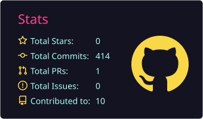

<div align="center">


<a href="https://git.io/typing-svg"></a>

<br/>


&nbsp;
<a href="https://github.com/MatheusAgueda?tab=followers"></a>
&nbsp;

&nbsp;


</div>

---

<table>
<tr>
<td width="50%" valign="top">

```yaml
╭──────────────────────────────────────╮
│  $ whoami                            │
├──────────────────────────────────────┤
│  Name:     Matheus Agueda            │
│  Role:     Systems Architect         │
│  Location: PT / FR / NL / ES         │
│  Focus:    Scale & Automation        │
│  Agents:   32 AI agents deployed     │
│  Uptime:   99.7% across 9 services  │
╰──────────────────────────────────────╯

  Languages:
  Python     ████████████████████  95%
  TypeScript ██████████████████░░  88%
  Node.js    █████████████████░░░  85%
  SQL        ████████████████░░░░  80%
  C / Metal  ██████████████░░░░░░  70%
  MQL5       ████████████░░░░░░░░  60%
  Solidity   ██████████░░░░░░░░░░  50%
```

</td>
<td width="50%" valign="top">

<div align="center">
<br/>

<a href="https://github.com/MatheusAgueda"></a>
<a href="https://github.com/MatheusAgueda"></a>
<a href="https://github.com/MatheusAgueda"></a>
<a href="https://github.com/MatheusAgueda"></a>
<a href="https://github.com/MatheusAgueda"></a>
<br/>
<a href="https://github.com/MatheusAgueda"></a>
<a href="https://github.com/MatheusAgueda"></a>
<a href="https://github.com/MatheusAgueda"></a>
<a href="https://github.com/MatheusAgueda"></a>
<a href="https://github.com/MatheusAgueda"></a>

<br/><br/>


</div>

</td>
</tr>
</table>

---

<div align="center">


</div>

---

##  3D Contribution Calendar

<div align="center">

<picture>
  <source media="(prefers-color-scheme: dark)" srcset="./profile-3d-contrib/profile-night-rainbow.svg" />
  <source media="(prefers-color-scheme: light)" srcset="./profile-3d-contrib/profile-green-animate.svg" />
  
</picture>

<br/>

<table>
<tr>
<td align="center">

<sub><b>GitBlock View</b></sub>
</td>
<td align="center">

<sub><b>Animated Green</b></sub>
</td>
</tr>
</table>

</div>

---

##  Production Systems

<table>
<tr>
<td align="center" width="33%">


<br/><sub><b>Lead Generation Engine</b></sub><br/>
<sub>1.93M leads · 752K eligible · 789K emails</sub><br/>


</td>
<td align="center" width="33%">


<br/><sub><b>AI Security Research Platform</b></sub><br/>
<sub>Python + C + Metal · Multi-agent</sub><br/>


</td>
<td align="center" width="33%">


<br/><sub><b>WhatsApp Automation Platform</b></sub><br/>
<sub>Node.js · Baileys · Railway · 14 Pages</sub><br/>


</td>
</tr>
<tr>
<td align="center">


<br/><sub><b>Algorithmic Trading</b></sub><br/>
<sub>MQL5 · MetaTrader 5 · Live Execution</sub><br/>


</td>
<td align="center">


<br/><sub><b>Business Platform</b></sub><br/>
<sub>FastAPI · Dashboard · Calculator · Ads</sub><br/>


</td>
<td align="center">


<br/><sub><b>Anti-Detect Browser Fleet</b></sub><br/>
<sub>Next.js · Cloud Profiles · API</sub><br/>


</td>
</tr>
<tr>
<td align="center">


<br/><sub><b>DeFi Security Scanner</b></sub><br/>
<sub>TypeScript · On-chain · Honeypot detect</sub><br/>


</td>
<td align="center">


<br/><sub><b>Token Launch Sniper</b></sub><br/>
<sub>Python · Mempool · MEV Strategies</sub><br/>


</td>
<td align="center">


<br/><sub><b>Multi-Country Company Ops</b></sub><br/>
<sub>PT · FR · NL · ES portal automation</sub><br/>


</td>
</tr>
</table>

---

##  GitHub Analytics

<div align="center">


</div>

<div align="center">


</div>

<div align="center">


</div>

<div align="center">




</div>

<div align="center">


</div>

---

##  Metrics Deep Dive

<div align="center">


</div>

<div align="center">


</div>

<div align="center">


</div>

<div align="center">


</div>

---

##  Contribution Snake

<div align="center">

<picture>
  <source media="(prefers-color-scheme: dark)" srcset="https://raw.githubusercontent.com/MatheusAgueda/MatheusAgueda/output/github-snake-dark.svg" />
  <source media="(prefers-color-scheme: light)" srcset="https://raw.githubusercontent.com/MatheusAgueda/MatheusAgueda/output/github-snake.svg" />
  
</picture>

</div>

---

<details>
<summary><b>🏗️ Infrastructure & Architecture</b></summary>
<br/>

```
┌─────────────────────────────────────────────────────────────────────┐
│                      PRODUCTION INFRASTRUCTURE                       │
├────────────────┬────────────────────────────────────────────────────┤
│ Compute        │ Railway (3 services) · Vercel (2 apps) · M4 Pro   │
│ Database       │ PostgreSQL 16 — 1.93M rows, tuned (6GB shared)    │
│ Email          │ 3 DKIM relays — 385/day (Resend+SendGrid+GSMTP)  │
│ Monitoring     │ Sentry · Grafana · Custom health daemons          │
│ CI/CD          │ GitHub Actions · git push = deploy                │
│ DNS            │ Cloudflare (2 zones) · UOL Host                   │
│ Security       │ DMARC quarantine · SPF ~all · rate limiting       │
│ AI Agents      │ 32 specialized agents · Claude Code + MCP stack   │
│ Automation     │ Playwright fleet · cron jobs · webhook pipelines  │
│ Trading        │ MetaTrader 5 · Live algorithmic execution         │
│ Blockchain     │ Mempool monitoring · On-chain analysis · MEV      │
│ Browser Fleet  │ GeeLark anti-detect · Stealth Playwright          │
└────────────────┴────────────────────────────────────────────────────┘
```

</details>

<details>
<summary><b>🔐 Security Research & Offensive Tooling</b></summary>
<br/>

| Area | Tools & Techniques |
|------|-------------------|
| **Network** | bettercap · mitmproxy · routersploit · Wireshark · nmap |
| **WiFi** | WPA2/WPA3 audit · PMKID capture · deauth · monitor mode |
| **Web** | Burp Suite · SQLMap · XSS · session hijacking · CSRF |
| **OSINT** | Maltego · theHarvester · Shodan · breach correlation |
| **Crypto** | ECDSA research · lattice attacks · brainwallet audit |
| **RF/SDR** | RTL-SDR · HackRF · SubGHz · NFC/RFID · GSM interception |
| **AI Red Team** | garak · promptfoo · LLM jailbreak · prompt injection |
| **Mobile** | frida · objection · MVT · runtime instrumentation |
| **Forensics** | Volatility · Autopsy · disk imaging · memory analysis |
| **Stealth** | Anti-fingerprint · TLS mimicry · residential proxies |

**AI Security Platform (CIA Einstein):** Multi-agent system with 32+ specialized agents for automated vulnerability research, OSINT correlation, and threat intelligence aggregation. Built with Python + C + Metal for GPU-accelerated cryptanalysis.

</details>

<details>
<summary><b>📈 Trading & DeFi Operations</b></summary>
<br/>

| System | Stack | Status |
|--------|-------|--------|
| **Jessie Trader** | MQL5 · MetaTrader 5 | Live — algorithmic execution |
| **RugPull Scanner** | TypeScript · Ethers.js | Active — smart contract audit |
| **MoonSniper** | Python · Web3.py | Active — mempool frontrunning |
| **DeFi Research** | Solidity · Foundry | Ongoing — flash loan patterns |

**Capabilities:** Liquidity analysis, sandwich attack detection, honeypot identification, token launch sniping, MEV extraction strategies, on-chain forensics.

</details>

<details>
<summary><b>🌍 Business Operations — 4 Countries</b></summary>
<br/>

| Country | Entity | Activity | Stack |
|---------|--------|----------|-------|
| 🇵🇹 Portugal | Green Village Mobilehomes | Mobile home sales & logistics | FastAPI · PostgreSQL · Playwright |
| 🇫🇷 France | Easystart Office | Company formation services | Playwright · INPI automation |
| 🇳🇱 Netherlands | EU Operations Hub | Cross-border coordination | DigiD · KVK integration |
| 🇪🇸 Spain | Market Expansion | Dealer network building | Lead scraper · CRM |

**Automated:** Tax filing, compliance checks, government portal interactions, invoice processing, lead generation across 48 countries.

</details>

<details>
<summary><b>🤖 AI Agent Architecture</b></summary>
<br/>

```
┌────────────────────────────────────────────────────────────────┐
│                    32 SPECIALIZED AI AGENTS                     │
├────────────────────────────────────────────────────────────────┤
│                                                                │
│  ┌──────────┐  ┌──────────┐  ┌──────────┐  ┌──────────┐     │
│  │ Scraper  │  │  Email   │  │ Security │  │ Business │     │
│  │   Ops    │  │   Ops    │  │ Reviewer │  │   Ops    │     │
│  └────┬─────┘  └────┬─────┘  └────┬─────┘  └────┬─────┘     │
│       │              │              │              │           │
│  ┌────┴─────┐  ┌────┴─────┐  ┌────┴─────┐  ┌────┴─────┐     │
│  │  Relay   │  │ Campaign │  │  OSINT   │  │  Deploy  │     │
│  │ Analyst  │  │Dispatcher│  │  Recon   │  │  Verify  │     │
│  └────┬─────┘  └────┬─────┘  └────┬─────┘  └────┬─────┘     │
│       │              │              │              │           │
│       └──────────────┴──────┬───────┴──────────────┘           │
│                             │                                  │
│                    ┌────────┴────────┐                         │
│                    │   Commander     │                         │
│                    │   Dispatcher    │                         │
│                    └─────────────────┘                         │
│                                                                │
│  + 20 more: einstein-reader, researcher, parallel-fanout,     │
│    lead-auditor, smtp-ops, cia-test-runner, ptpt-reviewer,    │
│    ship-density-enforcer, joao-deploy, campaign-dispatch ...  │
└────────────────────────────────────────────────────────────────┘
```

</details>

<details>
<summary><b>⚡ Development Environment</b></summary>
<br/>

| Component | Details |
|-----------|---------|
| **Hardware** | MacBook Pro M4 Pro · 24GB · 14-core GPU |
| **Editor** | VS Code + Claude Code CLI (Opus) |
| **AI Stack** | 32 agents · 230+ MCP tools · 800+ skills |
| **Database** | PostgreSQL 16 tuned — 6GB shared_buffers |
| **Languages** | Python 3.14 · Node 22 · TypeScript 5.x · C · MQL5 |
| **Deploy** | `git push main` → Railway/Vercel auto-deploy |
| **Browser** | Playwright MCP · Chrome DevTools · Stagehand v3 |
| **Security** | 10 MCP security servers · 39 CLI tools · semgrep |
| **Monitoring** | Sentry · Grafana · custom zombie-killer daemon |

</details>

---

<div align="center">

```diff
@@                    System Status                    @@
+ 9 production systems operational
+ 1.93M leads scraped & processed
+ 4 countries with active business entities
+ 385 emails/day across 3 DKIM-verified relays
+ 32 AI agents deployed & coordinated
+ 230+ MCP tools across 10 servers
- 0 systems down
! Last updated: auto-generated via GitHub Actions
```

</div>

<div align="center">

<a href="https://github.com/MatheusAgueda"></a>
&nbsp;
<a href="mailto:aguedamatheus475@gmail.com"></a>
&nbsp;
<a href="https://www.greenvillagemobilehomes.com"></a>

</div>

---


