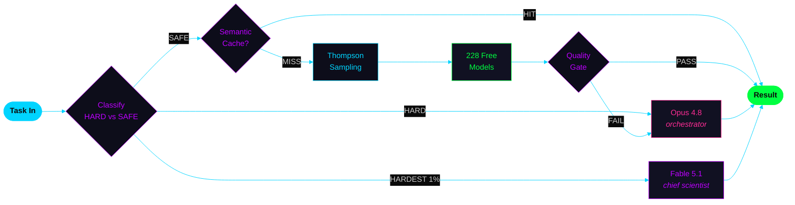
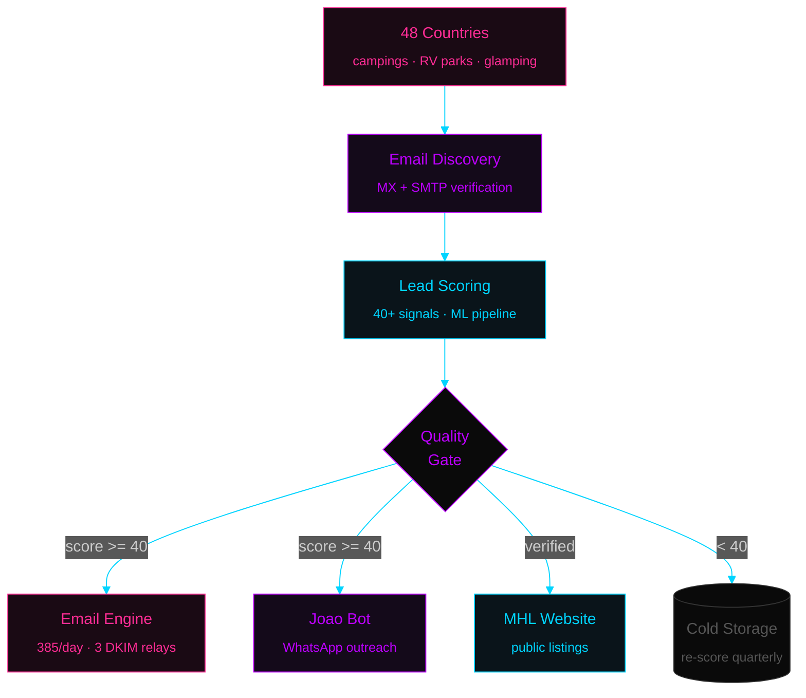

<div align="center">

<!-- ═══════════════════════════════════════════════════════════════════
     HEADER: Capsule-render waving + animated neon SVG + typing
     ═══════════════════════════════════════════════════════════════════ -->


<br/>

<a href="https://git.io/typing-svg"></a>

<br/>

<a href="https://git.io/typing-svg"></a>

<br/>

<!-- ═══════════════ BADGE WALL ═══════════════ -->


&nbsp;

&nbsp;

&nbsp;

&nbsp;


</div>

<!-- ═══════════════════════════════════════════════════════════════════
     TERMINAL ANIMATION — Fleet status dashboard
     ═══════════════════════════════════════════════════════════════════ -->

<div align="center">

</div>


<!-- ═══════════════════════════════════════════════════════════════════
     ABOUT — side-by-side: identity + tech stack
     ═══════════════════════════════════════════════════════════════════ -->

<table>
<tr>
<td width="40%" valign="top">

```properties
# ~/.config/architect.yml

identity:
  name:  Matheus Agueda
  role:  Systems Architect & AI Engineer
  ceo:   Green Village Mobile Homes
  scope: PT · FR · NL · ES

scale:
  systems:   12 production services
  ai_models: 228 (94.2% routed free)
  leads:     1,930,000 processed
  emails:    385/day × 3 DKIM relays
  agents:    17 self-improving AI agents
  tools:     85+ MCP tools · 40 skills

hardware:
  local: M4 Pro 14-core · 24GB unified
  db:    PostgreSQL 16 · 6GB shared_buffers
  cloud: Railway ×3 · Vercel ×2 · CF ×2
```

</td>
<td width="60%" valign="top">

<div align="center">

<br/>
<sub><kbd>LANGUAGES</kbd></sub>
<br/><br/>

<br/>
<sub><kbd>BACKEND</kbd></sub>
<br/><br/>

<br/>
<sub><kbd>FRONTEND</kbd></sub>
<br/><br/>

<br/>
<sub><kbd>INFRASTRUCTURE</kbd></sub>
<br/><br/>

<br/>
<sub><kbd>DEVOPS</kbd></sub>

</div>

</td>
</tr>
</table>


<!-- ═══════════════════════════════════════════════════════════════════
     FLEET BRAIN — the WTF centerpiece
     ═══════════════════════════════════════════════════════════════════ -->

##  The AI Router Nobody Expects in a Profile README

> [!IMPORTANT]
> This is not a wrapper. It's a **multi-armed bandit** that routes every AI sub-task to the cheapest model that clears the quality bar --- using **Thompson Sampling + UCB1** with calibrated confidence gates, semantic caching, and a self-correcting feedback loop.

<div align="center">


```mermaid
%%{init: {'theme': 'dark', 'themeVariables': {
  'primaryColor': '#FF2D95',
  'primaryTextColor': '#fff',
  'primaryBorderColor': '#BD00FF',
  'lineColor': '#00D4FF',
  'secondaryColor': '#0a0a14',
  'tertiaryColor': '#111122',
  'edgeLabelBackground': '#0a0a0a',
  'clusterBkg': '#0d0d1a',
  'clusterBorder': '#BD00FF',
  'titleColor': '#00D4FF',
  'nodeTextColor': '#cccccc'
}}}%%

flowchart LR
  IN(["Task In"]):::input --> CLASS{"Classify<br/>HARD vs SAFE"}:::gate

  CLASS -->|"HARD"| OPUS["Opus 4.8<br/><i>orchestrator</i>"]:::opus
  CLASS -->|"SAFE"| CACHE{"Semantic<br/>Cache?"}:::gate
  CLASS -->|"HARDEST 1%"| FABLE["Fable 5.1<br/><i>chief scientist</i>"]:::fable

  CACHE -->|"HIT"| OUT(["Result"]):::output
  CACHE -->|"MISS"| MAB["Thompson<br/>Sampling"]:::mab

  MAB --> FREE["228 Free<br/>Models"]:::free
  FREE --> VERIFY{"Quality<br/>Gate"}:::gate
  VERIFY -->|"PASS"| OUT
  VERIFY -->|"FAIL"| OPUS

  OPUS --> OUT
  FABLE --> OUT

  classDef input fill:#00D4FF,stroke:#00D4FF,color:#0a0a0a,font-weight:bold
  classDef output fill:#00ff41,stroke:#00ff41,color:#0a0a0a,font-weight:bold
  classDef gate fill:#0d0d1a,stroke:#BD00FF,color:#BD00FF
  classDef opus fill:#111122,stroke:#FF2D95,color:#FF2D95
  classDef fable fill:#111122,stroke:#BD00FF,color:#BD00FF
  classDef mab fill:#0d0d1a,stroke:#00D4FF,color:#00D4FF
  classDef free fill:#111122,stroke:#00ff41,color:#00ff41
```

</div>

The routing math behind the model selection:

$$P(\theta_i \mid \mathcal{D}) \propto \prod_{t=1}^{n} \text{Bernoulli}(r_t \mid \theta_i) \cdot \text{Beta}(\alpha_i, \beta_i)$$

Where $\theta_i$ is the success rate of model $i$, updated after every task via Thompson posterior draws. The **WIS** (Weighted Intelligence Score) sits at **0.9643** --- meaning 96.4% of routed tasks produce correct output on the first try, while spending 94.2% fewer tokens than running everything on Opus.


<!-- ═══════════════════════════════════════════════════════════════════
     LIVE DASHBOARD SVG
     ═══════════════════════════════════════════════════════════════════ -->

<div align="center">

##  System Dashboard


</div>


<!-- ═══════════════════════════════════════════════════════════════════
     12 PRODUCTION SYSTEMS — compact grid
     ═══════════════════════════════════════════════════════════════════ -->

## Production Systems

> [!NOTE]
> Each system runs in production daily. This is not a portfolio of demos.

<table>
<tr>
<td align="center" width="25%">

<br/><kbd>Fleet Brain</kbd><br/>
<sub>228 models  ·  Thompson + UCB1</sub><br/>
<sub>94.2% free routing  ·  WIS 0.96</sub><br/>

</td>
<td align="center" width="25%">

<br/><kbd>Global Lead Scraper</kbd><br/>
<sub>1.93M leads  ·  752K eligible</sub><br/>
<sub>789K verified emails</sub><br/>


</td>
<td align="center" width="25%">

<br/><kbd>Email Engine</kbd><br/>
<sub>385/day × 3 DKIM relays</sub><br/>
<sub>SPF + DMARC + bounce &lt;5%</sub><br/>

</td>
<td align="center" width="25%">

<br/><kbd>Claude Harness</kbd><br/>
<sub>17 agents  ·  85+ MCP tools</sub><br/>
<sub>40 skills  ·  self-improving</sub><br/>

</td>
</tr>
<tr>
<td align="center">

<br/><kbd>Jarvis</kbd><br/>
<sub>Computer-Use stack  ·  656 files</sub><br/>
<sub>4 browser lanes  ·  cursor-less</sub><br/>


</td>
<td align="center">

<br/><kbd>Joao Bot</kbd><br/>
<sub>WhatsApp automation</sub><br/>
<sub>Baileys  ·  BullMQ  ·  Railway</sub><br/>


</td>
<td align="center">

<br/><kbd>MHL Platform</kbd><br/>
<sub>Business website + CMS + API</sub><br/>
<sub>Next.js 15  ·  NestJS 11  ·  Prisma 6</sub><br/>

</td>
<td align="center">

<br/><kbd>Fleet Proxy</kbd><br/>
<sub>Unified Intelligence API</sub><br/>
<sub>49+ systems  ·  port 8787</sub><br/>

</td>
</tr>
<tr>
<td align="center">

<br/><kbd>Empresas</kbd><br/>
<sub>Company formation automation</sub><br/>
<sub>PT · FR · NL · ES portals</sub><br/>


</td>
<td align="center">

<br/><kbd>Jessie Trader</kbd><br/>
<sub>Algorithmic trading</sub><br/>
<sub>MQL5  ·  MetaTrader 5  ·  Live</sub><br/>

</td>
<td align="center">

<br/><kbd>MoonSniper</kbd><br/>
<sub>Solana memecoin trading</sub><br/>
<sub>Mempool sniping  ·  sub-ms</sub><br/>

</td>
<td align="center">

<br/><kbd>Green Village 72</kbd><br/>
<sub>3D mobile home configurator</sub><br/>
<sub>Three.js  ·  interactive  ·  live</sub><br/>

</td>
</tr>
</table>


<!-- ═══════════════════════════════════════════════════════════════════
     SKILLS RADAR + DATA PIPELINE MERMAID
     ═══════════════════════════════════════════════════════════════════ -->

<table>
<tr>
<td width="50%" valign="top">

### Skills Radar


</td>
<td width="50%" valign="top">

### Data Pipeline


```mermaid
%%{init: {'theme': 'dark', 'themeVariables': {
  'primaryColor': '#FF2D95',
  'primaryTextColor': '#cccccc',
  'primaryBorderColor': '#BD00FF',
  'lineColor': '#00D4FF',
  'secondaryColor': '#111122',
  'tertiaryColor': '#0d0d1a'
}}}%%

flowchart TB
  SCRAPE["48 Countries<br/><sub>campings · RV parks · glamping</sub>"]:::pink
  --> ENRICH["Email Discovery<br/><sub>MX + SMTP verification</sub>"]:::purple
  --> SCORE["Lead Scoring<br/><sub>40+ signals · ML pipeline</sub>"]:::cyan
  --> GATE{"Quality<br/>Gate"}:::gate
  GATE -->|"score >= 40"| SEND["Email Engine<br/><sub>385/day · 3 DKIM relays</sub>"]:::pink
  GATE -->|"score >= 40"| WA["Joao Bot<br/><sub>WhatsApp outreach</sub>"]:::purple
  GATE -->|"verified"| MHL["MHL Website<br/><sub>public listings</sub>"]:::cyan
  GATE -->|"< 40"| COLD[("Cold Storage<br/><sub>re-score quarterly</sub>")]:::dim

  classDef pink fill:#1a0a14,stroke:#FF2D95,color:#FF2D95
  classDef purple fill:#140a1a,stroke:#BD00FF,color:#BD00FF
  classDef cyan fill:#0a141a,stroke:#00D4FF,color:#00D4FF
  classDef gate fill:#0a0a0a,stroke:#BD00FF,color:#BD00FF
  classDef dim fill:#0a0a0a,stroke:#333,color:#555
```

$$\text{Score}(l) = \sum_{i=1}^{n} w_i \cdot f_i(l) \quad \text{s.t.} \quad \sum w_i = 1$$

<sub>Where $f_i$ are feature extractors (email validity, domain authority, geo match, vertical fit, etc.) and $w_i$ are learned weights.</sub>

</td>
</tr>
</table>


<!-- ═══════════════════════════════════════════════════════════════════
     3D CONTRIBUTION CALENDAR (dark/light responsive) + SNAKE
     ═══════════════════════════════════════════════════════════════════ -->

<div align="center">

## Contribution Topology

<picture>
  <source media="(prefers-color-scheme: dark)" srcset="./profile-3d-contrib/profile-night-rainbow.svg" />
  <source media="(prefers-color-scheme: light)" srcset="./profile-3d-contrib/profile-green-animate.svg" />
  
</picture>

<br/>

<picture>
  <source media="(prefers-color-scheme: dark)" srcset="https://raw.githubusercontent.com/MatheusAgueda/MatheusAgueda/output/github-snake-dark.svg" />
  <source media="(prefers-color-scheme: light)" srcset="https://raw.githubusercontent.com/MatheusAgueda/MatheusAgueda/output/github-snake.svg" />
  
</picture>

</div>


<!-- ═══════════════════════════════════════════════════════════════════
     GITHUB STATS — compact row
     ═══════════════════════════════════════════════════════════════════ -->

<div align="center">

## GitHub Analytics


<br/>


</div>

<div align="center">


</div>


<!-- ═══════════════════════════════════════════════════════════════════
     LOWLIGHTER METRICS + SUMMARY CARDS
     ═══════════════════════════════════════════════════════════════════ -->

<details>
<summary><b>&nbsp;Detailed Metrics &amp; Language Breakdown&nbsp;</b></summary>
<br/>

<div align="center">


<br/>


<br/>


<br/>


<br/>


</div>

</details>


<!-- ═══════════════════════════════════════════════════════════════════
     3D STL MODEL VIEWER — yes, GitHub renders STL in markdown
     ═══════════════════════════════════════════════════════════════════ -->

<div align="center">

## Rotate This

> [!TIP]
> Click and drag the crystal below. GitHub renders 3D models natively.

</div>

```stl
solid logo3d
  facet normal 0.0000 0.8507 0.5257
    outer loop
      vertex 0.0000 100.0000 0.0000
      vertex 42.5325 52.5731 0.0000
      vertex 13.1433 52.5731 40.4508
    endloop
  endfacet
  facet normal 0.0000 0.8507 0.5257
    outer loop
      vertex 0.0000 100.0000 0.0000
      vertex 13.1433 52.5731 40.4508
      vertex -34.4095 52.5731 25.0000
    endloop
  endfacet
  facet normal 0.0000 0.8507 -0.5257
    outer loop
      vertex 0.0000 100.0000 0.0000
      vertex -34.4095 52.5731 -25.0000
      vertex 13.1433 52.5731 -40.4508
    endloop
  endfacet
  facet normal 0.0000 0.8507 -0.5257
    outer loop
      vertex 0.0000 100.0000 0.0000
      vertex 13.1433 52.5731 -40.4508
      vertex 42.5325 52.5731 0.0000
    endloop
  endfacet
  facet normal -0.8090 0.5000 0.3090
    outer loop
      vertex 0.0000 100.0000 0.0000
      vertex -34.4095 52.5731 25.0000
      vertex -42.5325 52.5731 0.0000
    endloop
  endfacet
  facet normal -0.8090 0.5000 -0.3090
    outer loop
      vertex 0.0000 100.0000 0.0000
      vertex -42.5325 52.5731 0.0000
      vertex -34.4095 52.5731 -25.0000
    endloop
  endfacet
  facet normal 0.5878 0.0000 0.8090
    outer loop
      vertex 42.5325 52.5731 0.0000
      vertex 68.8190 0.0000 50.0000
      vertex 13.1433 52.5731 40.4508
    endloop
  endfacet
  facet normal -0.9511 0.0000 0.3090
    outer loop
      vertex -34.4095 52.5731 25.0000
      vertex -68.8190 0.0000 50.0000
      vertex -85.0651 0.0000 0.0000
    endloop
  endfacet
  facet normal -0.9511 0.0000 -0.3090
    outer loop
      vertex -34.4095 52.5731 -25.0000
      vertex -85.0651 0.0000 0.0000
      vertex -68.8190 0.0000 -50.0000
    endloop
  endfacet
  facet normal 0.5878 0.0000 -0.8090
    outer loop
      vertex 42.5325 52.5731 0.0000
      vertex 13.1433 52.5731 -40.4508
      vertex 68.8190 0.0000 -50.0000
    endloop
  endfacet
  facet normal 0.0000 0.0000 1.0000
    outer loop
      vertex 13.1433 52.5731 40.4508
      vertex 68.8190 0.0000 50.0000
      vertex -26.2866 0.0000 80.9017
    endloop
  endfacet
  facet normal 0.0000 0.0000 1.0000
    outer loop
      vertex 13.1433 52.5731 40.4508
      vertex -26.2866 0.0000 80.9017
      vertex -34.4095 52.5731 25.0000
    endloop
  endfacet
  facet normal 0.0000 0.0000 -1.0000
    outer loop
      vertex 13.1433 52.5731 -40.4508
      vertex -34.4095 52.5731 -25.0000
      vertex -26.2866 0.0000 -80.9017
    endloop
  endfacet
  facet normal 0.0000 0.0000 -1.0000
    outer loop
      vertex 13.1433 52.5731 -40.4508
      vertex -26.2866 0.0000 -80.9017
      vertex 68.8190 0.0000 -50.0000
    endloop
  endfacet
  facet normal 0.0000 -0.8507 -0.5257
    outer loop
      vertex 0.0000 -100.0000 0.0000
      vertex 13.1433 -52.5731 -40.4508
      vertex -34.4095 -52.5731 -25.0000
    endloop
  endfacet
  facet normal 0.0000 -0.8507 0.5257
    outer loop
      vertex 0.0000 -100.0000 0.0000
      vertex -34.4095 -52.5731 25.0000
      vertex 13.1433 -52.5731 40.4508
    endloop
  endfacet
  facet normal 0.0000 -0.8507 0.5257
    outer loop
      vertex 0.0000 -100.0000 0.0000
      vertex 13.1433 -52.5731 40.4508
      vertex 42.5325 -52.5731 0.0000
    endloop
  endfacet
  facet normal 0.0000 -0.8507 -0.5257
    outer loop
      vertex 0.0000 -100.0000 0.0000
      vertex 42.5325 -52.5731 0.0000
      vertex 13.1433 -52.5731 -40.4508
    endloop
  endfacet
  facet normal -0.8090 -0.5000 -0.3090
    outer loop
      vertex 0.0000 -100.0000 0.0000
      vertex -34.4095 -52.5731 -25.0000
      vertex -42.5325 -52.5731 0.0000
    endloop
  endfacet
  facet normal -0.8090 -0.5000 0.3090
    outer loop
      vertex 0.0000 -100.0000 0.0000
      vertex -42.5325 -52.5731 0.0000
      vertex -34.4095 -52.5731 25.0000
    endloop
  endfacet
  facet normal 0.9511 0.0000 0.3090
    outer loop
      vertex 42.5325 52.5731 0.0000
      vertex 85.0651 0.0000 0.0000
      vertex 68.8190 0.0000 50.0000
    endloop
  endfacet
  facet normal 0.9511 0.0000 -0.3090
    outer loop
      vertex 42.5325 52.5731 0.0000
      vertex 68.8190 0.0000 -50.0000
      vertex 85.0651 0.0000 0.0000
    endloop
  endfacet
  facet normal -0.5878 0.0000 0.8090
    outer loop
      vertex -34.4095 52.5731 25.0000
      vertex -26.2866 0.0000 80.9017
      vertex -68.8190 0.0000 50.0000
    endloop
  endfacet
  facet normal -0.5878 0.0000 -0.8090
    outer loop
      vertex -34.4095 52.5731 -25.0000
      vertex -68.8190 0.0000 -50.0000
      vertex -26.2866 0.0000 -80.9017
    endloop
  endfacet
  facet normal 0.9511 0.0000 0.3090
    outer loop
      vertex 42.5325 -52.5731 0.0000
      vertex 68.8190 0.0000 50.0000
      vertex 85.0651 0.0000 0.0000
    endloop
  endfacet
  facet normal 0.9511 0.0000 -0.3090
    outer loop
      vertex 42.5325 -52.5731 0.0000
      vertex 85.0651 0.0000 0.0000
      vertex 68.8190 0.0000 -50.0000
    endloop
  endfacet
  facet normal 0.5878 0.0000 0.8090
    outer loop
      vertex 13.1433 -52.5731 40.4508
      vertex 68.8190 0.0000 50.0000
      vertex 42.5325 -52.5731 0.0000
    endloop
  endfacet
  facet normal -0.5878 0.0000 0.8090
    outer loop
      vertex -34.4095 -52.5731 25.0000
      vertex -68.8190 0.0000 50.0000
      vertex -26.2866 0.0000 80.9017
    endloop
  endfacet
  facet normal 0.0000 0.0000 1.0000
    outer loop
      vertex 13.1433 -52.5731 40.4508
      vertex -34.4095 -52.5731 25.0000
      vertex -26.2866 0.0000 80.9017
    endloop
  endfacet
  facet normal 0.0000 0.0000 1.0000
    outer loop
      vertex 13.1433 -52.5731 40.4508
      vertex -26.2866 0.0000 80.9017
      vertex 68.8190 0.0000 50.0000
    endloop
  endfacet
  facet normal -0.9511 0.0000 0.3090
    outer loop
      vertex -42.5325 -52.5731 0.0000
      vertex -85.0651 0.0000 0.0000
      vertex -68.8190 0.0000 50.0000
    endloop
  endfacet
  facet normal -0.9511 0.0000 0.3090
    outer loop
      vertex -42.5325 -52.5731 0.0000
      vertex -68.8190 0.0000 50.0000
      vertex -34.4095 -52.5731 25.0000
    endloop
  endfacet
  facet normal -0.9511 0.0000 -0.3090
    outer loop
      vertex -42.5325 -52.5731 0.0000
      vertex -34.4095 -52.5731 -25.0000
      vertex -68.8190 0.0000 -50.0000
    endloop
  endfacet
  facet normal -0.9511 0.0000 -0.3090
    outer loop
      vertex -42.5325 -52.5731 0.0000
      vertex -68.8190 0.0000 -50.0000
      vertex -85.0651 0.0000 0.0000
    endloop
  endfacet
  facet normal -0.5878 0.0000 -0.8090
    outer loop
      vertex -34.4095 -52.5731 -25.0000
      vertex -26.2866 0.0000 -80.9017
      vertex -68.8190 0.0000 -50.0000
    endloop
  endfacet
  facet normal 0.0000 0.0000 -1.0000
    outer loop
      vertex 13.1433 -52.5731 -40.4508
      vertex 68.8190 0.0000 -50.0000
      vertex -26.2866 0.0000 -80.9017
    endloop
  endfacet
  facet normal 0.0000 0.0000 -1.0000
    outer loop
      vertex 13.1433 -52.5731 -40.4508
      vertex -26.2866 0.0000 -80.9017
      vertex -34.4095 -52.5731 -25.0000
    endloop
  endfacet
  facet normal 0.5878 0.0000 -0.8090
    outer loop
      vertex 42.5325 -52.5731 0.0000
      vertex 68.8190 0.0000 -50.0000
      vertex 13.1433 -52.5731 -40.4508
    endloop
  endfacet
endsolid logo3d
```


<!-- ═══════════════════════════════════════════════════════════════════
     OPERATIONS MAP — interactive GeoJSON
     ═══════════════════════════════════════════════════════════════════ -->

<div align="center">

## Operations Map

</div>

> [!NOTE]
> This is an **interactive map**. Scroll to zoom, click markers for details. GitHub renders GeoJSON natively.

```geojson
{
  "type": "FeatureCollection",
  "features": [
    {
      "type": "Feature",
      "properties": {
        "name": "Portugal  ---  HQ",
        "description": "Green Village Mobile Homes  ·  1.93M leads  ·  CEO base",
        "marker-color": "#FF2D95",
        "marker-size": "large",
        "marker-symbol": "commercial"
      },
      "geometry": { "type": "Point", "coordinates": [-8.61, 41.15] }
    },
    {
      "type": "Feature",
      "properties": {
        "name": "France  ---  Easystart Office",
        "description": "Company formation  ·  INPI/URSSAF automation",
        "marker-color": "#BD00FF",
        "marker-size": "large",
        "marker-symbol": "town-hall"
      },
      "geometry": { "type": "Point", "coordinates": [2.35, 48.86] }
    },
    {
      "type": "Feature",
      "properties": {
        "name": "Netherlands  ---  EU Ops",
        "description": "Cross-border  ·  KVK  ·  VAT VIES coordination",
        "marker-color": "#00D4FF",
        "marker-size": "large",
        "marker-symbol": "embassy"
      },
      "geometry": { "type": "Point", "coordinates": [4.90, 52.37] }
    },
    {
      "type": "Feature",
      "properties": {
        "name": "Spain  ---  Market Expansion",
        "description": "Dealer network  ·  Lead generation  ·  CRM",
        "marker-color": "#FF2D95",
        "marker-size": "large",
        "marker-symbol": "rocket"
      },
      "geometry": { "type": "Point", "coordinates": [-3.70, 40.42] }
    },
    {
      "type": "Feature",
      "properties": {
        "name": "Lead Coverage  ---  48 Countries",
        "stroke": "#BD00FF",
        "stroke-width": 2,
        "stroke-opacity": 0.5,
        "fill": "#BD00FF",
        "fill-opacity": 0.06
      },
      "geometry": {
        "type": "Polygon",
        "coordinates": [[[-10, 35], [30, 35], [30, 58], [-10, 58], [-10, 35]]]
      }
    }
  ]
}
```


<!-- ═══════════════════════════════════════════════════════════════════
     SYSTEM STATUS + CHESS
     ═══════════════════════════════════════════════════════════════════ -->

<table>
<tr>
<td width="55%" valign="top">

### System Status

```diff
@@                OPERATIONAL STATUS               @@
+ Fleet Brain ........... 228 models · WIS 0.9643
+ Lead Scraper .......... 1.93M leads · 752K eligible
+ Email Engine .......... 385/day · 3 DKIM relays
+ Claude Harness ........ 17 agents · self-improving
+ Jarvis ................ 4 lanes · 17 cognitive modules
+ Joao Bot .............. WhatsApp · Railway
+ MHL Platform .......... Next.js 15 · NestJS 11
+ Fleet Proxy ........... 49+ systems · port 8787
+ Empresas .............. PT·FR·NL·ES automation
+ Jessie Trader ......... MQL5 · live algo trading
+ MoonSniper ............ Rust · Solana sniping
+ Green Village 72 ...... Three.js · 3D configurator
- Systems down .......... 0
```

</td>
<td width="45%" valign="top">

### Play Chess Against Me

**Open a [new issue](https://github.com/MatheusAgueda/MatheusAgueda/issues/new?template=chess-move.yml) to make a move.**

| | a | b | c | d | e | f | g | h |
|:--|:-:|:-:|:-:|:-:|:-:|:-:|:-:|:-:|
| **8** | r | n | b | q | k | b | n | r |
| **7** | p | p | p | p | p | p | p | p |
| **6** | . | . | . | . | . | . | . | . |
| **5** | . | . | . | . | . | . | . | . |
| **4** | . | . | . | . | . | . | . | . |
| **3** | . | . | . | . | . | . | . | . |
| **2** | P | P | P | P | P | P | P | P |
| **1** | R | N | B | Q | K | B | N | R |

<div align="center">

<a href="https://github.com/MatheusAgueda/MatheusAgueda/issues/new?template=chess-move.yml&title=chess%7Ce2e4"></a>
<a href="https://github.com/MatheusAgueda/MatheusAgueda/issues/new?template=chess-move.yml&title=chess%7Cd2d4"></a>
<a href="https://github.com/MatheusAgueda/MatheusAgueda/issues/new?template=chess-move.yml&title=chess%7CNf3"></a>

</div>

</td>
</tr>
</table>


<!-- ═══════════════════════════════════════════════════════════════════
     RECENT ACTIVITY (auto-updated by GitHub Action)
     ═══════════════════════════════════════════════════════════════════ -->

<details>
<summary><b>&nbsp;Recent Activity&nbsp;</b></summary>
<br/>

<!--START_SECTION:activity-->
1. Pushed commits to repositories
<!--END_SECTION:activity-->

</details>

<!-- ═══════════════════════════════════════════════════════════════════
     FOOTER
     ═══════════════════════════════════════════════════════════════════ -->

<br/>

<div align="center">


&nbsp;

&nbsp;

&nbsp;


<br/><br/>

<a href="mailto:info@greenvillagemobilehomes.com"></a>
&nbsp;
<a href="https://www.greenvillagemobilehomes.com"></a>

<br/><br/>

<sub>

Built with custom animated SVGs, Thompson Sampling, and too much coffee.
Every number on this page comes from a live production system.

</sub>

</div>


