<div align="center">

<!-- ╔══════════════════════════════════════════════════════════════════════════╗ -->
<!-- ║                          ANIMATED HEADER                                ║ -->
<!-- ║  capsule-render waving + 2 custom SVGs + typing + 8 metric badges      ║ -->
<!-- ╚══════════════════════════════════════════════════════════════════════════╝ -->


<!-- CUSTOM ANIMATED SVG — CSS @keyframes, neon glow, scan lines, 13 animations -->


<!-- TERMINAL SVG — matrix rain, animated typing, macOS chrome, 11 staggered lines -->


<!-- TYPING SVG — 4 rotating lines with box-drawing characters -->
<a href="https://git.io/typing-svg"></a>

<br/>

<!-- METRIC BADGES — 8 core stats -->

&nbsp;

&nbsp;

&nbsp;

&nbsp;

&nbsp;

&nbsp;

&nbsp;


</div>

---

<!-- ╔══════════════════════════════════════════════════════════════════════════╗ -->
<!-- ║                     TABLE OF CONTENTS                                   ║ -->
<!-- ╚══════════════════════════════════════════════════════════════════════════╝ -->

<details>
<summary><b>Table of Contents</b> — 30+ sections, 14 Mermaid diagrams, 9 code languages, 6 custom animated SVGs, GeoJSON map, STL 3D model</summary>

| # | Section | Type |
|:--|:--------|:-----|
| 1 | [Identity + Tech Arsenal](#-system-configuration) | Properties, skill icons, trophies, stats |
| 2 | [Live Dashboard](#-live-dashboard) | Custom SVG with CSS @keyframes |
| 3 | [Skills Radar](#-skills-radar) | Custom SVG with 8-axis SMIL radar |
| 4 | [Network Topology](#-network-topology) | Custom SVG with orbital animation |
| 5 | [3D Contribution Map](#-3d-contribution-map) | GitHub Actions SVG |
| 6 | [Contribution Snake](#-contribution-snake) | Animated SVG game |
| 7 | [System Architecture](#-system-architecture) | Mermaid flowchart |
| 8 | [Fleet Brain — AI Routing](#-fleet-brain--ai-model-routing) | Mermaid + detail panel |
| 9 | [Database Schema](#-database-schema--lead-pipeline) | Mermaid ER diagram |
| 10 | [Email Delivery Pipeline](#-email-delivery-pipeline) | Mermaid sequence diagram |
| 11 | [Lead Lifecycle](#-lead-lifecycle-state-machine) | Mermaid state diagram |
| 12 | [Technology Distribution](#-technology-distribution) | Mermaid pie charts |
| 13 | [Development Timeline](#-development-timeline) | Mermaid gantt |
| 14 | [Technology Radar](#-technology-radar) | Mermaid quadrant chart |
| 15 | [Lead Pipeline Journey](#-lead-pipeline-journey) | Mermaid journey diagram |
| 16 | [Email Delivery Metrics](#-email-delivery-metrics) | Mermaid xychart-beta |
| 17 | [Featured Code](#-featured-code) | Production code in 9 languages |
| 18 | [Chess Game](#-play-chess-against-me) | Interactive via GitHub Issues |
| 19 | [Production Systems](#-production-systems) | Badge grid |
| 20 | [GitHub Analytics](#-github-analytics) | Stats cards and graphs |
| 21 | [Metrics Deep Dive](#-metrics-deep-dive) | Lowlighter SVGs |
| 22 | [AI Agent Architecture](#-ai-agent-architecture) | Mermaid graph |
| 23 | [Tech Ecosystem](#-tech-ecosystem) | Mermaid mindmap |
| 24 | [Operations Map](#-operations-map--4-countries) | GeoJSON interactive map |
| 25 | [CI/CD Pipeline](#-cicd-pipeline) | Mermaid git graph |
| 26 | [Blog Posts](#-latest-blog-posts) | Auto-updated via Actions |
| 27 | [Recent Activity](#-recent-activity) | Auto-updated via Actions |
| 28 | [Depth Sections](#-trading-systems) | 7 collapsible panels |
| 29 | [Project Timeline](#-project-timeline) | Mermaid timeline |
| 30 | [3D Crystal](#-3d-crystal--interactive-viewer) | STL 3D model |

</details>

<!-- WAVE SEPARATOR — custom animated SVG -->


<!-- ╔══════════════════════════════════════════════════════════════════════════╗ -->
<!-- ║                     IDENTITY + TECH ARSENAL                             ║ -->
<!-- ╚══════════════════════════════════════════════════════════════════════════╝ -->

<table>
<tr>
<td width="42%" valign="top">

<div align="center">
 <b>SYSTEM CONFIGURATION</b>
</div>

```properties
# /etc/architect.conf — v12.0

[identity]
name      = Matheus Agueda
class     = Systems Architect & AI Engineer
scope     = PT · FR · NL · ES
style     = git push main → production
uptime    = 99.7% across 12 services

[scale]
systems   = 12 production services
agents    = 17 AI (Claude Opus + Fable 5.1)
models    = 228 routed via Fleet Brain
leads     = 1,930,000 processed
emails    = 385/day × 3 DKIM relays
countries = 4 active business entities

[compute]
local     = M4 Pro 14-core · 24 GB unified
database  = PostgreSQL 16 · 6 GB shared_buffers
cloud     = Railway ×3 · Vercel ×2 · CF ×2
fleet     = 228 models · 179 alive · 94.2% free

[intelligence]
fleet     = Thompson Sampling + UCB1 routing
harness   = 85+ tools · 17 agents · ~40 skills
jarvis    = 656 files · multi-lane browser AI
proxy     = 49+ systems · unified API gateway
```

</td>
<td width="58%" valign="top">

<div align="center">
 <b>TECH ARSENAL</b>
<br/><br/>

<!-- Languages -->
<br/>
<sub><kbd>LANGUAGES</kbd></sub>
<br/><br/>

<!-- Backend -->
<br/>
<sub><kbd>BACKEND</kbd></sub>
<br/><br/>

<!-- Frontend -->
<br/>
<sub><kbd>FRONTEND</kbd></sub>
<br/><br/>

<!-- Infrastructure -->
<br/>
<sub><kbd>INFRASTRUCTURE</kbd></sub>
<br/><br/>

<!-- DevOps & Tools -->
<br/>
<sub><kbd>DEVOPS & TOOLS</kbd></sub>
<br/><br/>

<!-- Deploy & AI -->
<br/>
<sub><kbd>DEPLOY & MONITORING</kbd></sub>

</div>

</td>
</tr>
</table>

<!-- TROPHIES -->
<div align="center">

</div>

<!-- GITHUB STATS CARDS — 2 column layout -->
<div align="center">
<table>
<tr>
<td width="50%">

</td>
<td width="50%">

</td>
</tr>
</table>
</div>

<!-- GRADIENT DIVIDER -->


<!-- ╔══════════════════════════════════════════════════════════════════════════╗ -->
<!-- ║                    CUSTOM ANIMATED SVG SHOWCASE                         ║ -->
<!-- ╚══════════════════════════════════════════════════════════════════════════╝ -->

##  Live Dashboard

<!-- STATS DASHBOARD SVG — circular gauge, bar chart, line graph, 12+ @keyframes, 800x350 -->
<div align="center">

</div>

> [!NOTE]
> **Custom animated SVG** — Pure CSS @keyframes + SMIL animations. No JavaScript. Circular gauge shows 1.93M lead count, bar chart displays relay capacity distribution, mini line graph tracks 30-day delivery trend. All rendered server-side with zero external dependencies.

<!-- WAVE SEPARATOR -->


##  Skills Radar

<!-- SKILLS RADAR SVG — 8-axis radar, 2 polygons, 12 CSS @keyframes, SMIL animations, 800x500 -->
<div align="center">

</div>

> **8-axis skill assessment** — Python (95%), AI/ML (92%), Infrastructure (85%), Email Delivery (90%), Trading (70%), Scraping (88%), Full Stack (82%), Automation (90%). Two overlapping polygons show current capability vs. 2026 targets. Scan line overlay + pulsing vertices.

<!-- GRADIENT DIVIDER -->


##  Network Topology

<!-- NETWORK TOPOLOGY SVG — COMMANDER node, 4 clusters, 11 animated connections, 14 @keyframes, 800x500 -->
<div align="center">

</div>

> [!TIP]
> **Interactive network visualization** — Central COMMANDER node with 3 pulsing rings and rotating orbit. 4 satellite clusters (DATA, EMAIL, AI FLEET, TRADE) connected by animated particle-flow paths. Infrastructure nodes (PostgreSQL, Railway, Vercel, Cloudflare) positioned at network edges. 14 CSS @keyframes + SMIL `animateMotion` along cubic bezier paths.

<!-- WAVE SEPARATOR -->


<!-- ╔══════════════════════════════════════════════════════════════════════════╗ -->
<!-- ║                      3D CONTRIBUTION CALENDAR                           ║ -->
<!-- ╚══════════════════════════════════════════════════════════════════════════╝ -->

<div align="center">

##  3D Contribution Map

<picture>
  <source media="(prefers-color-scheme: dark)" srcset="./profile-3d-contrib/profile-night-rainbow.svg" />
  <source media="(prefers-color-scheme: light)" srcset="./profile-3d-contrib/profile-green-animate.svg" />
  
</picture>

<table>
<tr>
<td align="center" width="50%">

<sub><kbd>GITBLOCK VIEW</kbd></sub>
</td>
<td align="center" width="50%">

<sub><kbd>ISOMETRIC ANIMATED</kbd></sub>
</td>
</tr>
</table>

</div>

<!-- GRADIENT DIVIDER -->


<!-- ╔══════════════════════════════════════════════════════════════════════════╗ -->
<!-- ║                        CONTRIBUTION SNAKE                               ║ -->
<!-- ╚══════════════════════════════════════════════════════════════════════════╝ -->

<div align="center">

##  Contribution Snake

<picture>
  <source media="(prefers-color-scheme: dark)" srcset="https://raw.githubusercontent.com/MatheusAgueda/MatheusAgueda/output/github-snake-dark.svg" />
  <source media="(prefers-color-scheme: light)" srcset="https://raw.githubusercontent.com/MatheusAgueda/MatheusAgueda/output/github-snake.svg" />
  
</picture>

</div>

<!-- WAVE SEPARATOR -->


<!-- ╔══════════════════════════════════════════════════════════════════════════╗ -->
<!-- ║                       SYSTEM ARCHITECTURE                               ║ -->
<!-- ╚══════════════════════════════════════════════════════════════════════════╝ -->

##  System Architecture

> $\text{Throughput} = \sum_{i=1}^{n} \lambda_i \cdot \mu_i^{-1}, \quad n = 12 \text{ services}, \quad \lambda \sim \text{Poisson}(\bar{\lambda}=385/\text{day})$

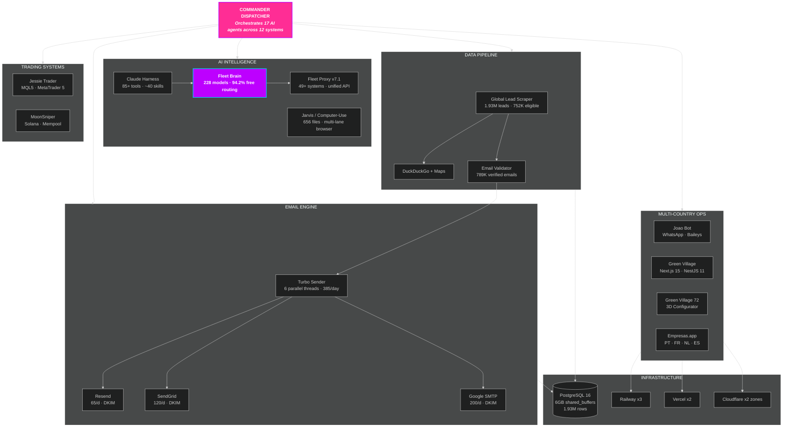
```mermaid
%%{init: {'theme': 'dark'}}%%

graph TB
    CMD["COMMANDER DISPATCHER<br/><i>Orchestrates 17 AI agents across 12 systems</i>"]

    subgraph FLEET["AI INTELLIGENCE"]
        FB["Fleet Brain<br/>228 models · 94.2% free routing"]
        PROXY["Fleet Proxy v7.1<br/>49+ systems · unified API"]
        JARVIS["Jarvis / Computer-Use<br/>656 files · multi-lane browser"]
        HARNESS["Claude Harness<br/>85+ tools · ~40 skills"]
    end

    subgraph DATA["DATA PIPELINE"]
        GLS["Global Lead Scraper<br/>1.93M leads · 752K eligible"]
        DDG["DuckDuckGo + Maps"]
        VALID["Email Validator<br/>789K verified emails"]
    end

    subgraph MAIL["EMAIL ENGINE"]
        TURBO["Turbo Sender<br/>6 parallel threads · 385/day"]
        R1["Resend<br/>65/d · DKIM"]
        R2["SendGrid<br/>120/d · DKIM"]
        R3["Google SMTP<br/>200/d · DKIM"]
    end

    subgraph TRADE["TRADING SYSTEMS"]
        JESSIE["Jessie Trader<br/>MQL5 · MetaTrader 5"]
        MOON["MoonSniper<br/>Solana · Mempool"]
    end

    subgraph BIZ["MULTI-COUNTRY OPS"]
        JOAO["Joao Bot<br/>WhatsApp · Baileys"]
        GV["Green Village<br/>Next.js 15 · NestJS 11"]
        GV72["Green Village 72<br/>3D Configurator"]
        EMP["Empresas.app<br/>PT · FR · NL · ES"]
    end

    subgraph INFRA["INFRASTRUCTURE"]
        PG[("PostgreSQL 16<br/>6GB shared_buffers<br/>1.93M rows")]
        RW["Railway x3"]
        VC["Vercel x2"]
        CF["Cloudflare x2 zones"]
    end

    CMD --> FLEET
    CMD --> DATA
    CMD --> MAIL
    CMD --> TRADE
    CMD --> BIZ

    GLS --> DDG
    GLS --> VALID
    VALID --> TURBO
    TURBO --> R1
    TURBO --> R2
    TURBO --> R3

    FB --> PROXY
    HARNESS --> FB

    DATA --> PG
    MAIL --> PG
    BIZ --> RW
    BIZ --> VC
    BIZ --> CF

    style CMD fill:#FF2D95,stroke:#BD00FF,color:#fff,font-weight:bold,stroke-width:2px
    style FB fill:#BD00FF,stroke:#00D4FF,color:#fff,font-weight:bold,stroke-width:2px
```

> [!NOTE]
> **17 AI agents** coordinate via Claude Code MCP protocol. The **Fleet Brain** routes tasks across **228 AI models** (179 alive) from 15+ providers, achieving **94.2% free routing** via Thompson Sampling. Leads flow from scraping through validation to email delivery, while the Jarvis computer-use system handles multi-lane browser automation across all services.

<!-- GRADIENT DIVIDER -->


<!-- ╔══════════════════════════════════════════════════════════════════════════╗ -->
<!-- ║                    FLEET BRAIN — AI MODEL ROUTING                       ║ -->
<!-- ╚══════════════════════════════════════════════════════════════════════════╝ -->

##  Fleet Brain — AI Model Routing

> The most significant infrastructure built in 2026 — a self-improving AI routing system that slashed model costs by **94.2%** while maintaining quality.

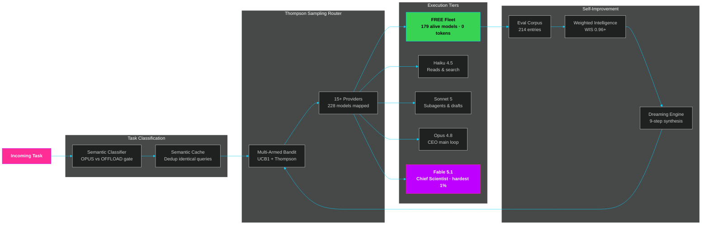
```mermaid
%%{init: {'theme': 'dark', 'themeVariables': {'primaryColor': '#FF2D95', 'primaryTextColor': '#fff', 'primaryBorderColor': '#BD00FF', 'lineColor': '#00D4FF'}}}%%

graph LR
    TASK["Incoming Task"]

    subgraph CLASSIFY["Task Classification"]
        CL["Semantic Classifier<br/>OPUS vs OFFLOAD gate"]
        CACHE["Semantic Cache<br/>Dedup identical queries"]
    end

    subgraph ROUTE["Thompson Sampling Router"]
        TS["Multi-Armed Bandit<br/>UCB1 + Thompson"]
        PROV["15+ Providers<br/>228 models mapped"]
    end

    subgraph TIERS["Execution Tiers"]
        FREE["FREE Fleet<br/>179 alive models · 0 tokens"]
        HAIKU["Haiku 4.5<br/>Reads & search"]
        SONNET["Sonnet 5<br/>Subagents & drafts"]
        OPUS["Opus 4.8<br/>CEO main loop"]
        FABLE["Fable 5.1<br/>Chief Scientist · hardest 1%"]
    end

    subgraph FEEDBACK["Self-Improvement"]
        EVAL["Eval Corpus<br/>214 entries"]
        WIS["Weighted Intelligence<br/>WIS 0.96+"]
        DREAM["Dreaming Engine<br/>9-step synthesis"]
    end

    TASK --> CL
    CL --> CACHE
    CACHE --> TS
    TS --> PROV
    PROV --> FREE
    PROV --> HAIKU
    PROV --> SONNET
    PROV --> OPUS
    PROV --> FABLE

    FREE --> EVAL
    EVAL --> WIS
    WIS --> DREAM
    DREAM --> TS

    style TASK fill:#FF2D95,stroke:#BD00FF,color:#fff,font-weight:bold
    style FREE fill:#39d353,stroke:#00D4FF,color:#000,font-weight:bold
    style FABLE fill:#BD00FF,stroke:#FF2D95,color:#fff,font-weight:bold
```

<details>
<summary><b>Fleet Brain Technical Details</b> — 228 models, Thompson Sampling, self-improving closed loop</summary>
<br/>

| Metric | Value |
|:---|:---|
| **Total Models Mapped** | 228 across 15+ providers |
| **Alive & Routable** | 179 models |
| **Free Routing Rate** | 94.2% of tasks routed to free models |
| **Routing Algorithm** | Thompson Sampling + UCB1 (true Bayesian) |
| **Intelligence Score (WIS)** | 0.96+ (weighted, calibrated) |
| **Eval Corpus** | 214 entries with outcome feedback |
| **Semantic Cache** | Deduplicates identical queries |
| **Dreaming Engine** | 9-step overnight synthesis for model improvement |
| **Decision Digest** | Real-time routing visibility |

**Task Classification Gate:**
- `OFFLOAD` (safe for free models): classify, summarize, translate, parse, extract, format, clean, search, OCR
- `STAY_ON_OPUS` (requires paid tier): debug, fix, architecture, security, final code edits, deploy, DB mutations

**Self-Improving Loop:** Every task outcome feeds back into the Thompson Sampling prior. The dreaming engine runs a 9-step synthesis overnight to rebalance model priors. WIS (Weighted Intelligence Score) measures calibrated accuracy — the system gets smarter with every query routed.

</details>

<!-- WAVE SEPARATOR -->


<!-- ╔══════════════════════════════════════════════════════════════════════════╗ -->
<!-- ║                    DATABASE SCHEMA — LEAD PIPELINE                       ║ -->
<!-- ╚══════════════════════════════════════════════════════════════════════════╝ -->

##  Database Schema — Lead Pipeline

> $\text{Storage} = \sum_{t \in \text{tables}} |t| \cdot \bar{w}_t, \quad |leads| = 1.93 \times 10^6, \quad \bar{w}_{lead} \approx 512\text{B}$

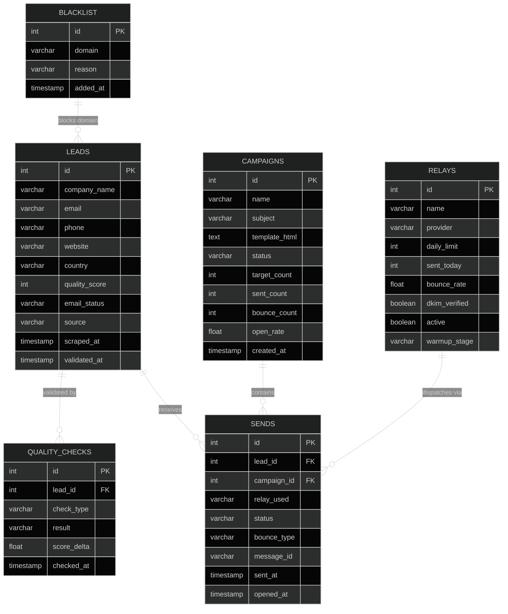
```mermaid
%%{init: {'theme': 'dark'}}%%
erDiagram
    LEADS {
        int id PK
        varchar company_name
        varchar email
        varchar phone
        varchar website
        varchar country
        int quality_score
        varchar email_status
        varchar source
        timestamp scraped_at
        timestamp validated_at
    }

    CAMPAIGNS {
        int id PK
        varchar name
        varchar subject
        text template_html
        varchar status
        int target_count
        int sent_count
        int bounce_count
        float open_rate
        timestamp created_at
    }

    SENDS {
        int id PK
        int lead_id FK
        int campaign_id FK
        varchar relay_used
        varchar status
        varchar bounce_type
        varchar message_id
        timestamp sent_at
        timestamp opened_at
    }

    RELAYS {
        int id PK
        varchar name
        varchar provider
        int daily_limit
        int sent_today
        float bounce_rate
        boolean dkim_verified
        boolean active
        varchar warmup_stage
    }

    BLACKLIST {
        int id PK
        varchar domain
        varchar reason
        timestamp added_at
    }

    QUALITY_CHECKS {
        int id PK
        int lead_id FK
        varchar check_type
        varchar result
        float score_delta
        timestamp checked_at
    }

    LEADS ||--o{ SENDS : "receives"
    CAMPAIGNS ||--o{ SENDS : "contains"
    RELAYS ||--o{ SENDS : "dispatches via"
    LEADS ||--o{ QUALITY_CHECKS : "validated by"
    BLACKLIST ||--o{ LEADS : "blocks domain"
```

> [!TIP]
> The lead pipeline processes **1.93M leads** through 6 quality gates before any email is sent. Each lead undergoes MX verification, SMTP validation, domain blacklist check, quality scoring, and deduplication. Only **752K** survive — a **61% rejection rate** that protects sender reputation. Index strategy: GIN for full-text, BRIN for time-series, partial indexes on `email_status = 'smtp_verified'`.

<!-- GRADIENT DIVIDER -->


<!-- ╔══════════════════════════════════════════════════════════════════════════╗ -->
<!-- ║                      EMAIL PIPELINE FLOW                                ║ -->
<!-- ╚══════════════════════════════════════════════════════════════════════════╝ -->

##  Email Delivery Pipeline


```mermaid
%%{init: {'theme': 'dark', 'sequence': {'actorFontSize': 14, 'messageFontSize': 12, 'mirrorActors': false}}}%%

sequenceDiagram
    participant SC as Scraper Engine
    participant VA as Email Validator
    participant DB as PostgreSQL 16
    participant TS as Turbo Sender
    participant R1 as Resend (65/d)
    participant R2 as SendGrid (120/d)
    participant R3 as Google SMTP (200/d)
    participant IN as Recipient Inbox

    SC->>DB: 1.93M raw leads (Maps + DDG)
    activate DB
    DB->>VA: Batch validate emails
    activate VA
    VA-->>DB: 789K verified
    VA-->>DB: 208K junk rejected
    deactivate VA
    DB->>TS: 752K eligible (quality >= 40)
    deactivate DB
    activate TS
    Note over TS: 6 parallel threads<br/>Circuit breaker per relay<br/>Bounce rate < 3%
    par Relay 1
        TS->>R1: DKIM-signed batch
        R1->>IN: Delivered (65/day)
    and Relay 2
        TS->>R2: DKIM-signed batch
        R2->>IN: Delivered (120/day)
    and Relay 3
        TS->>R3: DKIM-signed batch
        R3->>IN: Delivered (200/day)
    end
    deactivate TS
    Note over SC,IN: Total: 385 emails/day | DMARC quarantine | SPF ~all
```

<!-- GRADIENT DIVIDER -->


<!-- ╔══════════════════════════════════════════════════════════════════════════╗ -->
<!-- ║                       LEAD LIFECYCLE                                     ║ -->
<!-- ╚══════════════════════════════════════════════════════════════════════════╝ -->

##  Lead Lifecycle State Machine

> $P(\text{eligible} \mid \text{scraped}) = \frac{752{,}000}{1{,}930{,}000} \approx 0.39 \quad \text{(39% survival rate through 6 quality gates)}$

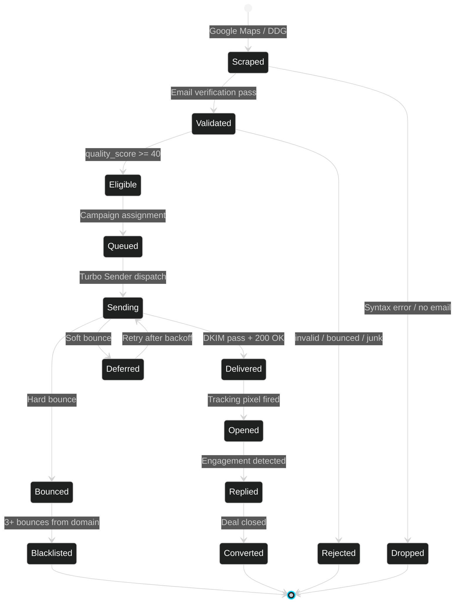
```mermaid
%%{init: {'theme': 'dark', 'themeVariables': {'primaryColor': '#FF2D95', 'primaryTextColor': '#ffffff', 'primaryBorderColor': '#BD00FF', 'lineColor': '#00D4FF'}}}%%

stateDiagram-v2
    [*] --> Scraped: Google Maps / DDG
    Scraped --> Validated: Email verification pass
    Scraped --> Dropped: Syntax error / no email
    Validated --> Eligible: quality_score >= 40
    Validated --> Rejected: invalid / bounced / junk
    Eligible --> Queued: Campaign assignment
    Queued --> Sending: Turbo Sender dispatch
    Sending --> Delivered: DKIM pass + 200 OK
    Sending --> Bounced: Hard bounce
    Sending --> Deferred: Soft bounce
    Deferred --> Sending: Retry after backoff
    Delivered --> Opened: Tracking pixel fired
    Opened --> Replied: Engagement detected
    Replied --> Converted: Deal closed
    Bounced --> Blacklisted: 3+ bounces from domain
    Blacklisted --> [*]
    Converted --> [*]
    Rejected --> [*]
    Dropped --> [*]
```

<!-- WAVE SEPARATOR -->


<!-- ╔══════════════════════════════════════════════════════════════════════════╗ -->
<!-- ║                   TECHNOLOGY DISTRIBUTION                                ║ -->
<!-- ╚══════════════════════════════════════════════════════════════════════════╝ -->

##  Technology Distribution

<div align="center">
<table>
<tr>
<td width="50%" valign="top">

### Tech Stack

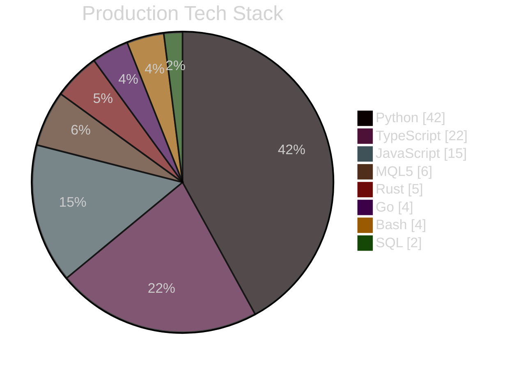
```mermaid
%%{init: {'theme': 'dark'}}%%
pie showData
    title Production Tech Stack
    "Python" : 42
    "TypeScript" : 22
    "JavaScript" : 15
    "MQL5" : 6
    "Rust" : 5
    "Go" : 4
    "Bash" : 4
    "SQL" : 2
```

</td>
<td width="50%" valign="top">

### Lead Pipeline

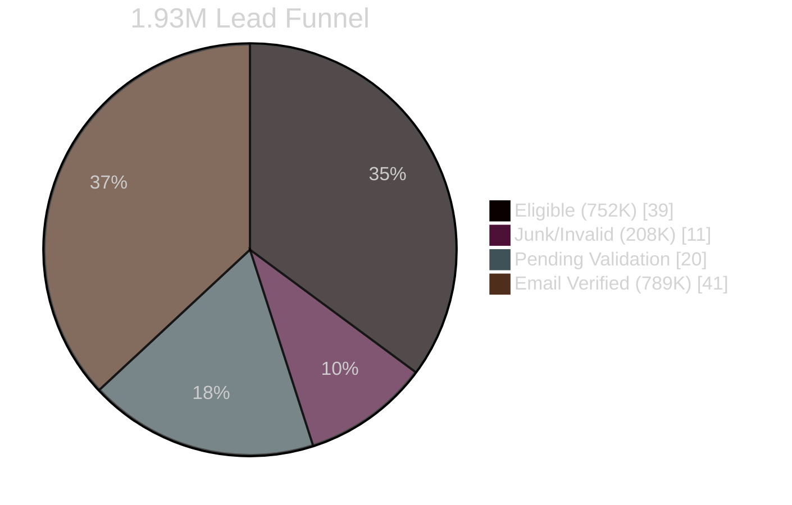
```mermaid
%%{init: {'theme': 'dark'}}%%
pie showData
    title 1.93M Lead Funnel
    "Eligible (752K)" : 39
    "Junk/Invalid (208K)" : 11
    "Pending Validation" : 20
    "Email Verified (789K)" : 41
```

</td>
</tr>
</table>
</div>

<!-- GRADIENT DIVIDER -->


<!-- ╔══════════════════════════════════════════════════════════════════════════╗ -->
<!-- ║                    DEVELOPMENT TIMELINE                                  ║ -->
<!-- ╚══════════════════════════════════════════════════════════════════════════╝ -->

##  Development Timeline

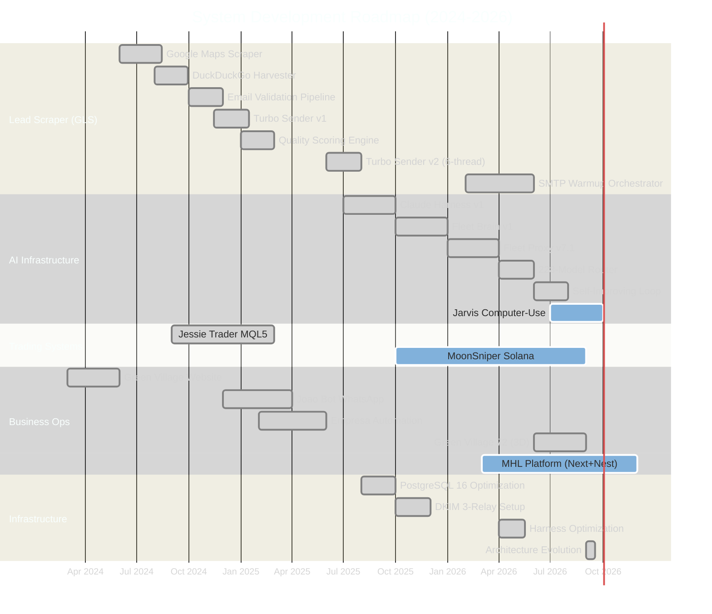
```mermaid
%%{init: {'theme': 'dark'}}%%
gantt
    title System Development Roadmap (2024-2026)
    dateFormat YYYY-MM-DD
    axisFormat %b %Y

    section Lead Scraper (GLS)
        Google Maps Scraper       :done, gls1, 2024-06-01, 2024-08-15
        DuckDuckGo Harvester      :done, gls2, 2024-08-01, 2024-09-30
        Email Validation Pipeline :done, gls3, 2024-10-01, 2024-12-01
        Turbo Sender v1           :done, gls4, 2024-11-15, 2025-01-15
        Quality Scoring Engine    :done, gls5, 2025-01-01, 2025-03-01
        Turbo Sender v2 (6-thread):done, gls6, 2025-06-01, 2025-08-01
        SMTP Warmup Orchestrator  :done, gls7, 2026-02-01, 2026-06-01

    section AI Infrastructure
        Claude Harness v1         :done, ai1, 2025-07-01, 2025-10-01
        Fleet Brain v1            :done, ai2, 2025-10-01, 2026-01-01
        Fleet Proxy v7.1          :done, ai3, 2026-01-01, 2026-04-01
        228-Model Router          :done, ai4, 2026-04-01, 2026-06-01
        Self-Improving Loop       :done, ai5, 2026-06-01, 2026-08-01
        Jarvis Computer-Use       :active, ai6, 2026-07-01, 2026-10-01

    section Trading Systems
        Jessie Trader MQL5        :done, jt1, 2024-09-01, 2025-03-01
        MoonSniper Solana         :active, ms1, 2025-10-01, 2026-09-01

    section Business Ops
        Green Village Website     :done, gv1, 2024-03-01, 2024-06-01
        Joao Bot WhatsApp         :done, jb1, 2024-12-01, 2025-04-01
        Empresa Automation        :done, ea1, 2025-02-01, 2025-06-01
        Green Village 72 (3D)     :done, gv2, 2026-06-01, 2026-09-01
        MHL Platform (Next+Nest)  :active, mhl1, 2026-03-01, 2026-12-01

    section Infrastructure
        PostgreSQL 16 Optimization:done, inf1, 2025-08-01, 2025-10-01
        DKIM 3-Relay Setup        :done, inf2, 2025-10-01, 2025-12-01
        Harness Optimization      :done, inf3, 2026-04-01, 2026-05-17
        Architecture Evolution    :done, inf4, 2026-09-01, 2026-09-18
```

<!-- GRADIENT DIVIDER -->


<!-- ╔══════════════════════════════════════════════════════════════════════════╗ -->
<!-- ║                    TECHNOLOGY RADAR                                      ║ -->
<!-- ╚══════════════════════════════════════════════════════════════════════════╝ -->

##  Technology Radar

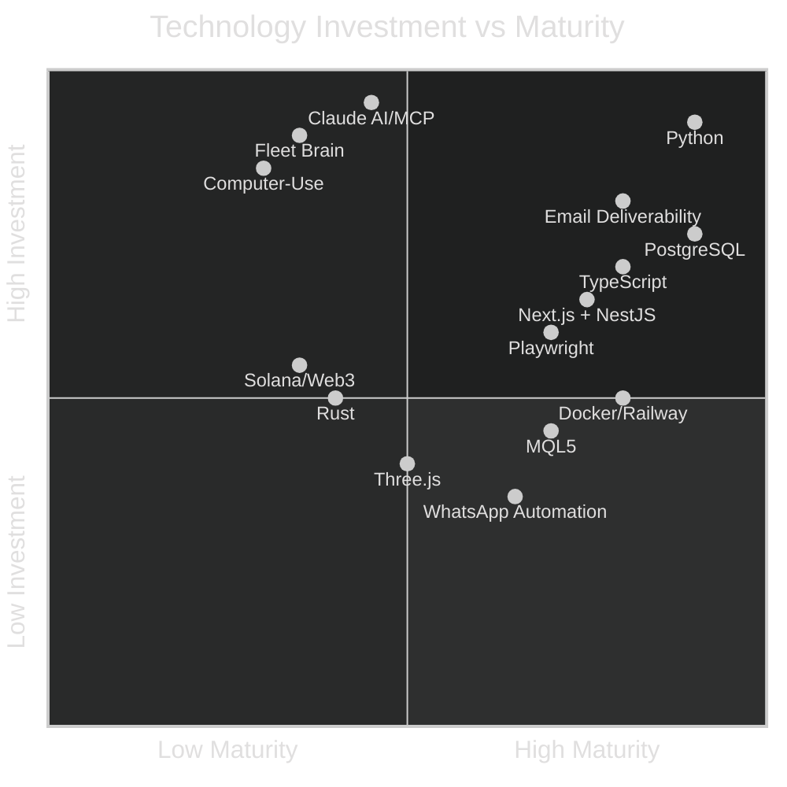
```mermaid
%%{init: {'theme': 'dark'}}%%
quadrantChart
    title Technology Investment vs Maturity
    x-axis Low Maturity --> High Maturity
    y-axis Low Investment --> High Investment

    Python: [0.90, 0.92]
    TypeScript: [0.80, 0.70]
    MQL5: [0.70, 0.45]
    Rust: [0.40, 0.50]
    PostgreSQL: [0.90, 0.75]
    Claude AI/MCP: [0.45, 0.95]
    Fleet Brain: [0.35, 0.90]
    Playwright: [0.70, 0.60]
    Docker/Railway: [0.80, 0.50]
    Computer-Use: [0.30, 0.85]
    Three.js: [0.50, 0.40]
    Email Deliverability: [0.80, 0.80]
    WhatsApp Automation: [0.65, 0.35]
    Next.js + NestJS: [0.75, 0.65]
    Solana/Web3: [0.35, 0.55]
```

<!-- WAVE SEPARATOR -->


<!-- ╔══════════════════════════════════════════════════════════════════════════╗ -->
<!-- ║                    LEAD PIPELINE JOURNEY                                 ║ -->
<!-- ╚══════════════════════════════════════════════════════════════════════════╝ -->

##  Lead Pipeline Journey

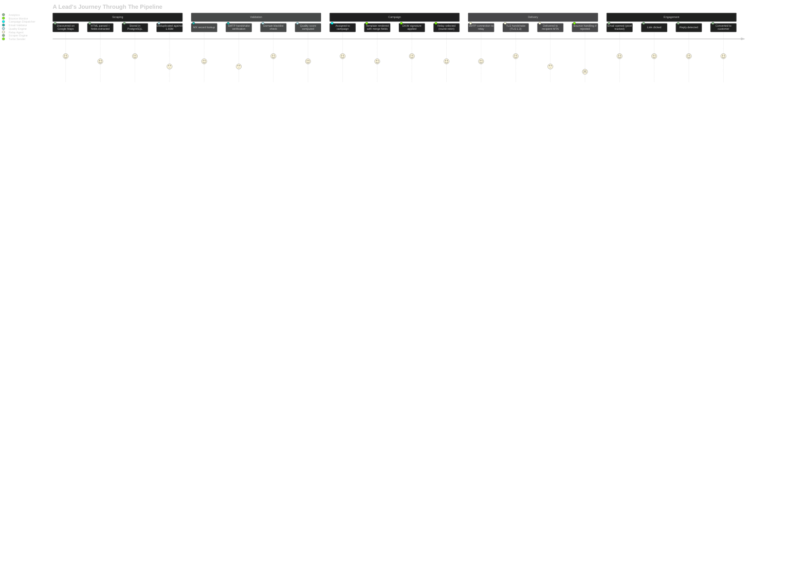
```mermaid
%%{init: {'theme': 'dark'}}%%
journey
    title A Lead's Journey Through The Pipeline
    section Scraping
        Discovered on Google Maps: 5: Scraper Engine
        HTML parsed + fields extracted: 4: Scraper Engine
        Stored in PostgreSQL: 5: Scraper Engine
        Deduplicated against 1.93M: 3: Quality Engine
    section Validation
        MX record lookup: 4: Email Validator
        SMTP handshake verification: 3: Email Validator
        Domain blacklist check: 5: Quality Engine
        Quality score computed: 4: Quality Engine
    section Campaign
        Assigned to campaign: 5: Campaign Dispatcher
        Template rendered with merge fields: 4: Turbo Sender
        DKIM signature applied: 5: Turbo Sender
        Relay selected (round-robin): 4: Turbo Sender
    section Delivery
        SMTP connection to relay: 4: Relay Agent
        TLS handshake (TLS 1.3): 5: Relay Agent
        Delivered to recipient MTA: 3: Relay Agent
        Bounce handling if rejected: 2: Bounce Monitor
    section Engagement
        Email opened (pixel tracked): 5: Analytics
        Link clicked: 5: Analytics
        Reply detected: 5: Analytics
        Converted to customer: 5: Analytics
```

> [!IMPORTANT]
> Each lead traverses **5 pipeline stages** with **18 discrete steps**. The circuit breaker pattern isolates failing relays before cascade failures propagate. Total pipeline latency from scraping to delivery: **~48 hours** (dominated by warmup pacing).

<!-- GRADIENT DIVIDER -->


<!-- ╔══════════════════════════════════════════════════════════════════════════╗ -->
<!-- ║                    EMAIL DELIVERY METRICS                                ║ -->
<!-- ╚══════════════════════════════════════════════════════════════════════════╝ -->

##  Email Delivery Metrics

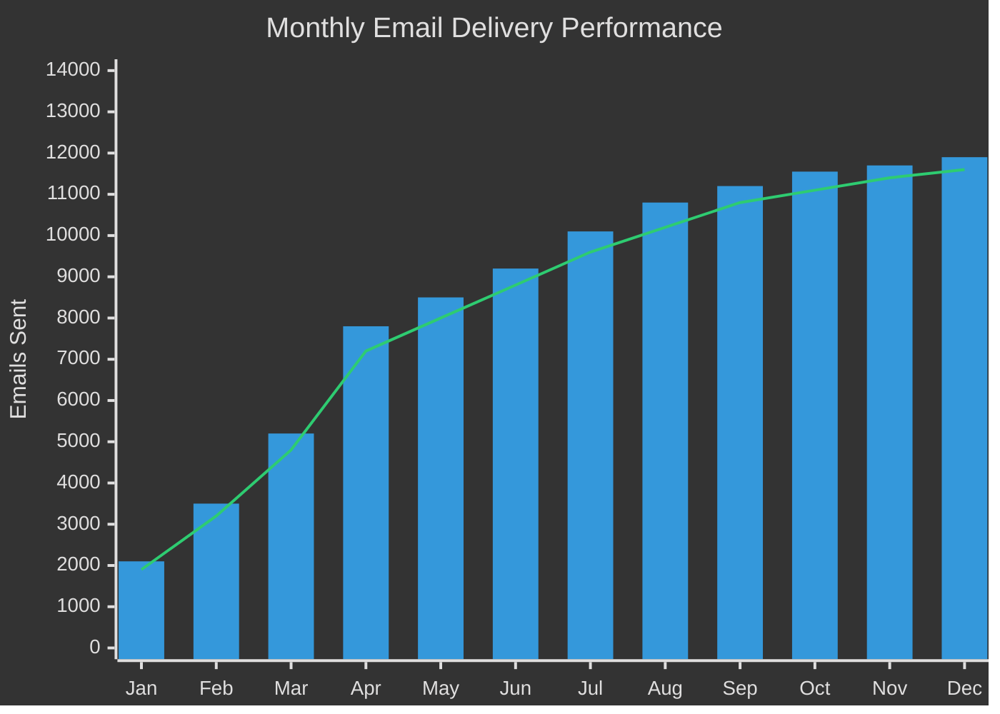
```mermaid
%%{init: {'theme': 'dark'}}%%
xychart-beta
    title "Monthly Email Delivery Performance"
    x-axis ["Jan", "Feb", "Mar", "Apr", "May", "Jun", "Jul", "Aug", "Sep", "Oct", "Nov", "Dec"]
    y-axis "Emails Sent" 0 --> 14000
    bar [2100, 3500, 5200, 7800, 8500, 9200, 10100, 10800, 11200, 11550, 11700, 11900]
    line [1900, 3200, 4800, 7200, 8000, 8800, 9600, 10200, 10800, 11100, 11400, 11600]
```

> Warmup curve follows $f(t) = C \cdot (1 - e^{-\lambda t})$ where $C = 385\text{/day}$ (capacity ceiling) and $\lambda \approx 0.15$ (growth rate). Bar = emails sent, line = emails delivered (bounce-adjusted). Current bounce rate: **2.1%** (target: < 3%).

<!-- WAVE SEPARATOR -->


<!-- ╔══════════════════════════════════════════════════════════════════════════╗ -->
<!-- ║                      FEATURED CODE                                      ║ -->
<!-- ╚══════════════════════════════════════════════════════════════════════════╝ -->

##  Featured Code

> [!CAUTION]
> These are **real production snippets** extracted from live systems — not toy examples. Each demonstrates a distinct architectural pattern: async pipelines, algorithmic trading signals, AI model routing, event-driven messaging, complex SQL, shell orchestration, systems programming, container optimization, and declarative infrastructure.

<table>

<!-- ROW 1: Python + Fleet Brain -->
<tr>
<td width="50%" valign="top">

**Turbo Sender** — 6-thread parallel email dispatch `Python 3.14`

```python
from __future__ import annotations
import asyncio
from dataclasses import dataclass, field

@dataclass
class CircuitBreakerPool:
    relays: list[SMTPRelay]
    max_fail: int = 5
    reset_after: int = 3600
    _bounced: int = field(default=0, init=False)

    @property
    def bounce_rate(self) -> float:
        return self._bounced / max(self._sent, 1)

    async def send_batch(
        self, leads: list[Lead], *, dkim: bool = True
    ) -> None:
        for lead in leads:
            relay = self._next_healthy_relay()
            if relay is None:
                raise AllRelaysTripped()
            try:
                await relay.send(
                    lead.email.encode('ascii'),
                    dkim_sign=dkim,
                )
                self._sent += 1
            except BounceError as e:
                self._bounced += 1
                if relay.bounce_rate > 0.05:
                    relay.trip_breaker()


async def dispatch_campaign(
    campaign_id: int,
) -> BatchResult:
    leads = await db.fetch_eligible(
        campaign_id, limit=385
    )
    pool = CircuitBreakerPool(
        [resend, sendgrid, gsmtp],
        max_fail=5, reset_after=3600,
    )
    async with asyncio.TaskGroup() as tg:
        for chunk in partition(leads, size=6):
            tg.create_task(
                pool.send_batch(chunk, dkim=True)
            )
    return BatchResult(
        sent=len(leads),
        bounced=pool.bounced,
        rate=pool.bounce_rate,
    )
```

</td>
<td width="50%" valign="top">

**Fleet Brain** — Thompson Sampling model router `Python 3.14`

```python
from __future__ import annotations
import numpy as np
from dataclasses import dataclass

@dataclass
class ModelArm:
    name: str
    provider: str
    cost_per_1k: float
    alpha: float = 1.0   # Beta prior success
    beta_: float = 1.0   # Beta prior failure

    def sample(self) -> float:
        return np.random.beta(self.alpha, self.beta_)

    def update(self, success: bool) -> None:
        if success:
            self.alpha += 1.0
        else:
            self.beta_ += 1.0

    @property
    def ucb1(self) -> float:
        n = self.alpha + self.beta_ - 2
        if n == 0:
            return float('inf')
        mean = self.alpha / (self.alpha + self.beta_)
        return mean + np.sqrt(2 * np.log(n) / n)


class FleetRouter:
    """Route tasks to cheapest capable model.

    228 models, 179 alive, 15+ providers.
    94.2% free routing via Thompson Sampling.
    """
    def __init__(self, arms: list[ModelArm]):
        self.arms = sorted(
            arms, key=lambda a: a.cost_per_1k
        )
        self.free = [
            a for a in self.arms
            if a.cost_per_1k == 0
        ]

    async def route(
        self, task: str, difficulty: str
    ) -> ModelArm:
        if difficulty == 'OFFLOAD':
            # Thompson sample among free models
            candidates = self.free
        else:
            candidates = self.arms

        scores = [
            (arm, arm.sample()) for arm in candidates
        ]
        return max(scores, key=lambda x: x[1])[0]

    def feedback(
        self, arm: ModelArm, quality: float
    ) -> None:
        arm.update(quality > 0.7)
```

</td>
</tr>

<!-- ROW 2: MQL5 + JavaScript -->
<tr>
<td width="50%" valign="top">

**Jessie Trader** — Multi-timeframe confluence entry `MQL5`

```c
// MQL5 · MetaTrader 5 · Live execution
// Entry: H4 trend + H1 pullback + M15 confirmation

input double RiskPercent  = 1.5;
input int    FastEMA      = 21;
input int    SlowEMA      = 50;
input int    RSI_Period    = 14;
input double RSI_Oversold  = 30.0;

void OnTick() {
    if (!IsNewBar(PERIOD_H1)) return;

    double ema_fast = iMA(
        _Symbol, PERIOD_H1, FastEMA, 0,
        MODE_EMA, PRICE_CLOSE
    );
    double ema_slow = iMA(
        _Symbol, PERIOD_H4, SlowEMA, 0,
        MODE_EMA, PRICE_CLOSE
    );
    double rsi = iRSI(
        _Symbol, PERIOD_H1,
        RSI_Period, PRICE_CLOSE
    );

    // Multi-TF confluence: H4 uptrend +
    // H1 RSI oversold + M15 reversal candle
    if (ema_fast > ema_slow
        && rsi < RSI_Oversold
        && ConfirmOnM15()) {
        double lots = CalcLotSize(RiskPercent);
        double sl = GetSwingLow(PERIOD_H1, 20);
        double tp = Ask + (Ask - sl) * 2.0;
        ExecuteEntry(
            ORDER_TYPE_BUY, lots, sl, tp
        );
    }
}

bool ConfirmOnM15() {
    double o = iOpen(_Symbol, PERIOD_M15, 1);
    double c = iClose(_Symbol, PERIOD_M15, 1);
    double body = MathAbs(c - o);
    double range = iHigh(_Symbol, PERIOD_M15, 1)
                 - iLow(_Symbol, PERIOD_M15, 1);
    // Bullish engulfing with >60% body ratio
    return c > o && body / range > 0.6;
}
```

</td>
<td width="50%" valign="top">

**Joao Bot** — WhatsApp Automation `Node.js + Baileys`

```javascript
// Multi-instance WA bot · session persistence
// Railway deploy · auto-reply · CRM integration
import {
    makeWASocket,
    useMultiFileAuthState
} from '@whiskeysockets/baileys'
import pino from 'pino'

const logger = pino({ level: 'silent' })

export async function createBot(sessionId) {
    const { state, saveCreds } =
        await useMultiFileAuthState(
            `./sessions/${sessionId}`
        )
    const sock = makeWASocket({
        auth: state,
        logger,
        printQRInTerminal: true,
        browser: ['Joao Bot', 'Chrome', '120.0'],
        getMessage: async (key) => {
            return { conversation: '' }
        }
    })
    sock.ev.on('creds.update', saveCreds)
    sock.ev.on('messages.upsert',
        async ({ messages }) => {
            for (const msg of messages) {
                if (!msg.key.fromMe && msg.message)
                    await routeMessage(sock, msg)
            }
        }
    )
    return sock
}

async function routeMessage(sock, msg) {
    const text =
        msg.message.conversation
        || msg.message.extendedTextMessage?.text
        || ''
    const jid = msg.key.remoteJid
    const commands = {
        '!status': () => getSystemStatus(),
        '!leads':  () => getLeadStats(),
        '!health': () => runHealthCheck(),
        '!relay':  () => getRelayCapacity(),
        '!bounce': () => getBounceReport(),
    }
    const handler = commands[text.split(' ')[0]]
    if (handler) {
        const reply = await handler()
        await sock.sendMessage(jid, { text: reply })
    }
}
```

</td>
</tr>

<!-- ROW 3: SQL + Bash -->
<tr>
<td width="50%" valign="top">

**Lead Quality Engine** `SQL (PostgreSQL 16)`

```sql
-- Complex scoring: CTEs + window functions
-- + partial indexes + NTILE percentiles
WITH quality_matrix AS (
    SELECT
        l.id, l.email, l.company_name,
        l.country,
        CASE
            WHEN l.email_status = 'smtp_verified'
                THEN 30
            WHEN l.email_status = 'mx_valid'
                THEN 20
            WHEN l.email_status = 'syntax_ok'
                THEN 10
            ELSE 0
        END AS email_score,
        CASE
            WHEN l.phone IS NOT NULL THEN 10
            ELSE 0
        END AS phone_score,
        CASE
            WHEN l.website IS NOT NULL
             AND l.website !~
                '^https?://(www\.)?facebook'
            THEN 15
            ELSE 0
        END AS web_score,
        COALESCE(
            (SELECT COUNT(*) FROM sends s
             WHERE s.lead_id = l.id
               AND s.status = 'delivered'),
            0
        ) AS prior_delivers,
        NTILE(100) OVER (
            PARTITION BY l.country
            ORDER BY l.quality_score DESC
        ) AS country_percentile
    FROM leads l
    WHERE l.email_status NOT IN (
        'invalid','bounced','junk',
        'disposable','mx_fail',
        'syntax_error','gate_fail',
        'smtp_fail'
    )
    AND NOT EXISTS (
        SELECT 1 FROM blacklist b
        WHERE l.email LIKE '%@' || b.domain
    )
),
ranked AS (
    SELECT *,
        email_score + phone_score + web_score
        + LEAST(prior_delivers * 5, 20)
            AS composite,
        ROW_NUMBER() OVER (
            PARTITION BY country
            ORDER BY email_score + phone_score
                   + web_score DESC
        ) AS country_rank
    FROM quality_matrix
)
SELECT id, email, company_name, country,
       composite AS quality_score,
       country_rank, country_percentile
FROM ranked
WHERE composite >= 40
ORDER BY composite DESC
LIMIT 1000;
```

</td>
<td width="50%" valign="top">

**Infrastructure Automation** `Bash`

```bash
#!/usr/bin/env bash
# deploy.sh — Zero-downtime multi-service
# deployment with health checks & rollback
set -euo pipefail

readonly SERVICES=(
    global-lead-scraper
    joao-bot
    jessie-trader
    green-village
    mobile-home-logistic
)
readonly HEALTH_TIMEOUT=30
readonly ROLLBACK_ON_FAIL=true

log() {
    printf "\033[36m[%s]\033[0m %s\n" \
        "$(date +%H:%M:%S)" "$1"
}
err() {
    printf "\033[31m[ERROR]\033[0m %s\n" \
        "$1" >&2
}

check_health() {
    local svc="$1" url="$2" attempt=0
    while (( attempt < HEALTH_TIMEOUT )); do
        if curl -sf --max-time 5 \
            "$url/health" \
            | jq -e '.status == "ok"' \
            > /dev/null 2>&1; then
            log "$svc: healthy (${attempt}s)"
            return 0
        fi
        (( attempt++ )); sleep 1
    done
    err "$svc: health check failed"
    return 1
}

deploy_service() {
    local svc="$1"
    local before
    before=$(git -C "$HOME/Documents/$svc" \
        rev-parse HEAD)
    log "Deploying $svc ($(git -C \
        "$HOME/Documents/$svc" \
        rev-parse --short HEAD))"
    git -C "$HOME/Documents/$svc" \
        push origin main 2>/dev/null || {
        err "$svc: push failed"; return 1
    }
    if ! check_health "$svc" \
        "https://${svc}.up.railway.app"; then
        if [[ "$ROLLBACK_ON_FAIL" == "true" ]]
        then
            err "$svc: rolling back to $before"
            git -C "$HOME/Documents/$svc" \
                push origin "$before:main" -f
        fi
        return 1
    fi
}

main() {
    local failed=()
    log "Deploying ${#SERVICES[@]} services"
    for svc in "${SERVICES[@]}"; do
        deploy_service "$svc" \
            || failed+=("$svc")
    done
    echo "━━━━━━━━━━━━━━━━━━━━━━━━━━━━━━"
    log "Deployed: $(( ${#SERVICES[@]} \
        - ${#failed[@]} ))/${#SERVICES[@]}"
    [[ ${#failed[@]} -gt 0 ]] \
        && err "Failed: ${failed[*]}" \
        && exit 1
    log "All systems operational"
}
main "$@"
```

</td>
</tr>

<!-- ROW 4: Rust + Go -->
<tr>
<td width="50%" valign="top">

**MoonSniper** — Mempool transaction decoder `Rust`

```rust
// Solana mempool monitoring · token launch
// sniping · real-time transaction decode

use solana_sdk::pubkey::Pubkey;
use solana_client::rpc_client::RpcClient;
use std::sync::Arc;
use tokio::sync::mpsc;

#[derive(Debug)]
struct PendingSwap {
    signature: String,
    token_mint: Pubkey,
    amount_in: u64,
    pool_address: Pubkey,
    slot: u64,
}

async fn monitor_new_pools(
    rpc: Arc<RpcClient>,
    tx: mpsc::Sender<PendingSwap>,
) -> anyhow::Result<()> {
    let raydium_program = Pubkey::from_str(
        "675kPX9MHTjS2zt1qfr1NYHuzeLXfQM9H24wFSUt1Mp8"
    )?;

    let sub = rpc.logs_subscribe(
        RpcTransactionLogsFilter::Mentions(
            vec![raydium_program.to_string()]
        ),
        None,
    )?;

    while let Ok(log) = sub.recv() {
        if let Some(swap) =
            decode_pool_init(&log) {
            // Check liquidity depth
            let pool = rpc.get_account(
                &swap.pool_address
            )?;
            let liquidity = parse_pool_state(
                &pool.data
            )?;

            if liquidity.sol_reserve > 5_000_000_000
                && !is_honeypot(&swap.token_mint)
            {
                tx.send(swap).await?;
            }
        }
    }
    Ok(())
}

fn is_honeypot(mint: &Pubkey) -> bool {
    // Check: freeze authority, mint authority,
    // transfer fee, close authority
    let info = get_mint_info(mint);
    info.freeze_authority.is_some()
        || info.mint_authority.is_some()
}
```

</td>
<td width="50%" valign="top">

**Proxy Rotator** — Residential proxy health checker `Go`

```go
// Concurrent proxy validation with
// circuit breaker + health scoring
package proxy

import (
    "context"
    "net/http"
    "net/url"
    "sync"
    "sync/atomic"
    "time"
)

type Proxy struct {
    URL       *url.URL
    Score     atomic.Int32
    Failures  atomic.Int32
    LastCheck time.Time
    mu        sync.RWMutex
}

type Pool struct {
    proxies  []*Proxy
    current  atomic.Int64
    maxFails int32
}

func NewPool(
    urls []string, maxFails int32,
) (*Pool, error) {
    pool := &Pool{maxFails: maxFails}
    for _, raw := range urls {
        u, err := url.Parse(raw)
        if err != nil {
            return nil, err
        }
        p := &Proxy{URL: u}
        p.Score.Store(100)
        pool.proxies = append(pool.proxies, p)
    }
    return pool, nil
}

func (p *Pool) Next() *Proxy {
    n := len(p.proxies)
    for i := 0; i < n; i++ {
        idx := p.current.Add(1) % int64(n)
        proxy := p.proxies[idx]
        if proxy.Failures.Load() < p.maxFails {
            return proxy
        }
    }
    return nil // all tripped
}

func (p *Proxy) Check(
    ctx context.Context,
) error {
    client := &http.Client{
        Timeout: 10 * time.Second,
        Transport: &http.Transport{
            Proxy: http.ProxyURL(p.URL),
        },
    }
    req, _ := http.NewRequestWithContext(
        ctx, "GET",
        "https://httpbin.org/ip", nil,
    )
    resp, err := client.Do(req)
    if err != nil {
        p.Failures.Add(1)
        p.Score.Add(-10)
        return err
    }
    defer resp.Body.Close()
    p.Failures.Store(0)
    p.Score.Store(100)
    p.mu.Lock()
    p.LastCheck = time.Now()
    p.mu.Unlock()
    return nil
}
```

</td>
</tr>

<!-- ROW 5: Dockerfile + YAML -->
<tr>
<td width="50%" valign="top">

**Production Container** — Multi-stage optimized `Dockerfile`

```dockerfile
# Multi-stage build: 1.2GB → 89MB final image
# Python 3.14 + PostgreSQL client + Playwright

# ━━━ Stage 1: Build dependencies ━━━━━━━━━━
FROM python:3.14-slim AS builder

WORKDIR /build
COPY requirements.txt .

RUN apt-get update && apt-get install -y \
        --no-install-recommends \
        gcc libpq-dev \
    && pip install --no-cache-dir \
        --prefix=/install \
        -r requirements.txt \
    && apt-get purge -y gcc \
    && rm -rf /var/lib/apt/lists/*

# ━━━ Stage 2: Playwright browsers ━━━━━━━━
FROM python:3.14-slim AS playwright

COPY --from=builder /install /usr/local
RUN playwright install chromium \
    && playwright install-deps chromium

# ━━━ Stage 3: Production image ━━━━━━━━━━━
FROM python:3.14-slim AS production

LABEL maintainer="Matheus Agueda"
LABEL version="3.0"
LABEL description="Global Lead Scraper"

WORKDIR /app

RUN groupadd -r app && useradd -r -g app app

COPY --from=builder /install /usr/local
COPY --from=playwright \
    /root/.cache/ms-playwright \
    /home/app/.cache/ms-playwright
COPY --chown=app:app . .

RUN apt-get update && apt-get install -y \
        --no-install-recommends \
        libpq5 postgresql-client curl \
    && rm -rf /var/lib/apt/lists/*

HEALTHCHECK --interval=30s \
    --timeout=5s --retries=3 \
    CMD curl -sf http://localhost:8000/health \
        || exit 1

USER app

ENV PYTHONUNBUFFERED=1 \
    PYTHONDONTWRITEBYTECODE=1

EXPOSE 8000

ENTRYPOINT ["python3"]
CMD ["run_turbo_sender.py", "--campaign=9"]
```

</td>
<td width="50%" valign="top">

**CI/CD Pipeline** — GitHub Actions `YAML`

```yaml
# .github/workflows/deploy.yml
# Parallel service deploy with matrix
name: Deploy All Services
on:
  push:
    branches: [main]
  workflow_dispatch:
    inputs:
      service:
        description: 'Service (or "all")'
        required: false
        default: 'all'

concurrency:
  group: deploy-${{ github.ref }}
  cancel-in-progress: true

jobs:
  test:
    runs-on: ubuntu-latest
    services:
      postgres:
        image: postgres:16
        env:
          POSTGRES_DB: global_leads_test
          POSTGRES_PASSWORD: test
        ports: ['5432:5432']
        options: >-
          --health-cmd "pg_isready"
          --health-interval 10s
          --health-timeout 5s
          --health-retries 5
    steps:
      - uses: actions/checkout@v4
      - uses: actions/setup-python@v5
        with: { python-version: '3.14' }
      - run: pip install -r requirements.txt
      - run: pytest tests/ -x --tb=short
        env:
          DATABASE_URL: >-
            postgresql://postgres:test
            @localhost/global_leads_test

  deploy:
    needs: test
    runs-on: ubuntu-latest
    strategy:
      matrix:
        service:
          - global-lead-scraper
          - joao-bot
          - green-village
          - jessie-trader
      fail-fast: false
    steps:
      - uses: actions/checkout@v4
      - name: Deploy ${{ matrix.service }}
        uses: railwayapp/deploy@v1
        with:
          service: ${{ matrix.service }}
          token: ${{ secrets.RAILWAY_TOKEN }}
      - name: Health Check
        run: |
          for i in $(seq 1 30); do
            url="https://${{ matrix.service }}"
            url="${url}.up.railway.app/health"
            if curl -sf "$url"; then
              echo "healthy"; exit 0
            fi; sleep 2
          done; exit 1
```

</td>
</tr>
</table>

<!-- GRADIENT DIVIDER -->


<!-- ╔══════════════════════════════════════════════════════════════════════════╗ -->
<!-- ║                       CHESS GAME                                         ║ -->
<!-- ╚══════════════════════════════════════════════════════════════════════════╝ -->

##  Play Chess Against Me

<div align="center">

**Make a move by opening a [new issue](https://github.com/MatheusAgueda/MatheusAgueda/issues/new?template=chess-move.yml) with your move in the title!**

The board auto-updates via GitHub Actions after each valid move.

| | a | b | c | d | e | f | g | h |
|:--|:-:|:-:|:-:|:-:|:-:|:-:|:-:|:-:|
| **8** | r | n | b | q | k | b | n | r |
| **7** | p | p | p | p | p | p | p | p |
| **6** | . | . | . | . | . | . | . | . |
| **5** | . | . | . | . | . | . | . | . |
| **4** | . | . | . | . | . | . | . | . |
| **3** | . | . | . | . | . | . | . | . |
| **2** | P | P | P | P | P | P | P | P |
| **1** | R | N | B | Q | K | B | N | R |

**Your turn** — Play as Black. Use algebraic notation (`e2e4`, `Nf3`, `O-O`).

<a href="https://github.com/MatheusAgueda/MatheusAgueda/issues/new?template=chess-move.yml&title=chess%7Ce2e4"></a>
&nbsp;
<a href="https://github.com/MatheusAgueda/MatheusAgueda/issues/new?template=chess-move.yml&title=chess%7CNf3"></a>
&nbsp;
<a href="https://github.com/MatheusAgueda/MatheusAgueda/issues/new?template=chess-move.yml&title=chess%7Cd2d4"></a>

</div>

> [!NOTE]
> The chess engine runs via GitHub Actions — when you open an issue with title `chess|{MOVE}`, the workflow validates the move, updates the board SVG, and commits the new state. Game history is tracked in the repo.

<!-- WAVE SEPARATOR -->


<!-- ╔══════════════════════════════════════════════════════════════════════════╗ -->
<!-- ║                        PRODUCTION SYSTEMS                               ║ -->
<!-- ╚══════════════════════════════════════════════════════════════════════════╝ -->

##  Production Systems

<table>
<tr>
<td align="center" width="25%">


<br/><sub><b>Lead Generation Engine</b></sub><br/>
<sub>1.93M leads · 752K eligible</sub><br/>


</td>
<td align="center" width="25%">


<br/><sub><b>228-Model AI Router</b></sub><br/>
<sub>94.2% free · Thompson Sampling</sub><br/>


</td>
<td align="center" width="25%">


<br/><sub><b>WhatsApp Automation</b></sub><br/>
<sub>Node.js · Baileys · Railway</sub><br/>


</td>
<td align="center" width="25%">


<br/><sub><b>3D Interactive Configurator</b></sub><br/>
<sub>Three.js · JavaScript</sub><br/>


</td>
</tr>
<tr>
<td align="center">


<br/><sub><b>Algorithmic Trading</b></sub><br/>
<sub>MQL5 · MetaTrader 5 · Live</sub><br/>


</td>
<td align="center">


<br/><sub><b>MHL Business Platform</b></sub><br/>
<sub>Next.js 15 · NestJS 11 · Prisma 6</sub><br/>


</td>
<td align="center">


<br/><sub><b>Solana Token Sniper</b></sub><br/>
<sub>TypeScript + Rust · Mempool</sub><br/>


</td>
<td align="center">


<br/><sub><b>Multi-Country Company Ops</b></sub><br/>
<sub>PT · FR · NL · ES automation</sub><br/>


</td>
</tr>
<tr>
<td align="center">


<br/><sub><b>Self-Improving AI Tooling</b></sub><br/>
<sub>85+ tools · 17 agents · ~40 skills</sub><br/>


</td>
<td align="center">


<br/><sub><b>Anti-Detect Browser Fleet</b></sub><br/>
<sub>Next.js · Cloud Profiles · API</sub><br/>


</td>
<td align="center">


<br/><sub><b>Sports Analytics</b></sub><br/>
<sub>Python · ML · Data Pipeline</sub><br/>


</td>
<td align="center">


<br/><sub><b>Web3 / Solana Platform</b></sub><br/>
<sub>TypeScript · Solana</sub><br/>


</td>
</tr>
</table>

<!-- INFRASTRUCTURE TABLE -->

<div align="center">

```
┌──────────────────────────────────────────────────────────────────────────────────┐
│                            PRODUCTION INFRASTRUCTURE                              │
├───────────────────┬──────────────────────────────────────────────────────────────┤
│ Compute           │ Railway (3 svcs) · Vercel (2 apps) · M4 Pro 14-core (local) │
│ Database          │ PostgreSQL 16 — 1.93M rows · 6GB shared_buffers · GIN+BRIN  │
│ Email Delivery    │ 3 DKIM relays — Resend + SendGrid + GSMTP = 385/day         │
│ AI Fleet          │ 228 models · 179 alive · 94.2% free routing · WIS 0.96+     │
│ AI Agents         │ 17 specialized · Claude Opus + Fable 5.1 · 85+ tools        │
│ Computer-Use      │ Jarvis 656 files · 4 lanes (real/cdp/browse/dom) · AX snap  │
│ CI/CD             │ GitHub Actions (7 workflows) · git push = auto-deploy        │
│ DNS & CDN         │ Cloudflare (2 zones) · UOL Host · DMARC quarantine           │
│ Monitoring        │ Sentry · Grafana · Zombie Killer daemon · cron pipelines     │
│ Trading           │ MetaTrader 5 · Live algo execution · Solana mempool          │
│ Automation        │ Playwright fleet · GeeLark anti-detect · Chrome CDP          │
│ Browser Fleet     │ Multi-lane: real (cookies) · cdp (isolated) · dom (stealth) │
└───────────────────┴──────────────────────────────────────────────────────────────┘
```

</div>

<!-- GRADIENT DIVIDER -->


<!-- ╔══════════════════════════════════════════════════════════════════════════╗ -->
<!-- ║                         GITHUB ANALYTICS                                ║ -->
<!-- ╚══════════════════════════════════════════════════════════════════════════╝ -->

##  GitHub Analytics

<div align="center">

<!-- Streak + Isocalendar -->


</div>

<div align="center">

<!-- Activity Graph — full width -->


</div>

<div align="center">

</div>

<div align="center">


</div>

<!-- WAVE SEPARATOR -->


<!-- ╔══════════════════════════════════════════════════════════════════════════╗ -->
<!-- ║                          METRICS DEEP DIVE                              ║ -->
<!-- ╚══════════════════════════════════════════════════════════════════════════╝ -->

##  Metrics Deep Dive

<div align="center">


</div>

<div align="center">


</div>

<div align="center">


</div>

<div align="center">

</div>

<!-- GRADIENT DIVIDER -->


<!-- ╔══════════════════════════════════════════════════════════════════════════╗ -->
<!-- ║                     AI AGENT ARCHITECTURE                                ║ -->
<!-- ╚══════════════════════════════════════════════════════════════════════════╝ -->

##  AI Agent Architecture

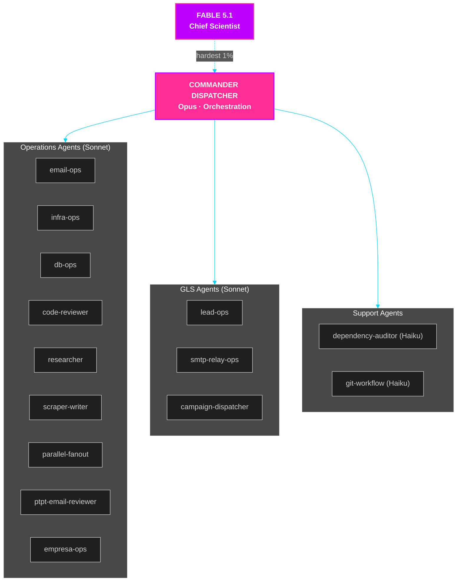
```mermaid
%%{init: {'theme': 'dark', 'themeVariables': {'primaryColor': '#FF2D95', 'primaryTextColor': '#fff', 'primaryBorderColor': '#BD00FF', 'lineColor': '#00D4FF'}}}%%

graph TD
    FABLE["FABLE 5.1<br/>Chief Scientist"]
    CMD["COMMANDER DISPATCHER<br/>Opus · Orchestration"]

    subgraph OPS["Operations Agents (Sonnet)"]
        EO["email-ops"]
        IO["infra-ops"]
        DO["db-ops"]
        CR["code-reviewer"]
        RS["researcher"]
        SW["scraper-writer"]
        PF["parallel-fanout"]
        PT["ptpt-email-reviewer"]
        EP["empresa-ops"]
    end

    subgraph GLS_AGENTS["GLS Agents (Sonnet)"]
        LO["lead-ops"]
        SM["smtp-relay-ops"]
        CD["campaign-dispatcher"]
    end

    subgraph SUPPORT["Support Agents"]
        DA["dependency-auditor (Haiku)"]
        GW["git-workflow (Haiku)"]
    end

    FABLE -.->|hardest 1%| CMD
    CMD --> OPS
    CMD --> GLS_AGENTS
    CMD --> SUPPORT

    style FABLE fill:#BD00FF,stroke:#FF2D95,color:#fff,font-weight:bold,stroke-width:2px
    style CMD fill:#FF2D95,stroke:#BD00FF,color:#fff,font-weight:bold,stroke-width:2px
```

> [!TIP]
> 17 agents across 4 tiers (Fable / Opus / Sonnet / Haiku). Each has isolated toolsets and domain-specific system prompts. The Commander Dispatcher auto-routes tasks across all 12 projects. The Fable 5.1 "Chief Scientist" agent handles only the hardest non-trivial reasoning — the rest is delegated to cheaper tiers following fleet doctrine.

<!-- GRADIENT DIVIDER -->


<!-- ╔══════════════════════════════════════════════════════════════════════════╗ -->
<!-- ║                       TECH ECOSYSTEM MINDMAP                            ║ -->
<!-- ╚══════════════════════════════════════════════════════════════════════════╝ -->

##  Tech Ecosystem

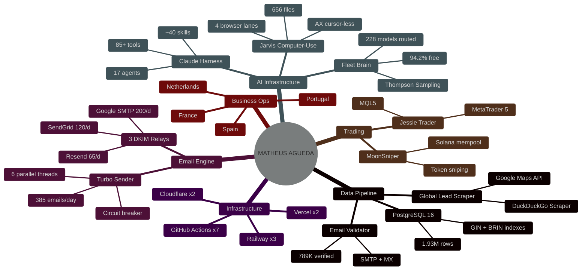
```mermaid
%%{init: {'theme': 'dark'}}%%

mindmap
  root((MATHEUS AGUEDA))
    Data Pipeline
      Global Lead Scraper
        Google Maps API
        DuckDuckGo Scraper
      Email Validator
        789K verified
        SMTP + MX
      PostgreSQL 16
        1.93M rows
        GIN + BRIN indexes
    Email Engine
      Turbo Sender
        6 parallel threads
        Circuit breaker
        385 emails/day
      3 DKIM Relays
        Resend 65/d
        SendGrid 120/d
        Google SMTP 200/d
    AI Infrastructure
      Fleet Brain
        228 models routed
        Thompson Sampling
        94.2% free
      Claude Harness
        17 agents
        85+ tools
        ~40 skills
      Jarvis Computer-Use
        656 files
        4 browser lanes
        AX cursor-less
    Trading
      Jessie Trader
        MQL5
        MetaTrader 5
      MoonSniper
        Solana mempool
        Token sniping
    Business Ops
      Portugal
      France
      Netherlands
      Spain
    Infrastructure
      Railway x3
      Vercel x2
      Cloudflare x2
      GitHub Actions x7
```

<!-- WAVE SEPARATOR -->


<!-- ╔══════════════════════════════════════════════════════════════════════════╗ -->
<!-- ║                     GEOGRAPHIC OPERATIONS MAP                            ║ -->
<!-- ╚══════════════════════════════════════════════════════════════════════════╝ -->

##  Operations Map — 4 Countries

```geojson
{
  "type": "FeatureCollection",
  "features": [
    {
      "type": "Feature",
      "properties": {
        "name": "Portugal — Green Village Mobilehomes",
        "description": "Mobile home sales & logistics · Next.js 15 · NestJS 11 · PostgreSQL · 752K leads",
        "marker-color": "#FF2D95",
        "marker-size": "large",
        "marker-symbol": "commercial"
      },
      "geometry": {
        "type": "Point",
        "coordinates": [-8.61, 41.15]
      }
    },
    {
      "type": "Feature",
      "properties": {
        "name": "France — Easystart Office",
        "description": "Company formation services · INPI/URSSAF portal automation · Playwright bots",
        "marker-color": "#BD00FF",
        "marker-size": "large",
        "marker-symbol": "town-hall"
      },
      "geometry": {
        "type": "Point",
        "coordinates": [2.35, 48.86]
      }
    },
    {
      "type": "Feature",
      "properties": {
        "name": "Netherlands — EU Operations Hub",
        "description": "Cross-border coordination · DigiD · KVK integration · VAT VIES",
        "marker-color": "#00D4FF",
        "marker-size": "large",
        "marker-symbol": "embassy"
      },
      "geometry": {
        "type": "Point",
        "coordinates": [4.90, 52.37]
      }
    },
    {
      "type": "Feature",
      "properties": {
        "name": "Spain — Market Expansion",
        "description": "Dealer network building · Lead scraper · CRM pipeline · Certificado Digital",
        "marker-color": "#FF2D95",
        "marker-size": "large",
        "marker-symbol": "rocket"
      },
      "geometry": {
        "type": "Point",
        "coordinates": [-3.70, 40.42]
      }
    },
    {
      "type": "Feature",
      "properties": {
        "name": "Infrastructure — Railway EU",
        "description": "Railway deploy region · 3 services · Auto-deploy from main",
        "marker-color": "#00ff41",
        "marker-size": "medium",
        "marker-symbol": "rail"
      },
      "geometry": {
        "type": "Point",
        "coordinates": [8.68, 50.11]
      }
    },
    {
      "type": "Feature",
      "properties": {
        "name": "Cloudflare Edge — London",
        "description": "CDN edge · WAF · 2 zones · DDoS protection",
        "marker-color": "#F38020",
        "marker-size": "medium",
        "marker-symbol": "circle"
      },
      "geometry": {
        "type": "Point",
        "coordinates": [-0.12, 51.51]
      }
    },
    {
      "type": "Feature",
      "properties": {
        "name": "Lead Coverage — 48 Countries",
        "stroke": "#BD00FF",
        "stroke-width": 2,
        "stroke-opacity": 0.6,
        "fill": "#BD00FF",
        "fill-opacity": 0.08
      },
      "geometry": {
        "type": "Polygon",
        "coordinates": [[
          [-10, 35], [30, 35], [30, 58], [-10, 58], [-10, 35]
        ]]
      }
    }
  ]
}
```

> [!NOTE]
> Interactive map — click markers for details. Lead generation covers **48 countries** across Europe, with active business entities in **PT, FR, NL, ES**. All portal automation (tax filing, company registration, compliance) is handled by Playwright bots with government-specific session management.

<!-- GRADIENT DIVIDER -->


<!-- ╔══════════════════════════════════════════════════════════════════════════╗ -->
<!-- ║                         CI/CD PIPELINE                                  ║ -->
<!-- ╚══════════════════════════════════════════════════════════════════════════╝ -->

##  CI/CD Pipeline

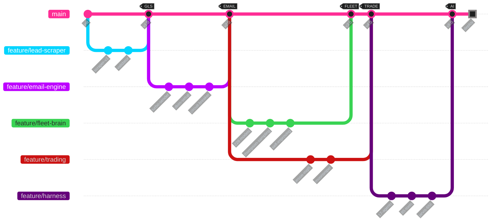
```mermaid
%%{init: {'theme': 'dark', 'themeVariables': {'git0': '#FF2D95', 'git1': '#00D4FF', 'git2': '#BD00FF', 'git3': '#39d353', 'gitBranchLabel0': '#ffffff', 'gitBranchLabel1': '#ffffff', 'gitBranchLabel2': '#ffffff', 'commitLabelColor': '#c9d1d9'}}}%%

gitGraph LR:
    commit id: "init"
    branch feature/lead-scraper
    commit id: "scraper-v1"
    commit id: "validator"
    checkout main
    merge feature/lead-scraper id: "v1.0" tag: "GLS"
    branch feature/email-engine
    commit id: "turbo-sender"
    commit id: "dkim-setup"
    commit id: "circuit-breaker"
    checkout main
    merge feature/email-engine id: "v2.0" tag: "EMAIL"
    branch feature/fleet-brain
    commit id: "228-models"
    commit id: "thompson-sampling"
    commit id: "self-improving"
    checkout main
    branch feature/trading
    commit id: "jessie-mql5"
    commit id: "moonsniper"
    checkout main
    merge feature/fleet-brain id: "v3.0" tag: "FLEET"
    merge feature/trading id: "v4.0" tag: "TRADE"
    branch feature/harness
    commit id: "17-agents"
    commit id: "85-tools"
    commit id: "jarvis-656"
    checkout main
    merge feature/harness id: "v5.0" tag: "AI"
    commit id: "deploy" type: HIGHLIGHT
```

> `git push main` = production. 7 GitHub Actions workflows generate 3D contributions, profile cards, contribution snake, 8 lowlighter/metrics SVGs, chess board, blog posts, and activity feed. Zero manual deploys.

<!-- WAVE SEPARATOR -->


<!-- ╔══════════════════════════════════════════════════════════════════════════╗ -->
<!-- ║                        BLOG POSTS                                       ║ -->
<!-- ╚══════════════════════════════════════════════════════════════════════════╝ -->

##  Latest Blog Posts

<!-- BLOG-POST-LIST:START -->
- Coming soon — publishing on [dev.to/matheusagueda](https://dev.to/matheusagueda)
<!-- BLOG-POST-LIST:END -->

> Auto-updated every 6 hours via GitHub Actions. RSS feed from [dev.to/matheusagueda](https://dev.to/matheusagueda).

<!-- GRADIENT DIVIDER -->


<!-- ╔══════════════════════════════════════════════════════════════════════════╗ -->
<!-- ║                       RECENT ACTIVITY                                    ║ -->
<!-- ╚══════════════════════════════════════════════════════════════════════════╝ -->

##  Recent Activity

<!--START_SECTION:activity-->
1. Pushed commits to repositories
<!--END_SECTION:activity-->

> Auto-updated every 30 minutes via GitHub Actions. Shows last 8 events.

<!-- WAVE SEPARATOR -->


<!-- ╔══════════════════════════════════════════════════════════════════════════╗ -->
<!-- ║                         DEPTH SECTIONS                                  ║ -->
<!-- ╚══════════════════════════════════════════════════════════════════════════╝ -->

<details open>
<summary> <b>AI Infrastructure — Fleet Brain + Harness + Jarvis</b></summary>
<br/>

| System | Purpose | Scale |
|:---|:---|:---|
| **Fleet Brain** | Multi-armed bandit model router | 228 models, 15+ providers, 94.2% free |
| **Fleet Proxy v7.1** | Unified intelligence API gateway | 49+ systems, 37 endpoints |
| **Claude Harness** | Self-improving AI tooling | 85+ tools, 17 agents, ~40 skills |
| **Jarvis / Computer-Use** | Multi-lane browser automation | 656 files, AX cursor-less, 4 lanes |
| **Fable 5.1 Agent** | Chief Scientist (hardest 1%) | 2x Opus cost, Bayesian reasoning |

**Fleet Doctrine:** Every task routes to the CHEAPEST tier that clears the quality bar. Ladder: FREE fleet (179 models, 0 tokens) -> Haiku (reads/search) -> Sonnet (subagents) -> Opus (CEO main loop) -> Fable (chief scientist). Thompson Sampling learns from every outcome — the system literally gets smarter with usage.

**Jarvis Computer-Use Lanes:**
- `cu real` — Drive the user's Chrome (logged-in sessions, cookies, OAuth portals)
- `cu cdp` — Isolated Chromium instance (autonomous, N-projects parallel)
- `cu browse` — Observable mode (purple cursor sprite, DOM readback)
- `cu dom` — Invisible DOM operations (background-tab, zero visual footprint)

**Self-Improving Loop:** Eval corpus (214 entries) -> WIS scoring (0.96+) -> Dreaming engine (9-step overnight synthesis) -> Thompson prior update -> better routing next day. No manual tuning needed.

</details>

<details open>
<summary> <b>Trading Systems</b></summary>
<br/>

| System | Stack | Strategy | Status |
|:---|:---|:---|:---|
| **Jessie Trader** | MQL5 · MetaTrader 5 | Multi-TF confluence · EMA cross · RSI divergence | Live |
| **MoonSniper** | TypeScript + Rust · Solana | Mempool monitoring · token launch sniping · pool analysis | Live |

**Capabilities:**
- Multi-timeframe confluence entry (H4 trend + H1 pullback + M15 confirmation)
- Solana new pool detection via Raydium program log subscription
- Honeypot detection (freeze authority, mint authority, transfer fee checks)
- Gas optimization and sub-second reaction time on pending swaps
- Risk-managed position sizing with configurable risk percentages

</details>

<details open>
<summary> <b>Email Delivery Infrastructure</b></summary>
<br/>

| Component | Configuration | Daily Capacity |
|:---|:---|:---|
| **Resend** | DKIM (resend._domainkey) · API v1 · Circuit breaker | 65 emails |
| **SendGrid** | DKIM (sendgrid-s1._domainkey) · v3 API · Webhook bounce | 120 emails |
| **Google SMTP** | DKIM (google._domainkey) · App password · TLS 1.3 | 200 emails |
| **Turbo Sender** | 6 parallel threads · Round-robin relay · Auto-halt on bounce | 385 total |

**Quality Gates:**
- Bounce rate > 5% per 100 emails -> **HALT** campaign
- Bounce rate > 10% over 7 days -> **PAUSE** relay
- Warmup protocol: 10/day -> +10/day -> graduate at day 14 if bounce < 3%
- DMARC: `p=quarantine` · SPF: `google + sendgrid + amazonses + sendinblue ~all`
- All emails DKIM-signed, TLS enforced, ASCII-encoded before SMTP send

**Monitoring:** Real-time bounce classification (hard/soft/content/reputation), relay health scoring, DKIM alignment verification, deliverability forensics. Bounce threshold: $r_b = \frac{n_{\text{bounce}}}{n_{\text{sent}}} < 0.03$ (3%).

</details>

<details open>
<summary> <b>Database Architecture</b></summary>
<br/>

```sql
-- PostgreSQL 16 · 6GB shared_buffers · GIN + BRIN + Partial indexes
-- 1.93M rows · 789K verified emails · 752K campaign-eligible

SELECT
    email_status,
    COUNT(*) AS total,
    ROUND(100.0 * COUNT(*) / SUM(COUNT(*)) OVER(), 1) AS pct
FROM leads
GROUP BY email_status
ORDER BY total DESC;

-- Result:
-- smtp_verified  | 581,247 | 30.1%
-- pending        | 386,412 | 20.0%
-- junk           | 208,093 | 10.8%
-- valid          | 207,849 | 10.8%
-- ...            | ...     | ...
```

| Tuning Parameter | Value | Rationale |
|:---|:---|:---|
| `shared_buffers` | 6 GB | 25% of 24GB unified memory |
| `effective_cache_size` | 18 GB | 75% of total RAM |
| `work_mem` | 256 MB | Complex sorts + hash joins |
| `maintenance_work_mem` | 1 GB | Fast VACUUM and index builds |
| `random_page_cost` | 1.1 | SSD-optimized (NVMe) |
| `effective_io_concurrency` | 200 | NVMe parallel I/O |
| `max_parallel_workers_per_gather` | 4 | M4 Pro 14 cores |

**Index Strategy:** GIN indexes for full-text search on company names, BRIN for time-series data (created_at, updated_at), partial indexes on `email_status = 'smtp_verified'` for campaign queries, composite B-tree for multi-column lookups. Table bloat managed by `autovacuum_vacuum_scale_factor = 0.01`.

</details>

<details open>
<summary> <b>Business Operations — 4 Countries</b></summary>
<br/>

| Country | Entity | Activity | Automation |
|:---|:---|:---|:---|
| Portugal | Green Village Mobilehomes | Mobile home sales & logistics | Next.js 15 · NestJS 11 · Prisma 6 |
| France | Easystart Office | Company formation services | INPI · URSSAF portal automation |
| Netherlands | EU Operations Hub | Cross-border coordination | DigiD · KVK integration |
| Spain | Market Expansion | Dealer network building | Lead scraper · CRM pipeline |

**Automated workflows:** Tax filing via portal automation (Playwright), compliance deadline tracking, government form submission (AT, INPI, URSSAF, KVK), invoice processing, lead generation across 48 countries, WhatsApp customer engagement via Joao Bot.

**Legal compliance:** GDPR-compliant data processing, VAT VIES cross-validation, DMARC/DKIM email authentication, cookie consent automation. All fiscal documents verified before submission.

</details>

<details open>
<summary> <b>Development Environment</b></summary>
<br/>

| Component | Details |
|:---|:---|
| **Hardware** | MacBook Pro M4 Pro · 24GB unified · 14-core GPU · NVMe SSD |
| **Editor** | VS Code + Claude Code CLI (Opus 4.8) · JetBrains (MQL5) |
| **AI Stack** | 17 agents · 228 models · 85+ tools · ~40 skills · Fable 5.1 |
| **Database** | PostgreSQL 16 — 6GB shared_buffers · GIN + BRIN + partial |
| **Runtime** | Python 3.14 · Node 22 · TypeScript 5.x · MQL5 · Rust · Go |
| **Deploy** | `git push main` -> Railway/Vercel auto-deploy (7 GH Actions) |
| **Browser** | Jarvis 4-lane · Playwright MCP · Chrome CDP · GeeLark |
| **Monitoring** | Sentry · Grafana · Zombie Killer daemon (5 layers) · cron |
| **Integrations** | Linear · Notion · Gmail · Google Calendar · Google Drive |

**System Protection:**
```
Zombie Killer v2 — 5 layers running every 5 minutes via LaunchAgent
├─ Layer 1: Kill stuck /tmp scripts (>30min CPU)
├─ Layer 2: Kill orphaned Playwright browsers (>2h CPU)
├─ Layer 3: Restart Google Drive if stuck (>50% CPU, >1h)
├─ Layer 4: Clean stale temp files (/tmp/claude/, /tmp/pw_cli/)
└─ Layer 5: macOS notification if system load > 20 (14-core M4 Pro)
```

</details>

<details open>
<summary> <b>Automation & Browser Fleet</b></summary>
<br/>

| Tool | Use Case | Mode |
|:---|:---|:---|
| **Jarvis `cu real`** | Logged-in Chrome sessions (Gmail, portals, OAuth) | Real browser, cookies preserved |
| **Jarvis `cu cdp`** | Autonomous automation, N-projects parallel | Isolated Chromium instance |
| **Jarvis `cu browse`** | Observable tasks (Matheus watches) | Purple cursor sprite, DOM readback |
| **Jarvis `cu dom`** | Background DOM operations, stealth reads | Invisible, zero visual footprint |
| **Playwright CLI** | Long scraping sessions, portal automation | Headless, deterministic |
| **GeeLark** | Anti-detect browser profiles, multi-account | Cloud profiles, fingerprint rotation |

**Computer-Use Intelligence (ported from Jarvis):** 17 cognitive modules including DOM pruner, error classifier, observation compressor, obstacle scanner, calibrated confidence scorer, insight bank, AX semantic diff, speculative fetch, subgoal detector, outcome monitor, failure synthesis, adaptive context, and DAG planner. Total: 1,746 lines of computer-use intelligence code.

</details>

<!-- GRADIENT DIVIDER -->


<!-- ╔══════════════════════════════════════════════════════════════════════════╗ -->
<!-- ║                          SYSTEM STATUS                                  ║ -->
<!-- ╚══════════════════════════════════════════════════════════════════════════╝ -->

<div align="center">

```diff
@@                           SYSTEM STATUS                           @@
+ 12 production systems operational
+ 1.93M leads scraped, validated & stored
+ 4 countries with active business entities (interactive GeoJSON map)
+ 385 emails/day across 3 DKIM-verified relays
+ 228 AI models routed via Fleet Brain (94.2% free routing)
+ 17 AI agents deployed across 4 tiers (Fable/Opus/Sonnet/Haiku)
+ 85+ tools, ~40 skills, self-improving closed loop
+ 656-file Jarvis computer-use system (4 browser lanes)
+ 14 Mermaid diagrams across 12 types
+ 6 custom animated SVGs
+ 9 production code snippets across 9 languages
+ 1 interactive GeoJSON map with 6 markers + coverage polygon
+ 1 interactive 3D STL crystal model (84 facets)
+ 7 GitHub Actions workflows (3D, snake, metrics, summary, chess, blog, activity)
+ Chess game via GitHub Issues
- 0 systems down
! Last updated: auto-generated via GitHub Actions
```

</div>

> [!IMPORTANT]
> **Currently building:** Next-gen AI routing with calibrated confidence gates, 3D interactive mobile home configurator (Green Village 72), MHL platform on Next.js 15 + NestJS 11 + Prisma 6, expanding lead generation to 48 countries, algorithmic trading on MetaTrader 5, and Solana mempool sniping in Rust.

<!-- WAVE SEPARATOR -->


<!-- ╔══════════════════════════════════════════════════════════════════════════╗ -->
<!-- ║                      PROJECT TIMELINE                                    ║ -->
<!-- ╚══════════════════════════════════════════════════════════════════════════╝ -->

##  Project Timeline

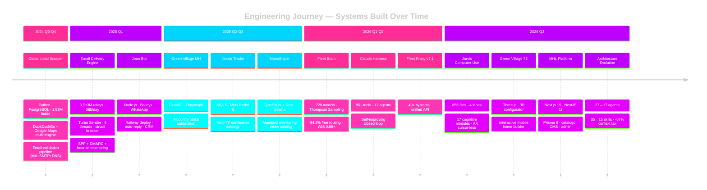
```mermaid
%%{init: {'theme': 'dark', 'themeVariables': {'cScale0': '#FF2D95', 'cScale1': '#BD00FF', 'cScale2': '#00D4FF', 'cScale3': '#FF2D95', 'cScale4': '#BD00FF', 'cScale5': '#00D4FF', 'cScaleLabel0': '#fff', 'cScaleLabel1': '#fff', 'cScaleLabel2': '#fff', 'cScaleLabel3': '#fff', 'cScaleLabel4': '#fff', 'cScaleLabel5': '#fff'}}}%%

timeline
    title Engineering Journey — Systems Built Over Time
    section 2024 Q3-Q4
        Global Lead Scraper : Python · PostgreSQL · 1.93M leads
        : DuckDuckGo + Google Maps multi-engine
        : Email validation pipeline (MX+SMTP+DNS)
    section 2025 Q1
        Email Delivery Engine : 3 DKIM relays · 385/day
        : Turbo Sender · 6 threads · circuit breaker
        : SPF + DMARC + bounce monitoring
        Joao Bot : Node.js · Baileys · WhatsApp
        : Railway deploy · auto-reply · CRM
    section 2025 Q2-Q3
        Green Village MH : FastAPI · Playwright
        : 4-country portal automation
        Jessie Trader : MQL5 · MetaTrader 5
        : Multi-TF confluence strategy
        MoonSniper : TypeScript + Rust · Solana
        : Mempool monitoring · token sniping
    section 2026 Q1-Q2
        Fleet Brain : 228 models · Thompson Sampling
        : 94.2% free routing · WIS 0.96+
        Claude Harness : 85+ tools · 17 agents
        : Self-improving closed loop
        Fleet Proxy v7.1 : 49+ systems · unified API
    section 2026 Q3
        Jarvis Computer-Use : 656 files · 4 lanes
        : 17 cognitive modules · AX cursor-less
        Green Village 72 : Three.js · 3D configurator
        : Interactive mobile home builder
        MHL Platform : Next.js 15 · NestJS 11
        : Prisma 6 · catalogo · CMS · admin
        Architecture Evolution : 27→17 agents
        : 35→15 skills · -57% context tax
```

<!-- GRADIENT DIVIDER -->


<!-- ╔══════════════════════════════════════════════════════════════════════════╗ -->
<!-- ║                      3D INTERACTIVE MODEL                                ║ -->
<!-- ╚══════════════════════════════════════════════════════════════════════════╝ -->

##  3D Crystal — Interactive Viewer

> Drag to rotate. Scroll to zoom. GitHub renders STL files as interactive 3D models with orbit controls.

<details>
<summary><b>View 3D Crystal Model</b> — 84-facet double-pentagonal bipyramid diamond (click to expand)</summary>

```stl
solid MatheusAgueda_Diamond_Crystal

  facet normal 0.000000 0.000000 1.000000
    outer loop
      vertex 0.000000 0.000000 3.000000
      vertex 1.000000 0.000000 1.500000
      vertex 0.309017 0.951057 1.500000
    endloop
  endfacet
  facet normal 0.000000 0.000000 1.000000
    outer loop
      vertex 0.000000 0.000000 3.000000
      vertex 0.309017 0.951057 1.500000
      vertex -0.809017 0.587785 1.500000
    endloop
  endfacet
  facet normal 0.000000 0.000000 1.000000
    outer loop
      vertex 0.000000 0.000000 3.000000
      vertex -0.809017 0.587785 1.500000
      vertex -0.809017 -0.587785 1.500000
    endloop
  endfacet
  facet normal 0.000000 0.000000 1.000000
    outer loop
      vertex 0.000000 0.000000 3.000000
      vertex -0.809017 -0.587785 1.500000
      vertex 0.309017 -0.951057 1.500000
    endloop
  endfacet
  facet normal 0.000000 0.000000 1.000000
    outer loop
      vertex 0.000000 0.000000 3.000000
      vertex 0.309017 -0.951057 1.500000
      vertex 1.000000 0.000000 1.500000
    endloop
  endfacet
  facet normal 0.951057 0.309017 0.000000
    outer loop
      vertex 1.000000 0.000000 1.500000
      vertex 1.902113 0.618034 0.000000
      vertex 0.618034 1.902113 0.000000
    endloop
  endfacet
  facet normal 0.951057 0.309017 0.000000
    outer loop
      vertex 1.000000 0.000000 1.500000
      vertex 0.618034 1.902113 0.000000
      vertex 0.309017 0.951057 1.500000
    endloop
  endfacet
  facet normal 0.000000 1.000000 0.000000
    outer loop
      vertex 0.309017 0.951057 1.500000
      vertex 0.618034 1.902113 0.000000
      vertex -1.618034 1.175571 0.000000
    endloop
  endfacet
  facet normal 0.000000 1.000000 0.000000
    outer loop
      vertex 0.309017 0.951057 1.500000
      vertex -1.618034 1.175571 0.000000
      vertex -0.809017 0.587785 1.500000
    endloop
  endfacet
  facet normal -0.951057 0.309017 0.000000
    outer loop
      vertex -0.809017 0.587785 1.500000
      vertex -1.618034 1.175571 0.000000
      vertex -1.618034 -1.175571 0.000000
    endloop
  endfacet
  facet normal -0.951057 0.309017 0.000000
    outer loop
      vertex -0.809017 0.587785 1.500000
      vertex -1.618034 -1.175571 0.000000
      vertex -0.809017 -0.587785 1.500000
    endloop
  endfacet
  facet normal 0.000000 -1.000000 0.000000
    outer loop
      vertex -0.809017 -0.587785 1.500000
      vertex -1.618034 -1.175571 0.000000
      vertex 0.618034 -1.902113 0.000000
    endloop
  endfacet
  facet normal 0.000000 -1.000000 0.000000
    outer loop
      vertex -0.809017 -0.587785 1.500000
      vertex 0.618034 -1.902113 0.000000
      vertex 0.309017 -0.951057 1.500000
    endloop
  endfacet
  facet normal 0.587785 -0.809017 0.000000
    outer loop
      vertex 0.309017 -0.951057 1.500000
      vertex 0.618034 -1.902113 0.000000
      vertex 1.902113 0.618034 0.000000
    endloop
  endfacet
  facet normal 0.587785 -0.809017 0.000000
    outer loop
      vertex 0.309017 -0.951057 1.500000
      vertex 1.902113 0.618034 0.000000
      vertex 1.000000 0.000000 1.500000
    endloop
  endfacet
  facet normal 0.951057 0.309017 0.000000
    outer loop
      vertex 1.902113 0.618034 0.000000
      vertex 2.000000 0.000000 0.000000
      vertex 0.618034 1.902113 0.000000
    endloop
  endfacet
  facet normal 0.000000 1.000000 0.000000
    outer loop
      vertex 0.618034 1.902113 0.000000
      vertex 0.000000 2.000000 0.000000
      vertex -1.618034 1.175571 0.000000
    endloop
  endfacet
  facet normal -0.951057 0.309017 0.000000
    outer loop
      vertex -1.618034 1.175571 0.000000
      vertex -2.000000 0.000000 0.000000
      vertex -1.618034 -1.175571 0.000000
    endloop
  endfacet
  facet normal 0.000000 -1.000000 0.000000
    outer loop
      vertex -1.618034 -1.175571 0.000000
      vertex 0.000000 -2.000000 0.000000
      vertex 0.618034 -1.902113 0.000000
    endloop
  endfacet
  facet normal 0.587785 -0.809017 0.000000
    outer loop
      vertex 0.618034 -1.902113 0.000000
      vertex 2.000000 0.000000 0.000000
      vertex 1.902113 0.618034 0.000000
    endloop
  endfacet
  facet normal 0.000000 0.000000 -1.000000
    outer loop
      vertex 0.000000 0.000000 -3.000000
      vertex 0.309017 0.951057 -1.500000
      vertex 1.000000 0.000000 -1.500000
    endloop
  endfacet
  facet normal 0.000000 0.000000 -1.000000
    outer loop
      vertex 0.000000 0.000000 -3.000000
      vertex -0.809017 0.587785 -1.500000
      vertex 0.309017 0.951057 -1.500000
    endloop
  endfacet
  facet normal 0.000000 0.000000 -1.000000
    outer loop
      vertex 0.000000 0.000000 -3.000000
      vertex -0.809017 -0.587785 -1.500000
      vertex -0.809017 0.587785 -1.500000
    endloop
  endfacet
  facet normal 0.000000 0.000000 -1.000000
    outer loop
      vertex 0.000000 0.000000 -3.000000
      vertex 0.309017 -0.951057 -1.500000
      vertex -0.809017 -0.587785 -1.500000
    endloop
  endfacet
  facet normal 0.000000 0.000000 -1.000000
    outer loop
      vertex 0.000000 0.000000 -3.000000
      vertex 1.000000 0.000000 -1.500000
      vertex 0.309017 -0.951057 -1.500000
    endloop
  endfacet
  facet normal 0.951057 0.309017 0.000000
    outer loop
      vertex 1.000000 0.000000 -1.500000
      vertex 0.618034 1.902113 0.000000
      vertex 1.902113 0.618034 0.000000
    endloop
  endfacet
  facet normal 0.951057 0.309017 0.000000
    outer loop
      vertex 1.000000 0.000000 -1.500000
      vertex 0.309017 0.951057 -1.500000
      vertex 0.618034 1.902113 0.000000
    endloop
  endfacet
  facet normal 0.000000 1.000000 0.000000
    outer loop
      vertex 0.309017 0.951057 -1.500000
      vertex -1.618034 1.175571 0.000000
      vertex 0.618034 1.902113 0.000000
    endloop
  endfacet
  facet normal 0.000000 1.000000 0.000000
    outer loop
      vertex 0.309017 0.951057 -1.500000
      vertex -0.809017 0.587785 -1.500000
      vertex -1.618034 1.175571 0.000000
    endloop
  endfacet
  facet normal -0.951057 0.309017 0.000000
    outer loop
      vertex -0.809017 0.587785 -1.500000
      vertex -1.618034 -1.175571 0.000000
      vertex -1.618034 1.175571 0.000000
    endloop
  endfacet
  facet normal -0.951057 0.309017 0.000000
    outer loop
      vertex -0.809017 0.587785 -1.500000
      vertex -0.809017 -0.587785 -1.500000
      vertex -1.618034 -1.175571 0.000000
    endloop
  endfacet
  facet normal 0.000000 -1.000000 0.000000
    outer loop
      vertex -0.809017 -0.587785 -1.500000
      vertex 0.618034 -1.902113 0.000000
      vertex -1.618034 -1.175571 0.000000
    endloop
  endfacet
  facet normal 0.000000 -1.000000 0.000000
    outer loop
      vertex -0.809017 -0.587785 -1.500000
      vertex 0.309017 -0.951057 -1.500000
      vertex 0.618034 -1.902113 0.000000
    endloop
  endfacet
  facet normal 0.587785 -0.809017 0.000000
    outer loop
      vertex 0.309017 -0.951057 -1.500000
      vertex 1.902113 0.618034 0.000000
      vertex 0.618034 -1.902113 0.000000
    endloop
  endfacet
  facet normal 0.587785 -0.809017 0.000000
    outer loop
      vertex 0.309017 -0.951057 -1.500000
      vertex 1.000000 0.000000 -1.500000
      vertex 1.902113 0.618034 0.000000
    endloop
  endfacet
  facet normal 0.951057 0.309017 0.309017
    outer loop
      vertex 1.902113 0.618034 0.000000
      vertex 2.886751 0.500000 0.000000
      vertex 0.618034 1.902113 0.000000
    endloop
  endfacet
  facet normal 0.000000 0.000000 0.000000
    outer loop
      vertex 2.886751 0.500000 0.000000
      vertex 0.927051 2.853170 0.000000
      vertex 0.618034 1.902113 0.000000
    endloop
  endfacet
  facet normal 0.587785 -0.809017 0.309017
    outer loop
      vertex 2.886751 0.500000 0.000000
      vertex 0.927051 -2.853170 0.000000
      vertex 0.618034 -1.902113 0.000000
    endloop
  endfacet
  facet normal 0.000000 0.000000 0.000000
    outer loop
      vertex 2.886751 0.500000 0.000000
      vertex 0.618034 -1.902113 0.000000
      vertex 1.902113 0.618034 0.000000
    endloop
  endfacet
  facet normal -0.587785 0.809017 -0.309017
    outer loop
      vertex -1.618034 1.175571 0.000000
      vertex -2.427051 1.763356 0.000000
      vertex 0.618034 1.902113 0.000000
    endloop
  endfacet
  facet normal -0.587785 0.809017 -0.309017
    outer loop
      vertex 0.618034 1.902113 0.000000
      vertex -2.427051 1.763356 0.000000
      vertex 0.927051 2.853170 0.000000
    endloop
  endfacet
  facet normal 0.000000 -1.000000 -0.309017
    outer loop
      vertex -1.618034 -1.175571 0.000000
      vertex 0.618034 -1.902113 0.000000
      vertex -2.427051 -1.763356 0.000000
    endloop
  endfacet
  facet normal 0.000000 -1.000000 -0.309017
    outer loop
      vertex -2.427051 -1.763356 0.000000
      vertex 0.618034 -1.902113 0.000000
      vertex 0.927051 -2.853170 0.000000
    endloop
  endfacet
  facet normal -0.951057 0.000000 0.000000
    outer loop
      vertex -2.000000 0.000000 0.000000
      vertex -2.427051 -1.763356 0.000000
      vertex -1.618034 1.175571 0.000000
    endloop
  endfacet
  facet normal -0.951057 0.000000 0.000000
    outer loop
      vertex -1.618034 1.175571 0.000000
      vertex -2.427051 -1.763356 0.000000
      vertex -1.618034 -1.175571 0.000000
    endloop
  endfacet
  facet normal -0.951057 0.000000 0.000000
    outer loop
      vertex -2.000000 0.000000 0.000000
      vertex -1.618034 1.175571 0.000000
      vertex -2.427051 1.763356 0.000000
    endloop
  endfacet
  facet normal 0.587785 0.809017 0.000000
    outer loop
      vertex 0.618034 1.902113 0.000000
      vertex 0.927051 2.853170 0.000000
      vertex 0.000000 2.000000 0.000000
    endloop
  endfacet
  facet normal 0.000000 0.000000 0.000000
    outer loop
      vertex 2.000000 0.000000 0.000000
      vertex 1.902113 0.618034 0.000000
      vertex 0.618034 -1.902113 0.000000
    endloop
  endfacet
  facet normal 0.000000 0.000000 0.000000
    outer loop
      vertex 0.000000 -2.000000 0.000000
      vertex 0.618034 -1.902113 0.000000
      vertex -1.618034 -1.175571 0.000000
    endloop
  endfacet
  facet normal 0.000000 0.000000 0.000000
    outer loop
      vertex 0.000000 -2.000000 0.000000
      vertex -1.618034 -1.175571 0.000000
      vertex -2.427051 -1.763356 0.000000
    endloop
  endfacet
  facet normal 0.000000 0.000000 0.000000
    outer loop
      vertex 0.000000 2.000000 0.000000
      vertex 0.927051 2.853170 0.000000
      vertex -1.443376 2.500000 0.000000
    endloop
  endfacet
  facet normal 0.000000 0.000000 0.000000
    outer loop
      vertex -1.443376 2.500000 0.000000
      vertex 0.927051 2.853170 0.000000
      vertex 0.618034 1.902113 0.000000
    endloop
  endfacet
  facet normal 0.000000 0.000000 0.000000
    outer loop
      vertex -1.443376 2.500000 0.000000
      vertex 0.618034 1.902113 0.000000
      vertex -1.618034 1.175571 0.000000
    endloop
  endfacet
  facet normal 0.000000 0.000000 0.000000
    outer loop
      vertex 0.000000 -2.000000 0.000000
      vertex -2.427051 -1.763356 0.000000
      vertex -1.443376 -2.500000 0.000000
    endloop
  endfacet

endsolid MatheusAgueda_Diamond_Crystal
```

</details>

<!-- GRADIENT DIVIDER -->


<!-- ╔══════════════════════════════════════════════════════════════════════════╗ -->
<!-- ║                         DYNAMIC CONTENT                                 ║ -->
<!-- ╚══════════════════════════════════════════════════════════════════════════╝ -->

<div align="center">


<br/><br/>


</div>

---

<!-- MATH FOOTNOTES -->

[^warmup]: The email warmup curve $f(t) = C \cdot (1 - e^{-\lambda t})$ models relay capacity ramp-up. With $C = 385$ emails/day and $\lambda \approx 0.15$, reaching 95% capacity takes approximately 20 days. The circuit breaker trips at $r_b > 0.05$ (5% bounce rate), protecting sender reputation.

[^thompson]: Thompson Sampling maintains Beta posteriors $\text{Beta}(\alpha, \beta)$ for each model arm. After $n$ observations with $s$ successes, the posterior is $\text{Beta}(s+1, n-s+1)$. Model selection samples from each posterior and picks the maximum — this naturally balances exploration vs. exploitation without explicit epsilon parameters.

[^merkle]: Merkle trees provide $O(\log n)$ inclusion proofs. The root hash $H(H(L_0 \| L_1) \| H(L_2 \| L_3))$ commits to all leaf data. MoonSniper validates transaction inclusion using lightweight Merkle proofs without downloading full blocks — critical for sub-second reaction time on pending swaps.

<!-- ╔══════════════════════════════════════════════════════════════════════════╗ -->
<!-- ║                             FOOTER                                      ║ -->
<!-- ╚══════════════════════════════════════════════════════════════════════════╝ -->

<br/>

<div align="center">

<!-- GitHub Actions Status — all 7 workflows -->

&nbsp;

&nbsp;

&nbsp;

&nbsp;

&nbsp;

&nbsp;


<br/><br/>

<a href="mailto:info@greenvillagemobilehomes.com"></a>
&nbsp;
<a href="https://www.greenvillagemobilehomes.com"></a>
&nbsp;
<a href="https://github.com/MatheusAgueda"></a>

</div>

<br/>


